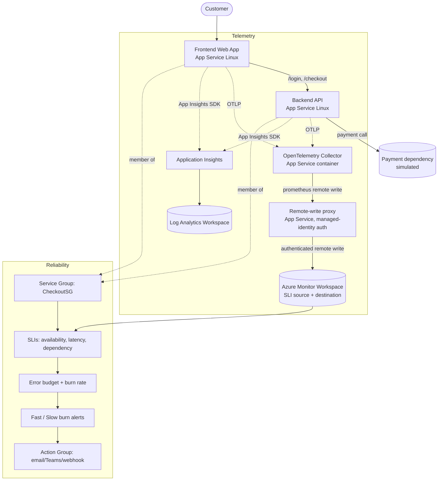
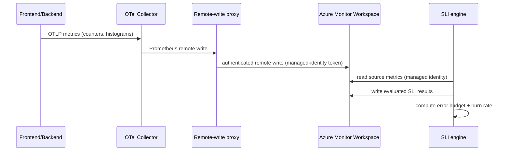

# Azure Monitor SLI/SLO Demo: Mission-Critical E-Commerce Reliability

A complete, runnable demo that shows how to **author SLIs**, **track an SLO (baseline)**, and **realize error budgets for burn-rate alerting** on Azure Monitor, applied to a mission-critical e-commerce application.

This plan follows the customer narrative from the deck: an online store with **Login** and **Checkout** services grouped into a **Service Group (**`**CheckoutSG**`**)**, measured by request-success availability and sub-300 ms latency, with error-budget-based fast/slow burn alerting.

> **Design guides in this folder:** the SLI/SLO theory and design process are in  
> [SLI-Design-Guide.md](SLI-Design-Guide.md), and the executable, command-by-command  
> walkthrough is in [SLI-Lab-UserGuide.md](SLI-Lab-UserGuide.md). Read the guide first if the  
> vocabulary (SLI, SLO, error budget, burn rate) is new.

---

## 1\. Why SLI-based reliability

Traditional infrastructure monitoring tells you the machine is busy; it rarely tells you whether customers are actually getting what they came for. **Service Level Indicators (SLIs)** flip the question from "is the server healthy?" to "is the user's journey succeeding?", and give you one agreed number and one agreed target to reason about it. [SLI-Design-Guide.md](SLI-Design-Guide.md) covers the theory in depth; this is the short version.

### Traditional monitoring vs SLI-based reliability

| Aspect | Traditional monitoring | SLI-based reliability |
| --- | --- | --- |
| What it watches | **Internal metrics** (CPU, memory, logs) | **User experience** (latency, availability) |
| Alerting | On **any threshold breach** | Only when the **error budget burns too fast** |
| Acceptable failure | No measure of it | Explicitly defines **how much failure is OK** |
| The metric | **Non-standard**, each team defines its own | A clear, standard **signal** across services |
| Posture | Reactive, system-driven | Proactive, **customer-driven** reliability |

### The four building blocks

Reliability with SLIs rests on four concepts, each built on the one before it:

| Concept | Role (the question it answers) | Example: Checkout availability |
| --- | --- | --- |
| **SLI** (indicator) | How good is it right now? A ratio of good events / valid events, as a percentage. | 99.87% of checkout requests returned 2xx |
| **SLO** (objective) | How good must it be? The SLI plus a target and a rolling window. | >= 99.5% over 7 rolling days |
| **Error budget** | How much failure is allowed? `100% - SLO`, the room to fail before breaching. | 0.5% (~129,500 of ~25.9M requests/30 days) |
| **Burn rate** | How fast are we spending the budget? In multiples of the sustainable rate. | 1x = on track; 14x = budget gone in ~12h |

**How they come together:** you **measure** the SLI, **commit** to an SLO, and the gap between 100% and the SLO becomes your **error budget**. You then alert on the **burn rate** (how fast that budget is being spent), so a small dip that is catastrophic against a tight budget pages you, while a large but affordable blip does not. One measurement, one target, one allowance, and one speed signal, all reading from the same number.

### Two SLI types you will author

| Type | Question | Good events | Valid events | Demo example |
| --- | --- | --- | --- | --- |
| **Availability** | Did the request succeed? | Requests returning 2xx | All requests | Checkout: 2xx checkout requests / all checkout requests, target 99.5% |
| **Latency** | Was it fast enough? | Requests completing under the threshold | All requests | Login: login requests under 300 ms / all login requests, target 99.5% |

Both are request-based ratios (value = good / valid). The demo also adds a third SLI, a **dependency availability** SLI on the payment provider, which is just an availability SLI applied to a downstream call.

---

## 2\. Demo objectives (what the audience will see)

| # | Outcome | SLI feature shown |
| --- | --- | --- |
| 1 | Reliability measured from the **customer's** point of view, not CPU/memory | Why application SLIs |
| 2 | Author an **availability SLI** (request success ratio) for Checkout | Request Count Based evaluation, good/total signals, filters |
| 3 | Author a **latency SLI** (\< 300 ms) for Login | Latency type, temporal/spatial aggregation |
| 4 | Author a **dependency availability SLI** (payment provider) | Multi-metric signal, formulas |
| 5 | Set an **SLO baseline** (99.5% over 7 / 30 rolling days) | Baseline (SLO), compliance period |
| 6 | Watch the **error budget** deplete as we inject failures | Error budget remaining |
| 7 | Trigger **fast-burn and slow-burn alerts** | Burn-rate alerting, action groups |
| 8 | Drill into trend, error budget, burn-rate charts | View and manage SLIs |

**Anchored targets**

*   Availability SLO: **99.5%** of Checkout requests succeed (rolling 7 days, and a 30-day view).
*   Latency SLO: **99.5% of Login requests complete in \< 300 ms**.
*   Dependency SLO: **99.5%** of payment-provider calls succeed.
*   Alerting: **baseline alert** + **fast-burn** (rapid budget consumption) + **slow-burn** (sustained degradation).

---

## 3\. Reference architecture



**How it flows.** A customer hits the **frontend** web app, which calls the **backend** API for `/login` and `/checkout`; checkout in turn calls the simulated **payment** dependency. Every app emits two telemetry streams: OpenTelemetry **metrics** (the counters and histogram the SLIs are built on) flow to the **OpenTelemetry Collector**, which remote-writes them through a managed-identity **proxy** into the **Azure Monitor Workspace (AMW)**; and the **App Insights SDK** sends traces and failures to **Application Insights** (backed by Log Analytics) for the traditional-APM contrast. On the reliability side, the **Service Group (`CheckoutSG`)** scopes the workload, the **SLI engine** reads the source metrics from the AMW and writes evaluated SLI results back to it, and those results drive the **error budget** and **burn-rate** calculations that raise **fast/slow burn alerts** through an **action group**. The frontend and backend are members of the Service Group, which is what places them in SLI scope.

**Why this shape**

*   **App Insights + Log Analytics** give the APM story (distributed traces, live metrics, failures) that teams use today, so you can contrast traditional monitoring with SLIs.
*   Azure Monitor **SLIs read metrics from an Azure Monitor Workspace**. The apps emit OpenTelemetry metrics, and an **OpenTelemetry Collector** forwards them to the Azure Monitor Workspace using Prometheus remote write. The same workspace is the destination for evaluated SLI results.
*   A **Service Group** is the logical application boundary that the SLIs are defined on (per product requirement: SLIs are authored at the service group level).

### Custom metrics the apps emit (the SLI source signals)

| Metric | Type | Key labels | Used by SLI |
| --- | --- | --- | --- |
| `http_server_requests_total` | counter | `service` (login/checkout), `route`, `status_class` (2xx/4xx/5xx) | Availability good/total |
| `http_server_request_duration_seconds` | histogram | `service`, `route` | Latency (proportion \< 300 ms) |
| `dependency_calls_total` | counter | `dependency` (payment), `status` (ok/error) | Dependency availability |

These names and labels are what you select when authoring the SLI signals in the portal.

### Components

| Resource | Purpose |
| --- | --- |
| Frontend web app (App Service Linux) | Customer-facing site, calls backend for login/checkout |
| Backend API (App Service Linux) | `/login`, `/checkout`, calls the payment dependency; tunable failure/latency for the demo |
| Application Insights | Distributed tracing, failures, live metrics (the "traditional monitoring" contrast) |
| Log Analytics workspace | App Insights backing store, KQL |
| Azure Monitor Workspace | SLI **source** metrics and SLI **destination** (evaluated results) |
| OpenTelemetry Collector (App Service container) | Receives OTLP from the apps, remote-writes Prometheus metrics to the Azure Monitor Workspace |
| User-assigned managed identity | Used by the SLI engine to read source metrics and publish evaluated results |
| Service Group `CheckoutSG` | Application boundary the SLIs are defined on |
| Action Group | Notification target for baseline and burn-rate alerts |

### Metric flow



**Reading the sequence.** The app records OTLP metrics (request counters and a latency histogram) and pushes them to the **OTel Collector**. The collector converts them to Prometheus format and hands them to the **remote-write proxy**, which attaches a managed-identity token and authenticates the write into the **Azure Monitor Workspace**. Separately, the **SLI engine** reads those source metrics from the AMW (as the same managed identity), computes each SLI, writes the evaluated result back into the AMW, and derives error budget and burn rate from the stored results. Source and destination are the same workspace, so authoring and evaluation read one consistent set of numbers.

The demo's three SLIs (good/total signals and baselines), the error-budget and burn-rate math, and an alternative **AKS + Managed Prometheus** ingestion path are covered in [SLI-Design-Guide.md](SLI-Design-Guide.md).

---

## 4\. Lab structure

```
01-sli-demo/
  README.md                 <- overview + architecture (this file)
  SLI-Design-Guide.md       <- SLI/SLO theory and design process
  SLI-Lab-UserGuide.md      <- hands-on lab (automated runner + manual walkthrough)
  sli-run-lab.ps1           <- automated 8-phase lab runner
  infra/
    infra-deploy.ps1        <- one-stop deploy (infra + app code)
    infra-validate-lab.ps1  <- post-deploy smoke test (health + functional checks)
    main.bicep, main.parameters.json
    modules/                <- monitoring, identity, appservice, amwingest (Bicep)
    collector/              <- OpenTelemetry Collector config
    sli/                    <- deploy-sli.ps1 / teardown-slo.ps1, recording rules, SLIs
  src/
    backend/ frontend/ promproxy/   <- Node apps (API, web, managed-identity remote-write proxy)
  load/
    generate-traffic-all.ps1  <- multi-path traffic generator (used by the lab)
    generate-traffic.js       <- simple traffic generator
    inject-degradation.md     <- how to trigger error-budget burn live
```

---

## 5\. Running the lab

Everything hands-on lives in the two guides in this folder, so it stays in one place:

*   **[SLI-Lab-UserGuide.md](SLI-Lab-UserGuide.md)** - the executable lab: prerequisites, Phase 0 provisioning, the automated runner (`sli-run-lab.ps1`) and the manual field-by-field portal walkthrough, deployment validation, the portal screenshots of the end state, and cleanup.
*   **[SLI-Design-Guide.md](SLI-Design-Guide.md)** - the SLI/SLO theory and design method: the demo's three SLIs, error budgets and burn rate, the reliability talking points, and how each part of the demo maps to an Azure Monitor feature.

At a glance (see the lab guide for the full walkthrough, parameters, and expected output at each step):

```
cd 01-sli-demo/infra
./infra-deploy.ps1 -ResourceGroup rg-sli-demo -Location eastus2      # deploy infra + apps
./infra-validate-lab.ps1 -ResourceGroup rg-sli-demo                  # smoke-test the stack
cd ..
pwsh -File load/generate-traffic-all.ps1 -ResourceGroup rg-sli-demo -Rps 30 -DurationSeconds 3600   # traffic (leave running)
./sli-run-lab.ps1 -ResourceGroup rg-sli-demo                         # guided Phases 1-8
```

The Service Group and its SLIs are tenant-scoped (they do not live in the resource group), so teardown removes them separately from the resource group; the [lab guide](SLI-Lab-UserGuide.md) cleanup section covers both.