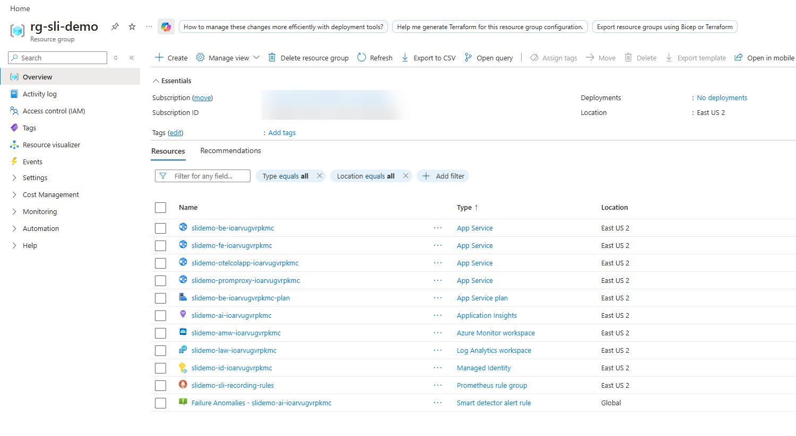
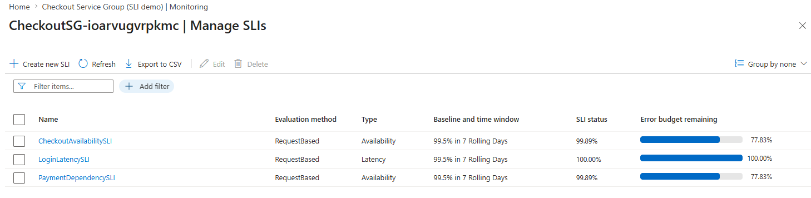

# SLI/SLO Design Lab: User Guide

A complete, hands-on lab that takes you from a running application to authored Service Level Indicators (SLIs) on Azure Monitor. You will enumerate every user journey, extract the critical ones, collect the evidence needed to design each SLI, fill in a design checklist, author the SLIs on a tenant-scoped Service Group, and validate that the SLI engine is publishing results.

There are two ways to run the 8-phase lab, and both share the same Phase 0 setup and the same traffic prerequisite:

*   **Path A - Automated:** [sli-run-lab.ps1](sli-run-lab.ps1) drives Phases 1 to 8 in one pass, prompting only for the few judgement inputs.
*   **Path B - Manual:** run the commands yourself, phase by phase, to understand each step and adapt the lab to your own application.

This lab is a **reusable template**: run it against your own application by substituting your resource names and journeys. Throughout, the **Checkout demo** (a store with Login, Checkout, and a Payment dependency) is filled in as the worked example so you can see what a completed answer looks like.

> **Baseline traffic is a manual prerequisite.** Every SLI signal is a rate over a rolling window, so the app must already be receiving continuous traffic before the metrics-dependent phases run. Neither path starts or stops traffic for you.

## How this fits with the design guide

[SLI-Design-Guide.md](SLI-Design-Guide.md) is the theory-plus-process reference: it starts from first principles (why SLIs exist, the layered mental model), states the design rules, and lays out the reusable process with the Azure form mapping. Read it first if the vocabulary is new. **This lab is the executable version:** the actual commands, queries, and form fields.

---

## Table of contents

*   [What the lab does](#what-the-lab-does)
*   [Prerequisites](#prerequisites)
*   [Why traffic must be running first](#why-traffic-must-be-running-first)
*   [Phase 0: Provision the Azure infrastructure](#phase-0-provision-the-azure-infrastructure)
*   [Start the traffic generator](#start-the-traffic-generator)
*   [Path A: Run the automated lab (sli-run-lab.ps1)](#path-a-run-the-automated-lab-sli-run-labps1)
*   [What it looks like in the portal](#what-it-looks-like-in-the-portal)
*   [Path B: Run the lab by hand (command-by-command)](#path-b-run-the-lab-by-hand-command-by-command)
    *   [Lab conventions](#lab-conventions)
    *   [Phase 1: Environment setup and access checks](#phase-1-environment-setup-and-access-checks)
    *   [Phase 2: Enumerate ALL user journeys](#phase-2-enumerate-all-user-journeys)
    *   [Phase 3: Extract the CRITICAL journeys](#phase-3-extract-the-critical-journeys)
    *   [Phase 4: Data collection (per critical journey)](#phase-4-data-collection-per-critical-journey)
    *   [Phase 5: Consolidate into the design checklist](#phase-5-consolidate-into-the-design-checklist)
    *   [Phase 6: Author the SLIs in the portal (field-by-field)](#phase-6-author-the-slis-in-the-portal-field-by-field)
    *   [Phase 7: Validate end-to-end](#phase-7-validate-end-to-end)
    *   [Phase 8: Lab completion checklist](#phase-8-lab-completion-checklist)
*   [Outputs](#outputs)
*   [Troubleshooting](#troubleshooting)
*   [Appendix A: Blank worksheets (copy per workload)](#appendix-a-blank-worksheets-copy-per-workload)
*   [Appendix B: PromQL / KQL cheat sheet](#appendix-b-promql--kql-cheat-sheet)
*   [Appendix C: Validated command outputs](#appendix-c-validated-command-outputs)
*   [Related files](#related-files)

---

## What the lab does

The lab implements Phases 1 through 8 of the SLO/SLI design method. The automated runner (`sli-run-lab.ps1`, Path A) maps one-to-one to the manual phases (Path B):

| Phase | Title | Automated mode (sli-run-lab.ps1) |
| --- | --- | --- |
| 1 | Environment setup and access checks | auto + confirm |
| 2 | Enumerate ALL user journeys | auto (from telemetry) |
| 3 | Extract the CRITICAL journeys | prompts for scores |
| 4 | Data collection (per critical journey) | auto + prompts |
| 5 | Consolidate into the design checklist | auto (writes CSV) |
| 6 | Author the SLIs in the portal | optional `deploy-sli.ps1` |
| 7 | Validate end-to-end | auto |
| 8 | Lab completion checklist | summary |

Phase 0 (infrastructure) is not part of the runner; deploy it first (below).

---

## Prerequisites

*   **PowerShell 7+** and **Azure CLI** signed in (`az login`) to the correct subscription.
*   An **Azure subscription** with **Contributor** and **User Access Administrator** (Phase 0 assigns Monitoring roles to a managed identity).
*   **Bicep** and **Node.js 20+** installed (for the Phase 0 deploy).
*   A region where **Azure Monitor Workspace** and **Service Groups (preview)** are available (for example `eastus2` or `westeurope`).

---

## Why traffic must be running first

Every SLI signal is a **rate over a rolling window** (for example, `rate(http_server_requests_total[5m])`). If the app is not receiving traffic, those rates collapse to zero and the metrics-dependent phases (1.3, 2, 4, 7) have nothing to read. Because of this, the app must already be receiving continuous traffic **before** you run either path.

Neither path starts or stops traffic. Path A only checks that request metrics are live in Phase 1.3; if they are not, it tells you to start the generator and re-run.

---

## Phase 0: Provision the Azure infrastructure

**Goal:** stand up every Azure resource the lab measures (the apps, the telemetry pipeline, the Azure Monitor Workspace, and the SLI managed identity) with one script, so Phase 1 has something to query. The repo ships a one-stop deployer, [infra/infra-deploy.ps1](infra/infra-deploy.ps1), that does exactly this.

> **Skip this phase if your infrastructure already exists.** If the demo is already deployed, or you are pointing the lab at your own application, go straight to the traffic generator and set the variables to your existing resource names.

### 0.1 Run the one-stop deploy

From `01-sli-demo/infra`, sign in, select your subscription, and run the deployer. This is a one-time setup per environment:

```
cd 01-sli-demo/infra
az login
az account set --subscription "<your-subscription-name-or-id>"

./infra-deploy.ps1 -ResourceGroup rg-sli-demo -Location eastus2
# optional: -PlanSku B1        # lower-cost App Service plan
# optional: -GenerateTraffic   # start the load generator as soon as the deploy finishes
```

Parameters:

| Parameter | Default | Meaning |
| --- | --- | --- |
| `-ResourceGroup` | `rg-sli-demo` | Resource group to create/use (becomes `<rg>`) |
| `-Location` | `eastus2` | Azure region |
| `-NamePrefix` | `slidemo` | Prefix for every resource name (becomes `<prefix>`) |
| `-PlanSku` | `P1v3` | App Service plan SKU (`B1` for lower cost) |
| `-GenerateTraffic` | off | Start `load/generate-traffic.js` right after the deploy |

### 0.2 What it provisions

*   The resource group and the required resource providers (`Microsoft.Monitor`, `Microsoft.Web`).
*   `main.bicep`: Log Analytics, Application Insights, the Azure Monitor Workspace, the user-assigned managed identity with the Monitoring roles (on the AMW account **and** its managed data collection rule), the OpenTelemetry Collector, the managed-identity remote-write proxy, and the frontend/backend apps.
*   The Node app code for the backend, frontend, and proxy (zip-deployed).

It does **not** create the Service Group, the recording rules, or the SLIs. Those come later: the recording rules and Service Group are provisioned by [infra/sli/deploy-sli.ps1](infra/sli/deploy-sli.ps1), and the SLIs are authored in Phase 6. The recording rules (`sli:http_requests:rate5m` and friends) that Phase 4 reads are part of that SLO deploy, so run `deploy-sli.ps1` after traffic is flowing if you want the pre-aggregated signals to exist.

### 0.3 Capture the outputs for Phase 1

When it finishes, the script prints the app URLs, the managed identity client ID, the Azure Monitor Workspace name, and the suggested Service Group name. Every Phase 1 variable is derivable from the deployment outputs, so read them back instead of copying by hand:

```
$RG     = "rg-sli-demo"                                    # the -ResourceGroup you deployed
$PREFIX = "slidemo"                                         # the -NamePrefix you deployed
$SUFFIX = az deployment group show -g $RG -n main `
  --query "properties.outputs.namingSuffix.value" -o tsv    # deterministic suffix
$AMW      = "$PREFIX-amw-$SUFFIX"
$IDENTITY = "$PREFIX-id-$SUFFIX"
$AI       = "$PREFIX-ai-$SUFFIX"
$SG       = az deployment group show -g $RG -n main `
  --query "properties.outputs.suggestedServiceGroupName.value" -o tsv   # CheckoutSG-<suffix>
```

Output-to-variable map:

| Deployment output | Lab variable / value |
| --- | --- |
| `namingSuffix` | `<suffix>` |
| `azureMonitorWorkspaceName` | `<amw>` (`slidemo-amw-<suffix>`) |
| `sliManagedIdentityClientId` | client ID of `<identity>` (`slidemo-id-<suffix>`) |
| `suggestedServiceGroupName` | `<sg>` (`CheckoutSG-<suffix>`) |
| derived from prefix + suffix | `<ai>` (`slidemo-ai-<suffix>`) |

The deployment prints the frontend URL when it finishes. Resource names carry a generated suffix (for example `slidemo-fe-<suffix>`), which the later steps discover automatically.

**Checkpoint:** the deploy finishes without error, prints the frontend URL and Azure Monitor Workspace name, and you have captured `<suffix>` so Phase 1's variables resolve to real resources.

### Example output (infra-deploy.ps1)

A clean run looks like this (console noise trimmed):

```
PS ...\01-sli-demo\infra> ./infra-deploy.ps1 -ResourceGroup rg-sli-demo -Location eastus2
==> Ensuring resource group rg-sli-demo (eastus2)
==> Registering required resource providers
==> Deploying infrastructure (Bicep)
==> Deploying app code (backend, frontend, proxy)
==> Deploying code to slidemo-be-ioarvugvrpkmc
  Status: Build successful. Time: 52(s)
  Status: Site started successfully. Time: 87(s)
  Deployment has completed successfully
  (frontend and proxy deploy the same way)

==> Done. Resources deployed and code pushed.
Frontend:           https://slidemo-fe-ioarvugvrpkmc.azurewebsites.net
Backend:            https://slidemo-be-ioarvugvrpkmc.azurewebsites.net
Collector:          https://slidemo-otelcolapp-ioarvugvrpkmc.azurewebsites.net
Proxy:              https://slidemo-promproxy-ioarvugvrpkmc.azurewebsites.net
Azure Monitor WS:   slidemo-amw-ioarvugvrpkmc
Managed identity:   5a1bb4ac-8d6a-4518-b553-c69e7eb7176f
Service Group name: CheckoutSG-ioarvugvrpkmc  (create it in the portal, add rg-sli-demo as a member)
```

The `az webapp deploy` note about `SCM_DO_BUILD_DURING_DEPLOYMENT` is expected and harmless: that app setting is already configured by the Bicep, so Oryx runs `npm install` during the deploy.

### 0.4 Validate the deployment

Smoke-test the stack before moving on. [infra/infra-validate-lab.ps1](infra/infra-validate-lab.ps1) reads the `main` deployment outputs and asserts the deployment succeeded, all four App Services are running, and every health and functional endpoint responds (including the frontend-to-backend proxy path). It prints `[PASS]`/`[FAIL]`/`[SKIP]` per check and exits non-zero on any failure, so it can gate CI or a demo run.

```
cd 01-sli-demo/infra
./infra-validate-lab.ps1 -ResourceGroup rg-sli-demo
```

Add `-IncludeMetrics` once traffic is flowing (next section) to confirm metrics reached the workspace, and `-IncludeSlo` after Phase 6 to confirm the recording rules and SLI signals exist.

> **The optional checks are staged, so run them in order.** `-IncludeSlo` looks for the `slidemo-sli-recording-rules` group, which `deploy-sli.ps1` (Phase 6) creates. If you run it before Phase 6, the "Recording-rule group deployed" check reports `[FAIL] (run deploy-sli.ps1)` and the rule-metric check reports `[SKIP]` (no data yet). That is expected sequencing, not a broken deployment: `[FAIL]` means a resource is missing, `[SKIP]` means it exists but has no data yet. After Phase 6 and ~5 minutes of traffic, `-IncludeMetrics -IncludeSlo` comes back clean.

Once all three SLIs report `Succeeded` (Phase 6) and traffic has been flowing for ~5 minutes, the full run (22 checks) passes end to end:

```
PS ...\01-sli-demo\infra> ./infra-validate-lab.ps1 -ResourceGroup rg-sli-demo -IncludeMetrics -IncludeSlo
Validating SLI/SLO demo infrastructure in 'rg-sli-demo'...

== Prerequisites ==
[PASS] Azure CLI signed in  (ME-MngEnvMCAP993834-varghesejoji-1)
[PASS] Resource group 'rg-sli-demo' exists

== Deployment ==
[PASS] Deployment 'main' found
[PASS] Deployment provisioningState  (Succeeded)

== App Service state ==
[PASS] frontend app running  (slidemo-fe-ioarvugvrpkmc)
[PASS] backend app running  (slidemo-be-ioarvugvrpkmc)
[PASS] proxy app running  (slidemo-promproxy-ioarvugvrpkmc)
[PASS] collector app running  (slidemo-otelcolapp-ioarvugvrpkmc)

== Health endpoints ==
[PASS] backend /healthz  (GET -> 200)
[PASS] frontend /healthz  (GET -> 200)
[PASS] proxy /healthz  (GET -> 200)
[PASS] frontend home  (GET -> 200)

== Functional endpoints ==
[PASS] backend /login  (GET -> 200)
[PASS] backend /checkout  (GET -> 200)
[PASS] frontend /api/login  (GET -> 200)
[PASS] frontend /api/checkout  (GET -> 200)

== Supporting resources ==
[PASS] Managed identity exists  (5a1bb4ac-8d6a-4518-b553-c69e7eb7176f)
[PASS] Azure Monitor Workspace exists  (slidemo-amw-ioarvugvrpkmc)

== Metric pipeline ==
[PASS] Prometheus query token acquired
[PASS] Source metrics present  (http_server_requests_total series=3)
[PASS] Recording-rule group deployed  (slidemo-sli-recording-rules)
[PASS] Recording-rule metrics present  (sli:http_requests:rate5m)

Summary: 22 passed, 0 failed, 0 skipped
```

A `[FAIL]` means a resource is missing; a `[SKIP]` means it exists but has no data yet (give the rules a few more minutes of traffic).

---

## Start the traffic generator

Leave this running for the whole lab, in its own terminal. The frontend URL is discovered automatically from the resource group (no need to look it up or paste it in):

```
# Terminal 1 (leave running)
cd 01-sli-demo
pwsh -File load/generate-traffic-all.ps1 -ResourceGroup rg-sli-demo -Rps 30 -DurationSeconds 1800
```

The generator resolves the target from the `main` deployment's `frontendUrl` output, falling back to the App Service in the resource group whose name contains `-fe-`. It prints the resolved URL, for example `Resolved target from 'rg-sli-demo': https://slidemo-fe-<suffix>.azurewebsites.net`. Pass `-Target '<url>'` only if you want to override auto-discovery.

Give it 1 to 2 minutes so the 5-minute rate windows register in Prometheus. Several later checks (the Phase 1.3 smoke test, the Phase 4.2 measurements, and the Phase 4.3 continuity check) need requests landing continuously, so keep it running through authoring and evaluation.

### Example output

It resolves the frontend URL from the resource group and drives a mixed checkout/login load; leave it running through SLI authoring and evaluation.

```
PS ...\01-sli-demo> pwsh -File load/generate-traffic-all.ps1 -ResourceGroup rg-sli-demo -Rps 30 -DurationSeconds 3600
Resolved target from 'rg-sli-demo': https://slidemo-fe-ioarvugvrpkmc.azurewebsites.net
Driving ~30 rps against https://slidemo-fe-ioarvugvrpkmc.azurewebsites.net
  checkout 70% (also drives payment dependency) | login 30%
  duration: 3600 s

[1188s] checkout: sent=11032 ok=10977 fail=23 | login: sent=4777 ok=4772 fail=1 | payment via checkout
```

---

## Path A: Run the automated lab (sli-run-lab.ps1)

[sli-run-lab.ps1](sli-run-lab.ps1) drives Phases 1 to 8 end to end. With traffic already running (previous section):

```
# Terminal 2
cd 01-sli-demo
./sli-run-lab.ps1 -ResourceGroup rg-sli-demo
```

Interactive runs pause at each phase and collect the judgement inputs (criticality scores, SLI category, targets). For an unattended pass that accepts sensible defaults, add `-NonInteractive`.

If Phase 1.3 reports no metrics, the run stops and prints the exact generator command to run. Start it (previous section) and re-run.

### Parameters

| Parameter | Default | Purpose |
| --- | --- | --- |
| `-ResourceGroup` | `rg-sli-demo` | Resource group deployed by `infra-deploy.ps1`. |
| `-Subscription` | current | Optional subscription to select first. |
| `-ServiceGroup` | discovered / `CheckoutSG-<suffix>` | Tenant-scoped Service Group name. Provide any name to target a NEW group. |
| `-NamePrefix` / `-Suffix` | discovered | Resource naming parts (auto-derived from the RG). |
| `-Amw` / `-Ai` | discovered | Azure Monitor Workspace / Application Insights names. |
| `-MainDeploymentName` | `main` | Name of the main deployment (for reading outputs). |
| `-LookbackDays` | `7` | Rolling window for the measured-performance queries in Phase 4. |
| `-StartPhase` / `-EndPhase` | `1` / `8` | Run a subset of phases (Phase 1 setup always runs first). |
| `-NonInteractive` | off | Accept every default without prompting (the teardown prompt still asks). |

> Traffic parameters were removed. Traffic is started manually (previous section), not by the script.

### New vs existing Service Group

*   If the named Service Group **does not exist**, Phase 6 creates it end-to-end via `deploy-sli.ps1` (recording rules, Service Group, membership, monitoring defaults, and the three SLIs).
*   If it **already exists**, Phase 6 treats `deploy-sli.ps1` as idempotent. Under `-NonInteractive` it is skipped by default (nothing to create), and Phase 7 validates whatever SLIs are already authored.

Phase 7 discovers the SLIs from the control plane (the Service Group's `slis` collection), so validation always matches the SLIs that were actually authored, regardless of naming.

### Cleanup (always asked)

At the end of the run the script offers to delete the Service Group and its SLIs. This prompt is shown **even under** `**-NonInteractive**` because deletion is destructive, and it defaults to **No**:

```
Delete Service Group 'CheckoutSG-<suffix>' and its SLIs now? (y/N):
```

*   Answer `n` (or press Enter) to keep everything. The recording rules and Azure Monitor Workspace are always left intact (they belong to the main deployment).
*   Answer `y` to run [infra/sli/teardown-slo.ps1](infra/sli/teardown-slo.ps1) immediately.

You can also stop the traffic generator (Terminal 1) once you are done.

### Full run output (Phases 1 to 8, non-interactive, existing Service Group)

Traffic generator already running in a separate terminal. Command:

```
./sli-run-lab.ps1 -ResourceGroup rg-sli-demo -ServiceGroup 'CheckoutSG-ioarvugvrpkmc' -NonInteractive -StartPhase 1 -EndPhase 8
```

```
SLO / SLI Design Lab - interactive runner
Phases 1 to 8 (non-interactive)

==============================================================================
  PHASE 1: Environment setup and access checks
==============================================================================
==> 1.1 - Select your subscription and set your variables
    Subscription : 463a82d4-1896-4332-aeeb-618ee5a5aa93
    infra-deploy.ps1 defaults its -ResourceGroup to 'rg-sli-demo'.
    Discovering resources in 'rg-sli-demo'...
    Azure Monitor Workspace : slidemo-amw-ioarvugvrpkmc
    Application Insights     : slidemo-ai-ioarvugvrpkmc
    Managed identity         : slidemo-id-ioarvugvrpkmc
    Log Analytics workspace  : slidemo-law-ioarvugvrpkmc
    Service Group is tenant-scoped (not in the RG); confirm it below.
    Checking whether the Service Group already exists...
    Service Group 'CheckoutSG-ioarvugvrpkmc' exists.

  Discovered / confirmed configuration:

Subscription       : 463a82d4-1896-4332-aeeb-618ee5a5aa93
ResourceGroup      : rg-sli-demo
NamePrefix         : slidemo
Suffix             : ioarvugvrpkmc
AMW                : slidemo-amw-ioarvugvrpkmc
AppInsights        : slidemo-ai-ioarvugvrpkmc
ManagedIdentity    : slidemo-id-ioarvugvrpkmc
ServiceGroup       : CheckoutSG-ioarvugvrpkmc
ServiceGroupExists : True

==> 1.2 - Resolve the Prometheus query endpoint of the Azure Monitor Workspace
    Endpoint: https://slidemo-amw-ioarvugvrpkmc-fzb4hzbqb4dgfxfq.eastus2.prometheus.monitor.azure.com
==> 1.3 - A reusable PromQL helper
    Smoke test: services emitting request metrics (last 5m).
    checkout = 2.825 req/s
    login = 1.175 req/s
==> 1.4 - Confirm Application Insights query access (for journey discovery)
    Bonus, not required; the PromQL path is sufficient.
    Application Insights query path works.

==============================================================================
  PHASE 2: Enumerate ALL user journeys
==============================================================================
==> 2.1 - Build the journey inventory from telemetry
    Querying workspace metrics (last 7d)...

Journey  Routes     Requests  Pct%
-------  ------     --------  ----
checkout /checkout 720308.00 70.00
login    /login    308331.00 30.00

    Dependencies observed: payment
    Inventory written to ...\01-sli-demo\journey-inventory.csv.
==> 2.2 - Enrich and cross-check (what telemetry cannot infer)
    Annotate user goals and any uninstrumented journeys by hand in the CSV.

==============================================================================
  PHASE 3: Extract the CRITICAL journeys
==============================================================================
==> 3.1 - Score each journey
    Rate each item 1 (low) to 3 (high). Frequency is derived from traffic share.
    Candidate threshold: total >= 9 of 12.

Journey: checkout  (70% of traffic, 720308 requests)
Journey: login  (30% of traffic, 308331 requests)
Dependency: payment
==> 3.2 - Criticality worksheet

Journey       Business Frequency Visibility BlastRadius Total Candidate
-------       -------- --------- ---------- ----------- ----- ---------
payment (dep)        3         3          2           3    11 Y
login                2         3          2           2     9 Y
checkout             2         3          2           2     9 Y

    3 SLO candidate(s): payment (dep), login, checkout

==============================================================================
  PHASE 4: Data collection (per critical journey)
==============================================================================

---- payment (dep) ----
==> 3.3 - Assign an SLI category per critical journey
==> 4.1 - Confirm the source metric and required dimensions exist
    payment / ok
    payment / error
==> 4.2 - Measure CURRENT performance (evidence for the target)
    Measuring over the last 7d...
    Measured (7d): 99.796%
==> 4.3 - Confirm the signal is continuous (no silent gaps)
    Checking the last 6h in 5m buckets...
    Continuous: yes (no empty 5m buckets).
==> 4.4 - Write the good / valid definition (the contract)
==> 4.5 - Data-collection worksheet (fill one per critical journey)
    At target 99.5% the error budget is 0.5% (currently ~0.41x used).
    Recorded worksheet for PaymentDependencySLI.

---- login ----
==> 3.3 - Assign an SLI category per critical journey
==> 4.1 - Confirm the source metric and required dimensions exist
    login / 2xx
==> 4.2 - Measure CURRENT performance (evidence for the target)
    Measuring over the last 7d...
    Measured (7d): 100%
==> 4.3 - Confirm the signal is continuous (no silent gaps)
    Checking the last 6h in 5m buckets...
    Continuous: yes (no empty 5m buckets).
==> 4.4 - Write the good / valid definition (the contract)
==> 4.5 - Data-collection worksheet (fill one per critical journey)
    At target 99.5% the error budget is 0.5% (currently ~0x used).
    Recorded worksheet for LoginAvailabilitySLI.

---- checkout ----
==> 3.3 - Assign an SLI category per critical journey
==> 4.1 - Confirm the source metric and required dimensions exist
    checkout / 2xx
    checkout / 5xx
==> 4.2 - Measure CURRENT performance (evidence for the target)
    Measuring over the last 7d...
    Measured (7d): 99.796%
==> 4.3 - Confirm the signal is continuous (no silent gaps)
    Checking the last 6h in 5m buckets...
    Continuous: yes (no empty 5m buckets).
==> 4.4 - Write the good / valid definition (the contract)
==> 4.5 - Data-collection worksheet (fill one per critical journey)
    At target 99.5% the error budget is 0.5% (currently ~0.41x used).
    Recorded worksheet for CheckoutAvailabilitySLI.

==============================================================================
  PHASE 5: Consolidate into the design checklist
==============================================================================
==> 5.1 - Design checklist worksheet (one row per SLI)
    Burn-rate policy applied uniformly: fast burn ~14x / 1h (page), slow burn ~3x / 6h (ticket).

SLI                     Type         Target Window Budget FastBurn SlowBurn
---                     ----         ------ ------ ------ -------- --------
PaymentDependencySLI    Dependency   99.5%  7d     0.5%   ~14x/1h  ~3x/6h
LoginAvailabilitySLI    Availability 99.5%  7d     0.5%   ~14x/1h  ~3x/6h
CheckoutAvailabilitySLI Availability 99.5%  7d     0.5%   ~14x/1h  ~3x/6h

    Design checklist written to ...\01-sli-demo\design-checklist.csv.
==> 5.2 - Carry the row into the wizard
    Each checklist row maps to the Create-new-SLI wizard fields in Phase 6.

==============================================================================
  PHASE 6: Author the SLIs in the portal
==============================================================================
==> 6.0 - Pre-flight (the form assumes these are already done)
    Needs: default Managed Identity + Azure Monitor Workspace on the Service Group, RBAC on the
    identity, and indexed metric dimensions. deploy-sli.ps1 wires these up automatically.
    SLI authoring is a portal wizard (Basics / SLI / Baseline + Alert / Review + create).
    For the demo scenario it is fully automated by infra/sli/deploy-sli.ps1 (recording rules,
    Service Group, membership, monitoring defaults, and the three SLIs).
    Service Group 'CheckoutSG-ioarvugvrpkmc' already exists; deploy-sli.ps1 is idempotent and will reconcile the SLIs.
    Skipped. Author each checklist row in the portal, or run:
      ./infra/sli/deploy-sli.ps1 -ResourceGroup rg-sli-demo -ServiceGroupName CheckoutSG-ioarvugvrpkmc

==============================================================================
  PHASE 7: Validate end-to-end
==============================================================================
==> 7.1 - Provisioning and execution state
    Check in the portal: Service Group > Monitoring > View all SLIs (Provisioning=Succeeded, execution=Running).
==> 7.2 - Confirm the engine publishes results
    Authored SLIs: CheckoutAvailabilitySLI, LoginLatencySLI, PaymentDependencySLI

---- CheckoutAvailabilitySLI ----
    No published :value series yet. The engine needs several evaluation cycles; portal columns lag 30-60 min further.

---- LoginLatencySLI ----
    No published :value series yet. The engine needs several evaluation cycles; portal columns lag 30-60 min further.

---- PaymentDependencySLI ----
    No published :value series yet. The engine needs several evaluation cycles; portal columns lag 30-60 min further.

==============================================================================
  PHASE 8: Lab completion checklist
==============================================================================
    Phase 1: PromQL (and App Insights) queries return data.
    Phase 2: every journey inventoried, gaps noted.
    Phase 3: 1 to 3 critical journeys extracted, each tagged with a category.
    Phase 4: dimensions confirmed, performance measured, continuity checked, good/valid written.
    Phase 5: a design-checklist row per SLI (target, window, budget, burn alerts).
    Phase 6: each row authored (portal or deploy-sli.ps1).
    Phase 7: each SLI publishes ns::.../m::...:value and matches your math.

    Designed SLIs: PaymentDependencySLI, LoginAvailabilitySLI, CheckoutAvailabilitySLI
    Operate and iterate: review monthly. Loose target = budget never spent; tight target = always blown.

==> Cleanup (optional)
    This DELETES Service Group 'CheckoutSG-ioarvugvrpkmc' and its SLIs (recording rules and AMW are left intact).
Delete Service Group 'CheckoutSG-ioarvugvrpkmc' and its SLIs now? (y/N): n
    Left in place. Delete later with:
      ./infra/sli/teardown-slo.ps1 -ResourceGroup rg-sli-demo -ServiceGroupName CheckoutSG-ioarvugvrpkmc

    Lab run complete.
```

### Phase 7 once the engine catches up

Phase 7 reads instant `:value` samples. Right after (re)starting traffic the engine has not published a recent sample yet, so it reports "No published :value series yet" (as above). After a few evaluation cycles the series populate. Re-running Phase 7 only (`-StartPhase 7 -EndPhase 7`) against the same Service Group shows the live values and the internal-consistency cross-check:

```
==> 7.2 - Confirm the engine publishes results
    Authored SLIs: CheckoutAvailabilitySLI, LoginLatencySLI, PaymentDependencySLI

---- CheckoutAvailabilitySLI ----
    engine value = 99.6914
==> 7.3 - Cross-check the engine against your own math
    100*good/total = 99.6914  (internal consistency)

---- LoginLatencySLI ----
    engine value = 100.0000
==> 7.3 - Cross-check the engine against your own math
    100*good/total = 100.0000  (internal consistency)

---- PaymentDependencySLI ----
    engine value = 99.6914
==> 7.3 - Cross-check the engine against your own math
    100*good/total = 99.6914  (internal consistency)
```

The Azure portal's **SLI status** and **Error budget remaining** columns aggregate the rolling SLO evaluation and lag further still (allow 30 to 60 minutes of continuous traffic before they fill in).

---

## What it looks like in the portal

Once the deploy, traffic, and SLI authoring are done and validation passes, the portal shows the two things this lab produces.

**Resources created** in `rg-sli-demo` (after `infra-deploy.ps1` and `deploy-sli.ps1`): the four App Services (frontend, backend, collector, proxy), the App Service plan, Application Insights, Azure Monitor Workspace, Log Analytics, the managed identity, and the Prometheus recording-rule group.



**SLIs on the Service Group** (`CheckoutSG-<suffix>` > Manage SLIs): the three request-based SLIs, each with a 99.5% baseline over a 7 rolling-day window, showing live SLI status and error budget remaining.



---

## Path B: Run the lab by hand (command-by-command)

Path B runs the same 8 phases manually so you can see and adapt every query. It assumes Phase 0 is done and traffic is running (previous sections). You will enumerate every user journey, extract the critical ones, collect the evidence needed to design each SLI, fill in a design checklist, and then translate that checklist field-by-field into the Azure portal "Create new SLI" form.

### Lab conventions

Placeholders you substitute once and reuse everywhere:

| Placeholder | Meaning | Demo value |
| --- | --- | --- |
| `<rg>` | Resource group holding the app and workspace | `rg-sli-demo` |
| `<prefix>` | Naming prefix from your deployment | `slidemo` |
| `<suffix>` | Unique suffix from your deployment | `ioarvugvrpkmc` |
| `<amw>` | Azure Monitor Workspace (SLI source and destination) | `slidemo-amw-ioarvugvrpkmc` |
| `<identity>` | User-assigned managed identity for the SLI engine | `slidemo-id-ioarvugvrpkmc` |
| `<sg>` | Service Group the SLIs are authored on | `CheckoutSG-ioarvugvrpkmc` |
| `<ai>` | Application Insights component (journey discovery) | `slidemo-ai-ioarvugvrpkmc` |

Commands are PowerShell (the workspace default shell). Queries are PromQL against the Azure Monitor Workspace, or KQL against Application Insights.

### Phase 1: Environment setup and access checks

**Goal:** confirm you can query both telemetry stores before you rely on their data.

#### 1.1 Select your subscription and set your variables

> **Stop: these are example values, not runnable defaults.** `rg-sli-demo`, `slidemo`, and the `ioarvugvrpkmc` suffix are the demo placeholders. If you run them as-is you will get `AuthorizationFailed` (the resources are not in your subscription). Replace every value below with your own deployment's names before continuing.

First point the CLI at the subscription that actually holds your app and workspace, and confirm it:

```
az login                                             # if not already signed in
az account set --subscription "<your-subscription-name-or-id>"
az account show --query "{name:name, id:id}" -o table   # confirm you are where you expect
```

Then set your resource names (these are the demo's values; replace with your own deployment's names):

```
$RG       = "rg-sli-demo"                  # your resource group
$PREFIX   = "slidemo"                       # your naming prefix
$SUFFIX   = "ioarvugvrpkmc"                 # your deployment suffix
$AMW      = "$PREFIX-amw-$SUFFIX"           # or your actual Azure Monitor Workspace name
$IDENTITY = "$PREFIX-id-$SUFFIX"            # or your actual user-assigned identity name
$SG       = "CheckoutSG-$SUFFIX"            # or your actual Service Group name
$AI       = "$PREFIX-ai-$SUFFIX"            # or your actual Application Insights name

# echo all variables to confirm they resolved
[pscustomobject]@{
  RG = $RG; PREFIX = $PREFIX; SUFFIX = $SUFFIX
  AMW = $AMW; IDENTITY = $IDENTITY; SG = $SG; AI = $AI
} | Format-List

# sanity check: the resource group must exist and be readable in the selected subscription
if ((az group exists -n $RG) -ne "true") {
  Write-Error "Resource group '$RG' not found (or no access) in the current subscription. Fix the subscription and names above before continuing."
}
```

If that last check errors, do not run the rest of the lab yet: your subscription context or resource names are wrong, and every later command will fail the same way.

#### 1.2 Resolve the Prometheus query endpoint of the Azure Monitor Workspace

The SLI engine reads Prometheus metrics from the workspace. You will query the same endpoint to collect design evidence.

```
$amwId = az resource show -g $RG -n $AMW `
  --resource-type "Microsoft.Monitor/accounts" --query id -o tsv

# guard: stop clearly here instead of cascading into a confusing '--ids expected at least one argument'
if (-not $amwId) {
  Write-Error "Azure Monitor Workspace '$AMW' not found or not accessible in RG '$RG'. Check 1.1 (subscription + names + RBAC) before continuing."
  return
}

$PROM = az resource show --ids $amwId `
  --query "properties.metrics.prometheusQueryEndpoint" -o tsv
$PROM   # e.g. https://<workspace>-<hash>.<region>.prometheus.monitor.azure.com
```

#### 1.3 A reusable PromQL helper

Every measurement in this lab runs a PromQL query. Define one helper and reuse it.

```
function Invoke-Prom($query) {
  $token = az account get-access-token `
    --resource "https://prometheus.monitor.azure.com" `
    --query accessToken -o tsv
  $resp = Invoke-RestMethod -Method Post -Uri "$PROM/api/v1/query" `
    -Headers @{ Authorization = "Bearer $token" } `
    -Body @{ query = $query }
  return $resp.data.result
}

# smoke test: which services are emitting request metrics right now?
Invoke-Prom 'sum by (service) (rate(http_server_requests_total[5m]))' |
  ForEach-Object { "{0} = {1}" -f $_.metric.service, [math]::Round([double]$_.value[1],3) }
```

Expected output (requests per second per service):

```
checkout = 10.772
login = 4.702
```

If this returns rows, your query path works. If it returns nothing, generate traffic first (see `load/generate-traffic-all.ps1`) so the metrics exist.

> **Validated mechanism.** The token + `POST /api/v1/query` flow above was run against a live Azure Monitor Workspace and returns a standard Prometheus envelope (`status=success`, `resultType=vector`). See [Appendix C](#appendix-c-validated-command-outputs) for the captured outputs. One workspace quirk to know: Azure Monitor managed Prometheus only accepts **equality** filters on the metric name (`__name__="..."`). A `!=` on `__name__` is rejected with `Not implemented`. Every query in this lab uses name equality, so this does not affect you, but keep it in mind when writing ad-hoc queries.

#### 1.4 Confirm Application Insights query access (for journey discovery)

App Insights returns results as a nested object, so raw output is hard to read. Define one helper that maps columns to rows and returns clean PowerShell objects you can pipe to `Format-Table`. Run (a) to confirm access (prints `1`), then (b) for a tidy operations-by-volume table.

```
# a) prove access + query path works (prints 1)
az monitor app-insights query --app $AI -g $RG `
  --analytics-query "print ok=1" --query "tables[0].rows[0][0]" -o tsv

# reusable helper: run KQL, return clean objects (default lookback 7 days)
function Invoke-AI($kql, $offset = "7d") {
  $resp = az monitor app-insights query --app $AI -g $RG --offset $offset `
            --analytics-query $kql -o json | ConvertFrom-Json
  $t = $resp.tables[0]
  $cols = @($t.columns.name)
  foreach ($row in $t.rows) {
    $o = [ordered]@{}
    for ($i = 0; $i -lt $cols.Count; $i++) { $o[$cols[$i]] = $row[$i] }
    [pscustomobject]$o
  }
}

# b) request operations by volume, as a clean table
Invoke-AI "requests | summarize Calls=count() by name | order by Calls desc" |
  Format-Table -AutoSize
```

Expected output (a) prints `1`; (b) is a clean table:

```
name               Calls
----               -----
GET /api/checkout 668142
GET /checkout     668081
GET /api/login    346355
GET /login        346310
GET /healthz        5052
GET /                  9
POST /admin/chaos      1
```

> **If (a) prints** `**1**` **but (b) is empty**, access is fine; App Insights just has no `requests` yet (ingestion lags a few minutes, and this demo sends most signal as OTel metrics, not to App Insights). It is a bonus here, so continue with the PromQL path. To see which tables do have data: `Invoke-AI "union withsource=T * | summarize Rows=count() by T | order by Rows desc" | Format-Table -AutoSize`

**Checkpoint:** the PromQL query in 1.3 returns rows, and the App Insights probe in 1.4a prints `1` (App Insights `requests` data is a bonus, not required, thanks to the PromQL discovery path).

### Phase 2: Enumerate ALL user journeys

**Goal:** produce a complete inventory of what users actually do. Do not filter for importance yet; completeness first, judgement later.

A **user journey** is a task a customer completes, expressed in their language ("check out", "log in", "view order history"), not an endpoint or a service. One journey usually spans several requests and may fan out to dependencies.

#### 2.1 Build the journey inventory from telemetry

> **Session prerequisites.** Functions and variables are per-terminal. In this same terminal you must have run 1.1 (variables), 1.3 (`Invoke-Prom`, `$PROM`), and 1.4 (`Invoke-AI`). Quick check: `Get-Command Invoke-Prom, Invoke-AI` and `"$AI / $RG / $PROM"` (all non-empty).

One script turns the request metric into a per-journey inventory (service = journey, its routes, volume, share of traffic, instrumentation) and lists the dependencies it sees. Volumes and percentages are computed for you, so there is nothing to hand-fill:

```
# Build the journey inventory from workspace metrics
$routes = Invoke-Prom 'sum by (service, route) (increase(http_server_requests_total[7d]))' |
  ForEach-Object {
    [pscustomobject]@{ Service=$_.metric.service; Route=$_.metric.route; Requests7d=[long][double]$_.value[1] }
  }
$total = ($routes | Measure-Object Requests7d -Sum).Sum
$deps  = Invoke-Prom 'count by (dependency) (dependency_calls_total)' | ForEach-Object { $_.metric.dependency }

$inventory = $routes | Group-Object Service | ForEach-Object {
  $reqs = ($_.Group | Measure-Object Requests7d -Sum).Sum
  [pscustomobject]@{
    Journey      = $_.Name
    Routes       = ($_.Group.Route | Sort-Object -Unique) -join ', '
    Requests7d   = $reqs
    PctTraffic   = '{0:P1}' -f ($reqs / $total)
    Instrumented = 'Y'
  }
} | Sort-Object Requests7d -Descending

$inventory | Format-Table -AutoSize
"Dependencies observed: {0}" -f ($deps -join ', ')
$inventory | Export-Csv -NoTypeInformation .\journey-inventory.csv   # optional, to annotate
```

Expected output:

```
Journey  Routes     Requests7d PctTraffic Instrumented
-------  ------     ---------- ---------- ------------
checkout /checkout      941231 65.7 %     Y
login    /login         490848 34.2 %     Y

Dependencies observed: payment
```

Every journey in the metric is `Instrumented = Y`; `PctTraffic` is its share of traffic (use `Requests7d` for the absolute count).

Optional App Insights cross-check (same picture from traces, one line):

```
Invoke-AI "requests | where timestamp > ago(7d) | summarize Calls=count(), ServerErrors=countif(toint(resultCode) >= 500), P95ms=round(percentile(duration,95),1) by name | order by Calls desc" | Format-Table -AutoSize
```

Each journey appears twice (frontend `/api/*` proxies to backend `/checkout` and `/login`), confirming the full path is instrumented:

```
name               Calls ServerErrors  P95ms
----               ----- ------------  -----
GET /api/checkout 683869        16894 227.20
GET /checkout     683835        16892 196.40
GET /api/login    363577            0 405.90
GET /login        363544            0 387.20
...
```

#### 2.2 Enrich and cross-check (what telemetry cannot infer)

The 1.1 table gives routes, volume, share, and instrumentation. Two things still need judgement; telemetry helps with one:

**User goal: not inferable, write it in.** Telemetry knows the route, not the intent, so add a one-line goal per journey yourself (`/checkout` -> "Complete a purchase", `/login` -> "Sign in") and have product confirm the wording.

**Dependency -> journey: map by hand.** Step 1.1 already lists the dependencies it saw (`Dependencies observed: payment`). Assign each to the journey that calls it from architecture knowledge (`payment` belongs to `checkout`). Metrics do not carry the caller, and this demo's OTel dependency spans are attribute-less, so there is nothing to group on programmatically.

**Add what telemetry cannot see.** Ask product and support for rare-but-critical journeys (refunds, annual exports) that generate little steady traffic, and flag any journey with no metric at all as an instrumentation gap. Add those rows by hand (blank worksheet in [Appendix A](#appendix-a-blank-worksheets-copy-per-workload)).

**Worked example (demo app), after annotation:**

| Journey | User goal | Route(s) | Dependencies | PctTraffic | Instrumented? |
| --- | --- | --- | --- | --- | --- |
| Checkout | Complete a purchase | `/checkout` (via `/api/checkout`) | Payment provider | 65.7 % | Y |
| Login | Sign in to the store | `/login` (via `/api/login`) | none | 34.2 % | Y |
| Browse catalog | View products | static page | none | not in metrics | Partial |

**Checkpoint:** a table listing every journey, including any that are uninstrumented.

### Phase 3: Extract the CRITICAL journeys

**Goal:** narrow the full inventory to the 1 to 3 journeys (plus their key dependencies) that deserve an SLO. SLOs are deliberately scarce: an SLO per endpoint produces noise no one defends.

#### 3.1 Score each journey

Rate every journey 1 (low) to 3 (high) on four axes, then sum. Because each axis contributes 1 to 3 and there are four of them, the total for a journey ranges from 4 (all low) to 12 (all high):

| Axis | What it measures | 1 | 2 | 3 |
| --- | --- | --- | --- | --- |
| Business impact | How directly failure hits revenue or customer trust | internal only | indirect revenue or trust | direct revenue |
| Frequency | How often the journey is exercised | rare | intermittent | constant |
| User visibility | How immediately a user notices the failure | background | degraded experience | foreground, blocking |
| Blast radius | How many other journeys break when this one fails | isolated | some depend on it | many depend on it |

A high total (roughly 9 or more out of the maximum 12) marks a journey as an SLO candidate, as does any dependency that a high-scoring journey cannot function without.

#### 3.2 Criticality worksheet

Seed the sheet **from Phase 2's** `**$inventory**` so you do not retype journeys, and derive the Frequency score from traffic share automatically. The other three axes are judgement, set them per journey (requires `$inventory` and `$deps` from Phase 2 in the same session):

```
# Frequency from traffic share; Business/Visibility/BlastRadius are yours to set (1-3)
function Freq([double]$p){ if($p -ge 30){3} elseif($p -ge 5){2} else {1} }

$score  = @()
$score += $inventory | ForEach-Object {
  [pscustomobject]@{ Journey=$_.Journey; Business=2; Frequency=(Freq ([double]($_.PctTraffic -replace '[^\d.]'))); Visibility=2; BlastRadius=2 }
}
$score += $deps | ForEach-Object {   # dependencies are candidates too
  [pscustomobject]@{ Journey="$_ (dep)"; Business=2; Frequency=3; Visibility=2; BlastRadius=2 }
}

# adjust the judgement axes for your app (examples):
($score | Where-Object Journey -eq 'checkout')      | ForEach-Object { $_.Business=3; $_.Visibility=3; $_.BlastRadius=3 }
($score | Where-Object Journey -eq 'login')         | ForEach-Object { $_.Visibility=3; $_.BlastRadius=3 }
($score | Where-Object Journey -eq 'payment (dep)') | ForEach-Object { $_.Business=3; $_.BlastRadius=3 }

# compute Total and SLO candidacy (>= 9 of 12)
$scored = $score |
  Select-Object *, @{n='Total';e={$_.Business+$_.Frequency+$_.Visibility+$_.BlastRadius}} |
  Select-Object *, @{n='Candidate';e={if($_.Total -ge 9){'Y'}else{'N'}}} |
  Sort-Object Total -Descending
$scored | Format-Table -AutoSize
```

Expected output:

```
Journey       Business Frequency Visibility BlastRadius Total Candidate
-------       -------- --------- ---------- ----------- ----- ---------
checkout             3         3          3           3    12 Y
login                2         3          3           3    11 Y
payment (dep)        3         3          2           3    11 Y
```

Prefer to fill by hand? Use the blank criticality sheet in [Appendix A](#appendix-a-blank-worksheets-copy-per-workload).

**Worked example (demo app):**

| Journey | Business | Frequency | Visibility | Blast radius | Total | SLO candidate? |
| --- | --- | --- | --- | --- | --- | --- |
| Checkout | 3 | 3 | 3 | 3 | 12 | **Yes** (most critical) |
| Login | 2 | 3 | 3 | 3 | 11 | **Yes** (gates everything) |
| Payment (dep) | 3 | 3 | 2 | 3 | 11 | **Yes** (checkout depends on it) |
| Browse catalog | 1 | 3 | 2 | 1 | 7 | No (revisit later) |

Result: three SLO candidates, matching the demo's three SLIs (Checkout availability, Login latency, Payment dependency availability).

#### 3.3 Assign an SLI category per critical journey

For each candidate, choose the dimension of experience that best captures pain, and the SLI shape:

| Category | When | Shape |
| --- | --- | --- |
| Availability | "did the request succeed?" (default) | request-based (good/total) |
| Latency | "was it fast enough?" (slowness is the failure) | request-based (fast requests / total) |
| Dependency availability | a downstream call the journey needs | request-based (good/total) |

Default a category programmatically from the `$scored` candidates: dependency rows become dependency availability and everything else defaults to availability. "Latency" cannot be inferred from telemetry, it is a judgement you apply, so list the journeys where slowness (not failure) is the pain. In the demo, Login almost never fails (its `ServerErrors` are ~0) but a slow login still hurts, so it is a latency SLI:

```
# journeys where slowness, not failure, is the pain -> latency (set these for your app)
$latencyJourneys = @('login')

$scored | Where-Object Candidate -eq 'Y' | ForEach-Object {
  $isDep = $_.Journey -like '*(dep)'
  $isLat = $_.Journey -in $latencyJourneys
  [pscustomobject]@{
    Journey  = $_.Journey
    Category = if ($isDep) { 'Dependency availability' } elseif ($isLat) { 'Latency' } else { 'Availability' }
    Shape    = 'Request-based'
  }
} | Format-Table -AutoSize
```

Expected output (matches the three deployed SLIs):

```
Journey       Category                Shape
-------       --------                -----
checkout      Availability            Request-based
login         Latency                 Request-based
payment (dep) Dependency availability Request-based
```

**Worked example:**

| Critical journey | SLI category | Shape |
| --- | --- | --- |
| Checkout | Availability | Request-based |
| Login | Latency | Request-based |
| Payment | Dependency availability | Request-based (formula) |

**Checkpoint 3:** 1 to 3 critical journeys, each tagged with an SLI category and shape.

### Phase 4: Data collection (per critical journey)

**Goal:** for each critical journey, collect the four pieces of evidence a defensible SLI design requires: (a) the source metric and its dimensions exist, (b) current performance (to set a measured target), (c) the signal is continuous, (d) the good/valid definition is written down.

Run Phase 4 once per critical journey.

#### 4.1 Confirm the source metric and required dimensions exist

An SLI can only filter on **labels that physically exist on the metric**. Prove every dimension each of your critical-journey SLIs will filter on is present before designing anything, one check per SLI:

```
# Checkout availability -> needs service + status_class on http_server_requests_total
Invoke-Prom 'count by (service, status_class) (http_server_requests_total{service="checkout"})' |
  ForEach-Object { "{0} / {1}" -f $_.metric.service, $_.metric.status_class }

# Login latency -> needs service on the request-based latency recording rules
Invoke-Prom 'count by (service) (sli:http_request_latency_total:rate5m{service="login"})' |
  ForEach-Object { $_.metric.service }

# Payment dependency -> needs dependency + status on dependency_calls_total
Invoke-Prom 'count by (dependency, status) (dependency_calls_total{dependency="payment"})' |
  ForEach-Object { "{0} / {1}" -f $_.metric.dependency, $_.metric.status }
```

Expected output:

```
# Checkout availability (service / status_class)
checkout / 2xx
checkout / 5xx

# Login latency (service)
login

# Payment dependency (dependency / status)
payment / error
payment / ok
```

Each SLI's filter labels exist: checkout has `status_class` (`2xx` = good) split by `service`; the login latency rule carries `service`; and the payment dependency has `status` (`ok` = good) split by `dependency`.

Source metric behind each dimension:

| SLI | Source metric (raw) | Dimensions used |
| --- | --- | --- |
| Checkout availability | `http_server_requests_total` | `service`, `status_class` |
| Login latency | `http_server_request_duration_seconds` (read via `sli:http_request_latency_good:rate5m` / `:total:rate5m`) | `service` |
| Payment dependency | `dependency_calls_total` | `dependency`, `status` |

This confirms the labels the SLI will filter on exist: `status_class=2xx` (good) vs all classes (valid) for checkout availability, and `status=ok` (good) vs all (valid) for the payment dependency.

If the label you need to filter on is missing, stop and fix instrumentation (or add a recording rule that emits it). In this demo the recording rules already pre-aggregate to exactly the SLI dimensions:

| Recording rule | Dimensions | Feeds SLI |
| --- | --- | --- |
| `sli:http_requests:rate5m` | `service`, `status_class` | Checkout availability |
| `sli:dependency_calls:rate5m` | `dependency`, `status` | Payment dependency |
| `sli:http_request_latency_good:rate5m` | `service` | Login latency (good: \< 300 ms) |
| `sli:http_request_latency_total:rate5m` | `service` | Login latency (total) |

#### 4.2 Measure CURRENT performance (evidence for the target)

Set the SLO from what the service does today, not from a default of "five nines".

**Availability over the trailing 7 days (Checkout):**

```
Invoke-Prom @'
sum(increase(http_server_requests_total{service="checkout",status_class="2xx"}[7d]))
/
sum(increase(http_server_requests_total{service="checkout"}[7d]))
'@ | ForEach-Object { "checkout availability 7d = {0:P3}" -f [double]$_.value[1] }
```

```
checkout availability 7d = 97.831%
```

**Latency: proportion of login requests completing within 300 ms over 7 days (Login):**

```
Invoke-Prom @'
sum(increase(http_server_request_duration_seconds_bucket{service="login",le="0.3"}[7d]))
/
sum(increase(http_server_request_duration_seconds_count{service="login"}[7d]))
'@ | ForEach-Object { "login fast-request fraction 7d = {0:P2}" -f [double]$_.value[1] }
```

```
login fast-request fraction 7d = 99.90%
```

**Dependency success over 7 days (Payment):**

```
Invoke-Prom @'
sum(increase(dependency_calls_total{dependency="payment",status="ok"}[7d]))
/
sum(increase(dependency_calls_total{dependency="payment"}[7d]))
'@ | ForEach-Object { "payment success 7d = {0:P3}" -f [double]$_.value[1] }
```

```
payment success 7d = 99.797%
```

Record the measured number, then set the target **slightly below** it so the SLO is achievable but still meaningful. Example: if measured Checkout availability is 99.94%, a 99.5% target leaves real budget while defending the journey.

**Measured performance summary (this run):**

| SLI | Measures | Measured (7d) | Proposed target | Error budget | Budget used |
| --- | --- | --- | --- | --- | --- |
| Checkout availability | 2xx / all checkout requests | 97.83% | 99.5% | 0.5% | ~434% (blown) |
| Login latency | login requests `< 300 ms` / all login requests | 99.90% | 99.5% | 0.5% | ~20% |
| Payment dependency | ok / all payment calls | 99.80% | 99.5% | 0.5% | ~41% |

**How the Error budget column is calculated.** "Target" is the **Proposed target** column above (the SLO you commit to). The error budget is simply the failure that target still allows:

**error budget = 100% - Proposed target**

Subtracting each row's Proposed target gives its Error budget column:

*   Checkout: `100% - 99.5% = 0.5%`
*   Login: `100% - 99.5% = 0.5%`
*   Payment: `100% - 99.5% = 0.5%`

**How much of that budget is already used** is the actual bad rate divided by the allowed bad rate (the error budget):

**budget used = (100% - Measured) / (100% - Proposed target)**

Above 100% means the budget is exhausted (the SLO is in breach). Worked for this run:

*   Checkout: `(100 - 97.83) / (100 - 99.5) = 2.17 / 0.5 ≈ 4.34` → ~434%, budget blown ~4.3x.
*   Login: `(100 - 99.90) / (100 - 99.5) = 0.10 / 0.5 = 0.20` → 20% used, 80% remaining.
*   Payment: `(100 - 99.80) / (100 - 99.5) = 0.20 / 0.5 = 0.41` → ~41% used, 59% remaining.

The proposed targets are the demo's chosen baselines (the three deployed SLIs). Checkout is **below** its target in this run because degradation is being injected, so it is burning budget hard right now (Login and Payment still have budget left). On a healthy service you set the target just under the measured value; measure during a clean window before locking targets in.

#### 4.3 Confirm the signal is continuous (no silent gaps)

An SLI over an empty window publishes nothing and the panel reads "No data". Verify each SLI's source metric never goes dark. For each source, aggregate all its series into one (otherwise you get one row per series, e.g. a `1` for `status_class=2xx` and another for `5xx`), then use a subquery so a single value covers the whole window:

```
# check the source metric behind each of the three SLIs
$sources = [ordered]@{
  'checkout availability' = 'http_server_requests_total{service="checkout"}'
  'login latency'         = 'sli:http_request_latency_total:rate5m{service="login"}'
  'payment dependency'    = 'dependency_calls_total{dependency="payment"}'
}
foreach ($name in $sources.Keys) {
  $q = "min_over_time( (sum(count_over_time($($sources[$name])[5m])) > bool 0)[6h:5m] )"
  Invoke-Prom $q | ForEach-Object { "{0} continuous (1=yes, 0=gap): {1}" -f $name, $_.value[1] }
}
```

Each query returns `1` when every 5-minute bucket in the last 6h had data, `0` if any bucket was empty.

Expected output (all continuous over the last 6h):

```
checkout availability continuous (1=yes, 0=gap): 1
login latency continuous (1=yes, 0=gap): 1
payment dependency continuous (1=yes, 0=gap): 1
```

If any returns `0`, a 5-min bucket in the window was empty; add a steady traffic or heartbeat generator so every evaluation window has samples (the demo uses `load/generate-traffic-all.ps1`).

#### 4.4 Write the good / valid definition (the contract)

In plain sentences, before any portal work. Be explicit about edge cases.

**Worked example:**

*   **Checkout availability:** valid = all requests to `service=checkout`; good = those with `status_class=2xx`. Exclude health checks (`/healthz`). 3xx and 4xx count as not-good.
*   **Login latency:** valid = all `service=login` requests; good = requests completing in `<= 0.3s` (300 ms). SLI = good requests / total requests.
*   **Payment dependency:** valid = all `dependency=payment` calls; good = `status=ok`.

#### 4.5 Data-collection worksheet (fill one per critical journey)

```
Journey: _______________________________________
SLI category / shape: __________________________
Source metric: _________________________________
Required dimensions present? (Y/N): ____________
Good = ________________________________________
Valid = _______________________________________
Measured current performance (7d): ______%
Signal continuous? (Y/N): ______________________
Proposed SLO target: ______%   Window: ___ rolling days
```

**Filled example, Checkout availability:**

```
Journey: Checkout
SLI category / shape: Availability / request-based
Source metric: http_server_requests_total
Required dimensions present? (Y/N): Y (service, status_class)
Good = requests with status_class=2xx (service=checkout)
Valid = all requests with service=checkout (exclude /healthz)
Measured current performance (7d): 97.83%
Signal continuous? (Y/N): Y
Proposed SLO target: 99.5%   Window: 7 rolling days
```

**Filled example, Login latency:**

```
Journey: Login
SLI category / shape: Latency / request-based
Source metric: http_server_request_duration_seconds (via sli:http_request_latency_good:rate5m / :total:rate5m)
Required dimensions present? (Y/N): Y (service)
Good = login requests completing in <= 0.3s (service=login)
Valid = all login requests (service=login)
Measured current performance (7d): 99.90%
Signal continuous? (Y/N): Y
Proposed SLO target: 99.5%   Window: 7 rolling days
```

**Filled example, Payment dependency:**

```
Journey: Payment (checkout dependency)
SLI category / shape: Dependency availability / request-based
Source metric: dependency_calls_total
Required dimensions present? (Y/N): Y (dependency, status)
Good = calls with status=ok (dependency=payment)
Valid = all calls with dependency=payment
Measured current performance (7d): 99.80%
Signal continuous? (Y/N): Y
Proposed SLO target: 99.5%   Window: 7 rolling days
```

**Checkpoint:** one completed data-collection worksheet per critical journey, each backed by a real measured number.

### Phase 5: Consolidate into the design checklist

**Goal:** collapse everything you gathered in Phase 4 into one row per SLI, so each row is a complete, unambiguous fill-in guide for the portal wizard in Phase 6. No new decisions are made here: the good and valid definitions come from Phase 4.4, and the target, window, and error budget come straight from the measured-performance summary in Phase 4.2.

Two extra values ride along with the target. The first is carried from Phase 4.2; the second is the one design choice introduced in Phase 5 (an alerting policy, not a measurement), which is why it did not appear in any earlier worksheet:

*   **Error budget** is the failure the target still allows: `error budget = 100% - target`. These are the same numbers you already filled into the Phase 4.2 summary (0.5% for Checkout, 0.5% for Login, 0.5% for Payment), so copy them across unchanged.
*   **Fast burn / Slow burn** are _not_ measured from telemetry, so unlike every other column they have no upstream source in Phases 2 to 4: they are a burn-rate alerting policy you decide here and apply uniformly to every SLI. A burn rate of `N` means the budget is being spent `N` times faster than the target sustains, so the fraction of the error budget consumed over a lookback `L` within an SLO window `W` is `N x (L / W)`. Set two rules with the same defaults on every SLI: a **fast burn** that pages (`~14x / 1h`, roughly 8% of a 7-day budget in one hour) and a **slow burn** that opens a ticket (`~3x / 6h`, roughly 11% over six hours). These are standard starting points; you bind them to an action group and tune for noise in Phase 6.3.

#### 5.1 Design checklist worksheet (one row per SLI)

```
SLI name | Type (Avail/Latency) | Shape (req/window) | Good signal | Total signal / criterion | Target % | Window (rolling d) | Error budget % | Fast burn | Slow burn
```

**Worked example (demo app)** - targets and budgets carried forward verbatim from the Phase 4.2 summary:

| SLI name | Type | Shape | Good signal | Total / criterion | Target | Window | Budget | Fast burn | Slow burn |
| --- | --- | --- | --- | --- | --- | --- | --- | --- | --- |
| `CheckoutAvailabilitySLI` | Availability | Request | `sli:http_requests:rate5m{service=checkout,status_class=2xx}` | `sli:http_requests:rate5m{service=checkout}` | 99.5% | 7 | 0.5% | ~14x / 1h | ~3x / 6h |
| `LoginLatencySLI` | Latency | Request | `sli:http_request_latency_good:rate5m{service=login}` | `sli:http_request_latency_total:rate5m{service=login}` | 99.5% | 7 | 0.5% | ~14x / 1h | ~3x / 6h |
| `PaymentDependencySLI` | Availability | Request | `sli:dependency_calls:rate5m{dependency=payment,status=ok}` | `sli:dependency_calls:rate5m{dependency=payment}` | 99.5% | 7 | 0.5% | ~14x / 1h | ~3x / 6h |

**Column provenance.** Every column is backed either by evidence collected earlier or by the stated policy default, so nothing in the row is invented at this step:

| Column | Where the data comes from |
| --- | --- |
| SLI name | Journey + category naming convention (Phase 3.3) |
| Type | SLI category (Phase 3.3) |
| Shape | SLI shape (Phase 3.3) |
| Good signal | Good definition + confirmed dimensions (Phases 4.1, 4.4) |
| Total / criterion | Valid definition + confirmed dimensions (Phases 4.1, 4.4) |
| Target | Proposed target from measured performance (Phase 4.2 summary, Phase 4.5) |
| Window | Evaluation window (Phases 4.2, 4.5) |
| Error budget | Computed `100% - target` (Phase 4.2) |
| Fast burn / Slow burn | Burn-rate alerting policy set in this section (not measured); tuned in Phase 6.3 |

#### 5.2 Carry the row into the wizard

Each column lands in a specific field of the Phase 6 "Create new SLI" wizard, so the completed row is literally your tab-by-tab script:

| Checklist column | Phase 6 wizard field | Tab |
| --- | --- | --- |
| SLI name, Type | SLI name, SLI type | Basics (6.1) |
| Shape | Evaluation method (Request Count Based / Window based) | SLI (6.2) |
| Good signal | Good signal(s) + filters | SLI (6.2) |
| Total signal / criterion | Total signal(s), or window uptime criterion | SLI (6.2) |
| Target | Baseline (SLO) | Baseline + Alert (6.3) |
| Window | Evaluation period | Baseline + Alert (6.3) |
| Fast burn, Slow burn | Burn-rate alert rules | Baseline + Alert (6.3) |

**Checkpoint:** a completed design-checklist row for every SLI you will author, with targets and budgets that match Phase 4.2. Carry the table straight into Phase 6 and work one tab at a time.

### Phase 6: Author the SLIs in the portal (field-by-field)

**Goal:** translate each design-checklist row into the "Create new SLI" wizard. The wizard has four tabs (as in the screenshots): **Basics**, **SLI**, **Baseline + Alert**, **Review + create**.

> The whole of Phase 6 is automated by [infra/sli/deploy-sli.ps1](infra/sli/deploy-sli.ps1) (recording rules, Service Group, membership, monitoring defaults, and the three SLIs). The field-by-field walkthrough below is for authoring by hand or for your own application.

### Example output (deploy-sli.ps1)

It reads the deployment context (Azure Monitor Workspace, managed identity, suggested Service Group name), deploys the recording rules, creates the Service Group, adds the resource group as a member, enables monitoring, waits for the rule metrics, and authors the three SLIs, polling each until `Succeeded`:

```
PS ...\01-sli-demo\infra\sli> ./deploy-sli.ps1 -ResourceGroup rg-sli-demo
==> Reading deployment context
    Subscription : 463a82d4-1896-4332-aeeb-618ee5a5aa93
    Tenant       : 5bb5fa45-2dcc-4310-bbc5-883021e9d84b
    AMW          : /subscriptions/.../Microsoft.Monitor/accounts/slidemo-amw-ioarvugvrpkmc
    Identity     : /subscriptions/.../userAssignedIdentities/slidemo-id-ioarvugvrpkmc
    ServiceGroup : CheckoutSG-ioarvugvrpkmc
==> Deploying Prometheus recording rules
Succeeded
==> Creating Service Group
    Service Group: Succeeded
==> Adding resource group as a Service Group member
    Member relationship submitted.
==> Enabling monitoring on the Service Group
    Default workspace and identity set.
==> Waiting up to 10 min for recording-rule metrics
    Counter metric present: True
    Latency total metric present: True
==> Creating SLIs
    CheckoutAvailabilitySLI created
    LoginLatencySLI created
    PaymentDependencySLI created
==> Verifying SLI provisioning
CheckoutAvailabilitySLI    Succeeded
LoginLatencySLI            Succeeded
PaymentDependencySLI       Succeeded

Done. View the Service Group and SLIs in the Azure portal:
  Service Group: CheckoutSG-ioarvugvrpkmc
  Portal: https://portal.azure.com  ->  Service Groups  ->  CheckoutSG-ioarvugvrpkmc
```

#### 6.0 Pre-flight (the form assumes these are already done)

1.  **Service Group monitoring defaults.** Open the Service Group (`<sg>`) > **Monitoring**. If it shows "No SLIs" / enable monitoring, select **Configure settings** and set a **default Managed Identity** (`<identity>`) and **default Azure Monitor Workspace** (`<amw>`). Without these the form warns that the SG has no default MI or AMW.
2.  **RBAC on** (`<identity>`)**.** On `<amw>`: `Monitoring Reader`, `Monitoring Data Reader` (read source) and `Monitoring Metrics Publisher` (publish results), plus `Monitoring Metrics Publisher` on the workspace's data collection rule.
3.  **Dimensions indexed.** The SLI validator rejects dimension filters until the workspace has indexed the metric metadata. If a filter will not accept `status_class`, wait and retry.

Then open: Service Group `<sg>` > **Monitoring** > **Service Level Indicators (SLIs)** > **Create SLIs**.

#### 6.1 Tab 1: Basics

| Field | What to enter | Source in this lab |
| --- | --- | --- |
| Service Group | Read-only, shows `<sg>` | Phase 3 |
| SLI type | **Availability** or **Latency** | checklist "Type" |
| SLI name | The SLI name (e.g. `CheckoutAvailabilitySLI`) | checklist "SLI name" |
| SLI description | The good/valid sentence (e.g. "Percent of checkout requests returning 2xx") | Phase 4.4 |

Availability measures success ratio; Latency measures response time against a threshold. Pick the one from your checklist "Type" column.

#### 6.2 Tab 2: SLI

**Metrics details**

| Field | What to enter | Source |
| --- | --- | --- |
| Evaluation method | **Request Count Based** (request shape) or **Window based** (window shape) | checklist "Shape" |

**Identity and data source**

| Field | What to enter | Source |
| --- | --- | --- |
| Managed Identity | `<identity>` | pre-flight |
| Data source | `<amw>` (source workspace) | Phase 1 |

**SLI Details (request-based, e.g. Checkout and Payment)**

*   **Good signal(s)** > '**\+ Add Metric**': the good metric with its filters, and Summarize (Sum) by the grouping dimension. Example (Checkout): metric `sli:http_requests:rate5m`, filters `service eq checkout` and `status_class eq 2xx`, Summarize **Sum** for dimension `service` (leave the metric's own time aggregation at its default, **Average**). Payment uses `sli:dependency_calls:rate5m` with `dependency eq payment` and `status eq ok`, Summarize **Sum** for dimension `dependency`.
*   **Total signal(s)** > '**\+ Add Metric**': the same metric with the broader filter. Example (Checkout): `sli:http_requests:rate5m`, filter `service eq checkout`, Summarize **Sum** for dimension `service` (Payment: `sli:dependency_calls:rate5m`, filter `dependency eq payment`).
*   For a ratio that needs combining metrics (e.g. Payment `ok / (ok + error)`), add each metric then '**\+ Add formula**'.
*   Click '**Validate**'. Confirm the '**Good Signal Preview**' and '**Total Signal Preview**' render and the ratio sits near 1.0 under healthy traffic.

**SLI Details (request-based latency, e.g. Login)**

*   **Good signal(s)** > '**\+ Add Metric**': `sli:http_request_latency_good:rate5m`, filter `service eq login`, Summarize **Sum** for dimension `service` (login requests completing within 300 ms, from the histogram bucket at `le="0.3"`).
*   **Total signal(s)** > '**\+ Add Metric**': `sli:http_request_latency_total:rate5m`, filter `service eq login`, Summarize **Sum** for dimension `service` (all login requests).
*   Click '**Validate**'; the SLI is the ratio of fast requests to all requests, and the previews should render near 1.0 under healthy traffic.
*   (Window-based is an alternative latency shape: instead of good/total requests, mark each 5-minute window good when its P95 `<= 0.3s` and target a fraction of good windows. This demo uses the request-based shape above because counter signals register reliably and never go NaN.)

**Identity and Data storage location** (where evaluated results are written)

| Field | What to enter |
| --- | --- |
| Managed Identity | `<identity>` (same) |
| Storage location | `<amw>` (source and destination may be the same workspace) |

#### 6.3 Tab 3: Baseline + Alert

| Field | What to enter | Source |
| --- | --- | --- |
| Baseline (SLO) | The target number, e.g. `99.5` | checklist "Target" |
| Evaluation period | `7` `rolling` day(s) | checklist "Window" |
| Alerts > Enable Alert | Turn on, then add burn-rate rules | checklist "Fast/Slow burn" |

Burn-rate alert starting points for a tight budget: fast burn ~14x over 1h (page), slow burn ~3x over 6h (ticket). Bind each to your action group (`ag-sli-demo` in the demo). The **Baseline Preview** chart populates once the managed identity and data source are set.

**Create the action group once** (portal: **Monitoring** > **Alerts** > **Action groups** > **Create**, or via CLI), then bind each burn-rate rule to it under **Action groups**:

```
az monitor action-group create `
  -g rg-sli-demo `
  -n ag-sli-demo `
  --short-name sliDemo `
  --action email oncall <oncall-email>
```

Add Teams/webhook/ITSM receivers as needed for the customer.

#### 6.4 Tab 4: Review + create

Review the summary against your checklist row and select **Create**.

#### 6.5 Repeat for each SLI

Run 6.1 to 6.4 once per checklist row. The demo yields three SLIs: `CheckoutAvailabilitySLI` (availability/request), `LoginLatencySLI` (latency/request), `PaymentDependencySLI` (availability/request, formula).

**Checkpoint 6:** every design-checklist row exists as a created SLI in the portal.

### Phase 7: Validate end-to-end

**Goal:** prove each SLI is not just configured but actually computing and publishing.

> **Session prerequisites.** `Invoke-Prom` and `$PROM` are per-terminal (defined in Phases 1.2 to 1.3). Run 6.2 and 6.3 in the same terminal where you set them up, or the query silently returns nothing. Quick check: `Get-Command Invoke-Prom` and `"$PROM"` (both non-empty); if either is blank, re-run Phases 1.2 to 1.3 in this terminal first.

#### 7.1 Provisioning and execution state

Service Group `<sg>` > **Monitoring** > **View all SLIs**. Each SLI should show its evaluation method, type, baseline/window, status, and error budget remaining. Provisioning should be `Succeeded` and execution `Running`.

#### 7.2 Confirm the engine publishes results

The engine writes results back to the destination workspace as `ns::<servicegroup>/m::<sli>:value` (lowercased, namespace-prefixed). Query that series directly.

```
Invoke-Prom '{__name__="ns::checkoutsg-ioarvugvrpkmc/m::checkoutavailabilitysli:value"}' |
  ForEach-Object { "published value = {0}" -f $_.value[1] }
```

Replace the service group and SLI name (lowercased) with yours. If the series exists with a sane value, publishing works and the native panels will populate.

#### 7.3 Cross-check the engine against your own math

Two independent checks confirm the published number is trustworthy. Run both in the terminal that has `Invoke-Prom` / `$PROM` loaded (see the session note above), substituting your lowercased service group and SLI name. (All three demo SLIs are request-based, so they publish `:good` and `:total`. Window-based SLIs instead publish `:uptime` and `:downtime`, with `value = 100 x uptime / (uptime + downtime)`.)

**a) Internal consistency:** `value` **must equal** `100 x good / total`**.** The engine publishes the good and total components next to the value, so check the arithmetic directly:

```
$v = [double](Invoke-Prom '{__name__="ns::checkoutsg-ioarvugvrpkmc/m::checkoutavailabilitysli:value"}').value[1]
$g = [double](Invoke-Prom '{__name__="ns::checkoutsg-ioarvugvrpkmc/m::checkoutavailabilitysli:good"}').value[1]
$t = [double](Invoke-Prom '{__name__="ns::checkoutsg-ioarvugvrpkmc/m::checkoutavailabilitysli:total"}').value[1]
"engine value = {0:n4}   100*good/total = {1:n4}" -f $v, (100 * $g / $t)
```

The two numbers should be identical to full precision:

```
engine value = 99.8369   100*good/total = 99.8369
```

**b) Independent recompute from the source signal.** Recompute the same ratio straight from the recording rule the SLI reads (`sli:http_requests:rate5m`), which the engine does not hand you pre-combined:

```
Invoke-Prom 'clamp_max(100 * sum(sli:http_requests:rate5m{service="checkout",status_class="2xx"}) / sum(sli:http_requests:rate5m{service="checkout"}), 100)' |
  ForEach-Object { "source recompute = {0:n4}" -f [double]$_.value[1] }
```

This is an instantaneous ratio over the 5-minute rate, so it tracks the engine's value closely but never bit-for-bit:

```
source recompute = 99.7395
```

**A small gap here is expected and still validates.** The engine's `:value` is evaluated on its own schedule and published, so you are reading a number computed moments earlier; your recompute is a fresh `sum(rate5m)` ratio at query time. The two are sampled at slightly different instants over slightly offset 5-minute windows, and the good/total mix keeps drifting (more so here, where degradation is being injected into Checkout), so the recompute can land a little **above or below** the engine value. For example, a run of `source recompute = 99.8391` against `engine value = 99.7458` is a gap of only ~0.09 point: normal timing noise, not a defect. Expect a fraction of a percentage point (typically well under 0.5) in either direction; only a large, persistent divergence points to a real problem.

The longer-window Phase 4.2 query (`increase(...[7d])`) is a useful third sanity check, but it averages a whole week, so expect the same ballpark rather than an exact match. Reading the results: if (a) disagrees, the engine's components or arithmetic are wrong; if (a) holds but (b) diverges by more than a fraction of a point and stays there, revisit the good/total filters or the recording rule feeding the SLI.

**Checkpoint:** for each SLI, the `ns::.../m::...:value` series exists, equals `100 x good / total` to full precision, and lands within a fraction of a percentage point of the independent recompute from source (a small above-or-below gap is normal timing noise).

### Phase 8: Lab completion checklist

*   Phase 1: PromQL and App Insights queries both return data.
*   Phase 2: every journey inventoried, gaps noted.
*   Phase 3: 1 to 3 critical journeys extracted, each with an SLI category and shape.
*   Phase 4: per journey, dimensions confirmed, current performance measured, continuity checked, good/valid written.
*   Phase 5: a design-checklist row per SLI (target, window, budget, burn alerts).
*   Phase 6: each row authored through Basics / SLI / Baseline + Alert / Review + create.
*   Phase 7: each SLI provisions `Succeeded`, publishes `ns::.../m::...:value`, and matches your math.

Operate and iterate: review monthly. If a budget is never spent the target is too loose; if it is always blown the target is too tight or the service needs reliability work.

---

## Outputs

Both paths write the same two CSV files:

| File | Written in | Contents |
| --- | --- | --- |
| `journey-inventory.csv` | Phase 2 | All journeys with routes, request counts, and traffic share. |
| `design-checklist.csv` | Phase 5 | One row per SLI: target, window, budget, burn-rate policy, good/total signals. |

---

## Troubleshooting

*   **"No request metrics found" in Phase 1.3 / run aborts**: the traffic generator is not running or has not registered yet. Start the generator in a separate terminal, wait 1 to 2 minutes, then re-run the lab.
*   **Phase 7 shows "No published :value series yet"**: expected right after starting traffic. Wait a few evaluation cycles and re-run Phase 7, or check the portal after 30 to 60 minutes.
*   **Phase 6 skipped for an existing Service Group under** `**-NonInteractive**`: expected. The group already exists, so there is nothing to create. Re-run `deploy-sli.ps1` manually if you need to reconcile SLIs.
*   `**AuthorizationFailed**` **in the manual path**: the demo placeholders (`rg-sli-demo`, `slidemo`, the `ioarvugvrpkmc` suffix) are not in your subscription. Replace every value in Phase 1.1 with your own deployment's names.
*   **Manual queries return nothing**: helpers and variables are per-terminal. Re-run Phases 1.1 to 1.4 in the same terminal so `Invoke-Prom`, `Invoke-AI`, `$PROM`, and the resource variables are defined.

---

## Appendix A: Blank worksheets (copy per workload)

```
--- Journey inventory (Phase 2) ---
Journey | User goal | Route(s) | Dependencies | PctTraffic | Instrumented?

--- Criticality scoring (Phase 3) ---
Journey | Business | Frequency | Visibility | Blast radius | Total | SLO candidate?

--- Data collection (Phase 4, one per critical journey) ---
Journey: __________________  SLI category/shape: __________________
Source metric: __________________  Dimensions present? (Y/N): ____
Good = __________________________________________________________
Valid = _________________________________________________________
Measured current performance (7d): ______%   Continuous? (Y/N): __
Proposed SLO target: ______%   Window: ___ rolling days

--- Design checklist (Phase 5, one row per SLI) ---
SLI name | Type | Shape | Good signal | Total/criterion | Target % | Window | Budget % | Fast burn | Slow burn
```

**Sample, filled out (demo Checkout Service Group):**

```
--- Journey inventory (Phase 2) ---
Journey  | User goal            | Route(s)                    | Dependencies | PctTraffic | Instrumented?
checkout | Complete a purchase  | /checkout (via /api/checkout)| payment      | 65.7%      | Y
login    | Sign in to the store | /login (via /api/login)     | none         | 34.2%      | Y

--- Criticality scoring (Phase 3) ---
Journey       | Business | Frequency | Visibility | Blast radius | Total | SLO candidate?
checkout      | 3        | 3         | 3          | 3            | 12    | Yes
login         | 2        | 3         | 3          | 3            | 11    | Yes
payment (dep) | 3        | 3         | 2          | 3            | 11    | Yes

--- Data collection (Phase 4, one per critical journey) ---
Journey: Checkout          SLI category/shape: Availability / request-based
Source metric: http_server_requests_total   Dimensions present? (Y/N): Y (service, status_class)
Good = requests with status_class=2xx (service=checkout)
Valid = all requests with service=checkout (exclude /healthz)
Measured current performance (7d): 99.94%   Continuous? (Y/N): Y
Proposed SLO target: 99.5%   Window: 7 rolling days

--- Design checklist (Phase 5, one row per SLI) ---
SLI name                | Type         | Shape   | Good signal                                                | Total/criterion                                      | Target % | Window | Budget % | Fast burn | Slow burn
CheckoutAvailabilitySLI | Availability | Request | sli:http_requests:rate5m{service=checkout,status_class=2xx} | sli:http_requests:rate5m{service=checkout}           | 99.5     | 7d     | 0.5      | ~14x/1h   | ~3x/6h
LoginLatencySLI         | Latency      | Request | sli:http_request_latency_good:rate5m{service=login}        | sli:http_request_latency_total:rate5m{service=login} | 99.5     | 7d     | 0.5      | ~14x/1h   | ~3x/6h
PaymentDependencySLI    | Availability | Request | sli:dependency_calls:rate5m{dependency=payment,status=ok}  | sli:dependency_calls:rate5m{dependency=payment}      | 99.5     | 7d     | 0.5      | ~14x/1h   | ~3x/6h
```

## Appendix B: PromQL / KQL cheat sheet

Every PromQL row runs through the `Invoke-Prom` helper (Phases 1.2 to 1.3) and was verified to execute and return data against the live workspace; the KQL row runs through `Invoke-AI` (Phase 1.4). Substitute your own `service` / `dependency` / service-group names where they appear.

| Purpose | Query |
| --- | --- |
| Services emitting requests | `sum by (service) (rate(http_server_requests_total[5m]))` |
| Status classes present | `count by (status_class) (http_server_requests_total{service="checkout"})` |
| Availability 7d | `sum(increase(http_server_requests_total{service="checkout",status_class="2xx"}[7d])) / sum(increase(http_server_requests_total{service="checkout"}[7d]))` |
| Latency fast-request fraction 7d | `sum(increase(http_server_request_duration_seconds_bucket{service="login",le="0.3"}[7d])) / sum(increase(http_server_request_duration_seconds_count{service="login"}[7d]))` |
| Dependency success 7d | `sum(increase(dependency_calls_total{dependency="payment",status="ok"}[7d])) / sum(increase(dependency_calls_total{dependency="payment"}[7d]))` |
| Signal continuity (1/0) | `count_over_time(http_server_requests_total{service="checkout"}[5m]) > bool 0` |
| Published SLI value | `{__name__="ns::<sg-lower>/m::<sli-lower>:value"}` |
| Journeys by volume (KQL) | `requests | summarize Calls=count() by name | order by Calls desc` |

**Runnable form (copy-paste; needs** `**Invoke-Prom**` **/** `**Invoke-AI**` **and** `**$PROM**` **from Phase 1 in this terminal):**

```
# PromQL, via Invoke-Prom (Phases 1.2 to 1.3)
Invoke-Prom 'sum by (service) (rate(http_server_requests_total[5m]))'                                     # services emitting requests
Invoke-Prom 'count by (status_class) (http_server_requests_total{service="checkout"})'                    # status classes present
Invoke-Prom 'sum(increase(http_server_requests_total{service="checkout",status_class="2xx"}[7d])) / sum(increase(http_server_requests_total{service="checkout"}[7d]))'   # availability 7d
Invoke-Prom 'sum(increase(http_server_request_duration_seconds_bucket{service="login",le="0.3"}[7d])) / sum(increase(http_server_request_duration_seconds_count{service="login"}[7d]))'   # latency fast-request fraction 7d
Invoke-Prom 'sum(increase(dependency_calls_total{dependency="payment",status="ok"}[7d])) / sum(increase(dependency_calls_total{dependency="payment"}[7d]))'              # dependency success 7d
Invoke-Prom 'count_over_time(http_server_requests_total{service="checkout"}[5m]) > bool 0'                # signal continuity (1/0)
Invoke-Prom '{__name__="ns::checkoutsg-ioarvugvrpkmc/m::checkoutavailabilitysli:value"}'                   # published SLI value (lowercased sg/sli)

# KQL, via Invoke-AI (Phase 1.4)
Invoke-AI "requests | summarize Calls=count() by name | order by Calls desc"                              # journeys by volume
```

## Appendix C: Validated command outputs

The commands in this lab were executed against live Azure services to confirm they run and return well-formed results. The application-specific queries (Phases 2 to 7) were exercised against a real Azure Monitor Workspace and Application Insights component; the demo `slidemo-*` resources were not deployed at validation time, so the sample values below come from generic workspaces. What is proven here is that the **commands, auth, endpoints, and response shapes are correct**; when you run them against your deployed app, the same shapes carry your data.

**Resolve the Prometheus query endpoint (Phase 1.2).** `az resource show` with `--query "properties.metrics.prometheusQueryEndpoint"` returns the endpoint URL:

```
https://<workspace>-<hash>.<region>.prometheus.monitor.azure.com
```

**Acquire a query token (Phase 1.3).** `az account get-access-token --resource "https://prometheus.monitor.azure.com"` succeeds and returns a bearer token with an `expiresOn` timestamp.

**PromQL instant query envelope (Phase 1.3, 4.x).** The `POST /api/v1/query` call returns a standard Prometheus success envelope:

```
=== instant query with metric-name equality ===
querying: count({__name__="process.cpu.time"})
status=success resultType=vector value=

=== rate() + sum ===
status=success resultType=vector value=
```

`status=success` and `resultType=vector` confirm the query path and syntax. The `value` is empty here only because that generic workspace had no live samples for the probed metric; with traffic flowing, the same call returns the numeric ratio.

**Metric / dimension discovery (Phase 2.1, 4.1).** The label-values API lists what exists:

```
=== metric-name discovery (label values API) ===
status=success, metric-name count=21
sample: process.cpu.time, process.cpu.utilization, process.disk.io, process.disk.operations, ...
```

**PowerShell formatting lines (Phase 1.3, 4.2).** The `-f`, `[math]::Round`, and `ForEach-Object` formatting used throughout produce exactly the documented output shape:

```
checkout availability 7d = 99.942%
checkout = 1.87
login = 0.8
```

**Application Insights KQL command (Phase 1.4, 2.1).** `az monitor app-insights query --app <ai> -g <rg> --analytics-query "..."` returns a tabular JSON envelope:

```
{
  "tables": [
    {
      "name": "PrimaryResult",
      "columns": [
        { "name": "validated", "type": "long" },
        { "name": "ts", "type": "datetime" }
      ],
      "rows": [ [ 1, "2026-07-01T05:40:04Z" ] ]
    }
  ]
}
```

**Known workspace quirk.** Azure Monitor managed Prometheus supports only **equality** on the metric name. `count({__name__!=""})` is rejected with `Not implemented: Metric name only support equality(=) filter`. Every query in this lab uses `__name__="..."` equality (including the published-SLI check in Phase 7.2), so no change is needed; just avoid `!=` on `__name__` in ad-hoc queries.

---

## Related files

*   [sli-run-lab.ps1](sli-run-lab.ps1): the automated lab runner (Path A).
*   [infra/infra-deploy.ps1](infra/infra-deploy.ps1): provisions the demo infrastructure (Phase 0).
*   [load/generate-traffic-all.ps1](load/generate-traffic-all.ps1): the manual traffic generator.
*   [infra/sli/deploy-sli.ps1](infra/sli/deploy-sli.ps1): creates the Service Group and authors the SLIs.
*   [infra/sli/teardown-slo.ps1](infra/sli/teardown-slo.ps1): deletes the Service Group and its SLIs.
*   [SLI-Design-Guide.md](SLI-Design-Guide.md): the concepts and design method behind the lab.