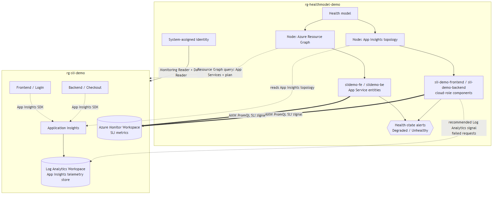

# Azure Monitor Health Model Demo: Checkout/Login application

Builds an Azure Monitor **Health Model (preview)** over the SLI demo (`../01-sli-demo`), discovering the Checkout/Login workload **two ways** (an Azure Resource Graph query and an Application Insights topology rule, each under its own node) and driving entity health from the SLI values in the Azure Monitor Workspace.

*   **Concepts and design process:** [Health-Model-Design-Guide.md](Health-Model-Design-Guide.md)
*   **Step-by-step lab** (prerequisites, run, view, teardown, doc mapping, portal fallback, troubleshooting): [Health-Model-Lab-UserGuide.md](Health-Model-Lab-UserGuide.md)
*   **Upstream SLI demo:** [../01-sli-demo](../01-sli-demo)

---

## Quickstart

One script runs the whole build end to end (Phases 1-6, interactive):

```
cd 02-healthmodel-demo
./healthmodel-run-lab.ps1
```

Deploy the SLI demo and author the SLIs first, and keep traffic running. Health models are region-limited (`Microsoft.CloudHealth`, default `centralus`); the monitored app can live anywhere. The runner calls the two write steps in `src/` (`src/healthmodel-deploy.ps1` at Phase 2, `src/configure-signals-alerts.ps1` at Phase 5); you normally do not run those directly. Full prerequisites, parameters, and options are in the [lab guide](Health-Model-Lab-UserGuide.md).

---

## Architecture



Two discovery nodes find the same Checkout/Login app; the app entities in both nodes get the **Azure Monitor Workspace** PromQL SLI signals (availability, latency), and the App Insights node also carries a **Log Analytics** failed-requests signal. An entity's health is the worst of its signals. See the [design guide](Health-Model-Design-Guide.md) for the reasoning.

> Diagram source: [img/architecture.mmd](img/architecture.mmd). Regenerate the PNG with `npx -p @mermaid-js/mermaid-cli mmdc -i img/architecture.mmd -o img/architecture.png -b white -s 2`.
