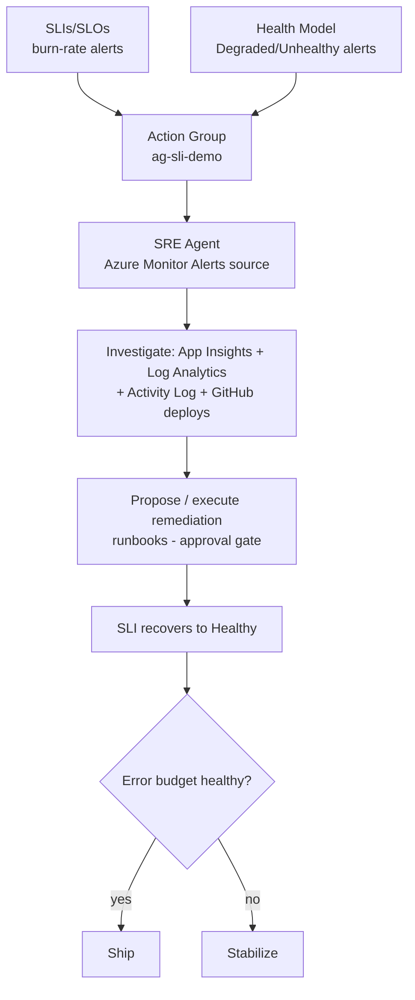

# SRE Agent Demo: Auto-Remediation from SLI and Health Model State

Phase 2 of the reliability kit. When the Checkout/Login workload enters a **Degraded** or **Unhealthy**
state, an Azure Monitor alert drives the **Azure SRE Agent** to investigate and (with approval) run a
safe remediation, then confirm recovery as the SLI returns to Healthy.

This phase is **SRE Agent only** (no Observability Agent, no Azure Monitor Issues). It reuses the alerts
you already emit from the SLI demo ([../01-sli-demo](../01-sli-demo)) and the Health Model demo
([../02-healthmodel-demo](../02-healthmodel-demo)).

- **Trigger:** the SLI burn-rate/baseline alerts and the Health Model Degraded/Unhealthy health-state
  alerts. Both are standard Azure Monitor alerts, which the SRE Agent ingests natively.
- **Actor:** the Azure SRE Agent, scoped to `rg-sli-demo` and `rg-healthmodel-demo`, in **approval-only**
  (Reader) mode. It proposes; a human approves; then it runs a reversible runbook.
- **Region:** the SRE Agent is created in **East US 2** (the workload can live anywhere).

---

## State to response mapping

| State / signal | Source (already deployed) | Severity | SRE Agent response |
| --- | --- | --- | --- |
| SLI **fast burn** (~14x / 1h) | SLI burn-rate alert on the Service Group | Sev1 | Page + investigate immediately |
| Health Model **Unhealthy** (SLI value `< 95`) | `../02-healthmodel-demo` entity alert | Sev1 | Investigate + **execute** an approved remediation on the failing entity |
| Health Model **Degraded** (SLI value `< 99`) | `../02-healthmodel-demo` entity alert | Sev2 | Investigate + **propose** mitigation, notify (no execution) |
| SLI **slow burn** (~3x / 6h) | SLI burn-rate alert | Sev2 | Ticket + weekly review (no urgent remediation) |

The **Unhealthy** health-state alert is the primary remediation trigger because it carries the failing
**entity** (a concrete Azure resource id the agent can act on). Fast burn is the early signal; Degraded
and slow burn are propose-only.

---

## Flow



**How the flow works:**

1. **Signals fire.** SLI burn-rate/baseline alerts and Health Model Degraded/Unhealthy health-state
   alerts route to the shared Action Group `ag-sli-demo`. Both are standard Azure Monitor alerts.
2. **Agent ingests.** Those alerts are the SRE Agent's incident source. The Unhealthy alert is the
   primary remediation trigger because it carries the failing entity (a concrete resource id to act on).
3. **Investigate.** The agent correlates App Insights, Log Analytics, the Activity Log, and recent GitHub
   deployments to form and cite a root-cause hypothesis.
4. **Propose or execute.** It proposes a reversible runbook (reset chaos, restart, scale, or rollback)
   behind an approval gate. In Reader/approval-only mode a human signs off before anything runs.
5. **Recover.** The applied fix brings the SLI value back above threshold and the entity returns to
   Healthy, resolving the alerts.
6. **Decide.** The error-budget gate governs the release call: ship features when the budget is healthy,
   stabilize when it is still burning.

---

## Prerequisites

1. The **SLI demo** deployed and its SLIs authored ([../01-sli-demo](../01-sli-demo)), with traffic running.
2. The **Health Model** deployed with health-state alerts ([../02-healthmodel-demo](../02-healthmodel-demo)).
3. **Azure CLI** signed in; **Owner** or **User Access Administrator** on the subscription.
4. `Microsoft.App` registered; `*.azuresre.ai` allowed through your firewall.
5. SRE Agent region: **Sweden Central, East US 2, or Australia East** (this demo uses East US 2).

---

## Quick start

```powershell
cd 03-sre-agent

# 1. Build the agent via the official IaC templates, validate it is up, and wire the SLI + Health Model
#    alert inputs. Interactive; add -NonInteractive for an unattended pass, or -DryRun for what-if.
#    -SkipRepos skips the optional GitHub connection so the run never pauses for a browser sign-in.
./sre-run-lab.ps1 -SkipRepos

# 2. In sre.azure.com, connect Azure Monitor Alerts as the incident source and GitHub for deploy
#    correlation, and keep the agent Reader/approval-only. (These are the only portal steps.)

# 3. Trigger the agent: enable the fast SLI alert, inject a fault, and watch it engage and remediate.
./sli-alert-scenario.ps1                                           # create alert -> fault -> agent ingests + remediates
#   (or approve the agent's proposal / run ./src/remediation-runbooks/disable-chaos.ps1 as the safe fix)

# Clean up (separate script):
./teardown.ps1 -DeleteResourceGroup
```

The agent itself deploys as code (`Microsoft.App/agents`) via the production templates from
[microsoft/sre-agent](https://github.com/microsoft/sre-agent) (the `azmon-lawappinsights` recipe),
which `sre-run-lab.ps1` orchestrates. It also uploads the app topology and every remediation runbook to
the agent's Knowledge settings (Phase 6.6). A few data-plane connections (incident source, GitHub) are
completed once in the portal (`sre.azure.com`). See the user guide for details.

---

## Repository layout

```
03-sre-agent/
  README.md                          this file
  sre-run-lab.ps1                    interactive runner: build (IaC) + validate + wire alerts + upload knowledge
  sli-alert-scenario.ps1             create the sli-fast-alerts trigger -> inject fault -> agent ingests + remediates
  upload-knowledge.ps1               upload app topology + all runbooks to the agent's Knowledge settings
  teardown.ps1                       delete the agent, optionally its resource group
  SRE-Agent-Lab-UserGuide.md         deploy runner + knowledge/runbooks upload + SLI-alert trigger demo
  knowledge/                         app topology + runbook docs uploaded to Knowledge settings
  src/
    wire-alerts.ps1                  register Microsoft.App; resolve workload; verify alerts
    incident-response-plan.md        agent instructions (the state->response mapping)
    remediation-runbooks/
      disable-chaos.ps1              reset the chaos knobs (primary safe fix)
      restart-backend.ps1            restart the backend App Service
      scale-plan.ps1                 scale the App Service plan (latency relief)
      rollback-deploy.ps1            correlate + guide rollback of the last deployment
```

---

## Guardrails

- **Approval-only (Reader) to start.** The agent proposes; nothing runs without human sign-off.
- Scope the agent to `rg-sli-demo` + `rg-healthmodel-demo` only.
- Remediations are **idempotent and reversible**; execute only on **Unhealthy / fast-burn**, propose on
  Degraded / slow-burn.

---

## Related

- [../01-sli-demo/SLI-Lab-UserGuide.md](../01-sli-demo/SLI-Lab-UserGuide.md) - the SLI foundation (alerts + burn rate).
- [../02-healthmodel-demo/Health-Model-Lab-UserGuide.md](../02-healthmodel-demo/Health-Model-Lab-UserGuide.md) - the health-state alerts that trigger this phase.
- [SRE Agent overview](https://learn.microsoft.com/azure/sre-agent/overview) - [Create agent](https://learn.microsoft.com/azure/sre-agent/create-agent)
