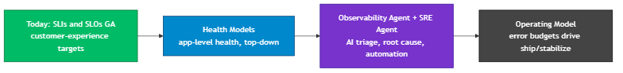
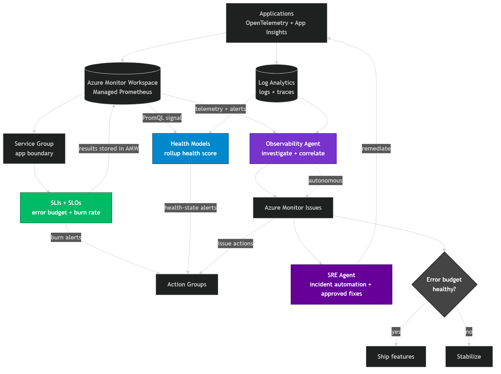
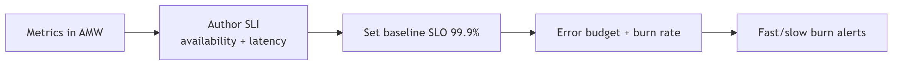
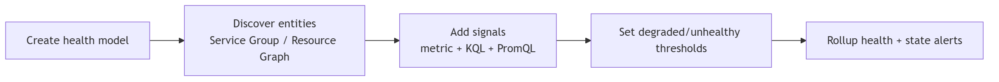
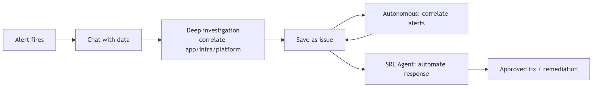
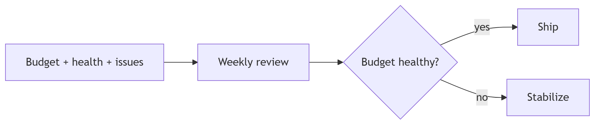

# Observability Path Forward: From SLIs to a Reliability Operating Model

A customer-facing plan for building reliability on Azure, starting from the SLI/SLO foundation you have today and layering in the newest Azure observability capabilities (Health Models, Observability Agent, and AI-assisted operations).

> Audience: platform, SRE, and engineering leadership. Goal: agree on a phased path from "we monitor infrastructure" to "we operate to customer-experience targets, with AI assistance."

**In one line:** Measure reliability the way customers feel it (SLIs/SLOs), roll it into one health score (Health Models), let AI explain and fix incidents (Observability + SRE Agents), with error budgets deciding ship vs. stabilize.

**Pattern:** Leverage the GA'd Azure Monitor SLI engine together with Health Models, the SRE Agent, and the Observability Agent to create one end-to-end observability workflow (measure, roll up, investigate, act).

> Related material in this repo: the SLI/SLO theory and authoring process live in [01-sli-demo/SLI-Design-Guide.md](01-sli-demo/SLI-Design-Guide.md) and the executable [01-sli-demo/SLI-Lab-UserGuide.md](01-sli-demo/SLI-Lab-UserGuide.md); the working demo (apps, infra, load) is under [01-sli-demo/](01-sli-demo/).

---

## 1. The story in one slide

Traditional monitoring tells you what your systems are doing. The path forward is to operate around what your customers experience, prove it against targets, and let AI shorten time-to-resolution.



Each phase reuses the previous one. SLIs feed Health Models, and Health Models focus the Observability Agent.

---

## 1a. Implementation logic flow (all services, high level)

How the services connect end to end: telemetry flows in, SLIs and Health Models score it, the Observability Agent reasons over it, and error budgets govern release decisions.



---

## 1b. Phase-by-phase flow

### Phase 0: SLIs and SLOs (done)



### Phase 1: Health Models



### Phase 2: Observability Agent + SRE Agent



### Phase 3: Operating model



---

## 1c. How the flow works, step by step

This flow shows how to move from monitoring infrastructure to **operating around the customer experience**, with AI assistance. It is a single, connected path rather than separate tools: each stage feeds the next, reusing the telemetry you already collect.

The aim is two outcomes at once:

*   **Reliability** measured the way customers feel it, with clear targets.
*   **Faster resolution** when something breaks, through AI triage and action.

The **error budget** is the connective tissue across both. It is the small amount of failure your SLO allows (at 99.5%, that is 0.5%). **Burn rate** is how fast you are spending it: 1x means you will use exactly the full budget by the end of the window, higher means you will exhaust it early. A burn-rate spike is the trigger that fires alerts, focuses the agents, and flips the release decision from ship to stabilize, so the same number drives both reliability and response.

Why this matters:

*   You should know your **reliability from the customer's point of view**, not just that the servers are up.
*   When an incident hits at 2am, **AI should do the first-pass root cause** so people resolve faster.

1.  **Telemetry in.** Apps emit OpenTelemetry and App Insights data into an Azure Monitor Workspace (metrics) and Log Analytics (logs and traces).
2.  **Score it.** SLIs and SLOs on a Service Group turn that telemetry into customer-experience reliability, with error budgets and burn rate.
3.  **Roll it up.** Health Models read the SLI results (PromQL signal) plus resource signals into one top-down health score.
4.  **Understand fast.** The Observability Agent ingests that telemetry and the burn-rate and health-state alerts directly, investigates, explains the root cause, and saves findings as Azure Monitor issues.
5.  **Notify and act.** Each issue fans out to shared Action Groups (notification, not raw metric noise) and to the SRE Agent, which correlates with code and deployments and applies approved fixes back to the apps.
6.  **Decide.** The error budget gates the call: ship features when healthy, stabilize when burning.

---

## 2. Where you are today (the foundation)

You have already done the hardest part: measuring reliability the way customers feel it.

*   **SLIs and SLOs are generally available** in Azure Monitor and authored at the Service Group level, so reliability is scored per application, not per box.
*   You have **availability and latency SLIs** with a **99.5% baseline**, **error budgets**, and **fast/slow burn-rate alerting**.
*   Telemetry flows through **OpenTelemetry to an Azure Monitor Workspace** (Managed Prometheus) plus **Application Insights** for traces and failures.

This is the bedrock. Everything below builds on it without rework.

---

## 3. The path forward (three moves)

### Move 1: Health Models, give the application a single, honest health score

Health Models roll your SLIs, resource health, and dependency signals into a top-down, application-centric model. Instead of staring at hundreds of metrics, leadership sees one number that reflects the customer, and engineers can drill from "the app is degraded" to the exact failing entity.

*   **Reuse, do not rebuild:** discover entities from the same Service Group your SLIs use, and consume the SLI by pointing an Azure Monitor workspace (PromQL) signal at the destination workspace where SLI results are stored.
*   **Outcome:** faster shared situational awareness, fewer "is it just me?" debates, and a clean executive view.

### Move 2: Observability Agent and SRE Agent, AI-assisted triage, root cause, and automation

Two complementary AI agents. The **Azure Copilot Observability Agent** lives inside Azure Monitor: chat with your data, run deep investigations that correlate application, infrastructure, and Azure platform signals, and preserve findings as Azure Monitor issues. Chat and deep investigation need no provisioning; create an Observability Agent resource only for autonomous alert correlation. The **Azure SRE Agent** is the action-taking partner: it picks up incidents, correlates with deployments and source code, automates response, and applies approved fixes across the estate. Observability Agent explains what is wrong; SRE Agent helps fix it.

*   **Reduces MTTR:** the agent does the first 20 minutes of investigation before a human joins.
*   **Knowledge leveling:** junior on-call gets senior-level correlation automatically.
*   **Outcome:** error-budget burn is stopped sooner, which directly protects the SLO.

### Move 3: Operating model, error budgets drive ship vs. stabilize

The capstone: budgets become a decision tool. Budget healthy means ship features; budget burning means stabilize. Health Models and the agent supply the evidence.

---

## 4. Phased roadmap

| Phase | Focus | Key actions | Outcome |
| --- | --- | --- | --- |
| 0 (done) | SLI foundation | SLIs/SLOs, error budgets, burn alerts on Service Group | Customer-experience reliability is measurable |
| 1 | Health Models | Build app health model from existing SLIs + resource health | One honest health score, faster triage |
| 2 | AI operations | Onboard Observability Agent + SRE Agent to top services | Lower MTTR, protected error budget |
| 3 | Operating model | Budgets gate releases; reviews use models + agent | Reliability runs as a managed practice |

---

## 5. At a glance: the four services

### SLIs and SLOs

**What:** Measure reliability the way customers feel it (availability, latency) against a target.  
**Helps:** Turns "feels reliable" into a number, with error budgets and burn-rate alerts.  
**Azure service:** Azure Monitor SLIs on a Service Group.

### Health Models

**What:** One top-down health score for the whole app, built from your SLIs and resource signals.  
**Helps:** See app health at a glance, drill to the failing entity, alert on state not noise.  
**Azure service:** Azure Monitor health models (PromQL/KQL/metric signals).

### Observability Agent

**What:** AI in Azure Monitor that chats with your data and runs deep investigations.  
**Helps:** Explains what is wrong and why, saves findings as issues, no setup to start.  
**Azure service:** Azure Copilot Observability Agent.

### SRE Agent

**What:** AI partner that takes action on incidents across the estate.  
**Helps:** Correlates with code and deployments, automates response, applies approved fixes.  
**Azure service:** Azure SRE Agent.

---

## 6. How each phase is done (validated against Azure docs)

This is the implementation plan, not theory. Every step below maps to a current Microsoft Learn procedure (links inline).

### Phase 0 (done): SLIs and SLOs on a Service Group

Confirming you are standing on documented ground, this is exactly the supported flow:

1.  Ensure prerequisites: a Service Group, a source Azure Monitor workspace with metrics, a destination workspace for results, and a user-assigned managed identity. Minimum roles: Monitoring Reader on source; Monitoring Reader + Monitoring Metrics Publisher on destination; Monitoring Reader on the destination default DCR.
2.  Service group, then Monitor, then Monitoring, then Service Level Indicators and Objectives.
3.  Basics tab: name + SLI type (Availability or Latency). SLI tab: Request-based or Window-based, identity, source/destination workspaces, good/total signals. Baseline + Alert tab: enter Baseline (SLO) %, Evaluation period, enable Baseline alert + Fast burn + Slow burn, attach action groups.

*   Docs: [Create SLIs](https://learn.microsoft.com/azure/azure-monitor/fundamentals/service-level-indicators-create) · [Monitor service groups](https://learn.microsoft.com/azure/governance/service-groups/monitoring)

### Phase 1: Health Models, app-level health over your SLIs

1.  Permissions: Contributor on the RG to create; identities (system or user-assigned) need Monitoring Reader on monitored resources and on the Log Analytics / Azure Monitor workspaces.
2.  Health Models, then Create: pick subscription, RG, region, name; set Identity; add tags.
3.  Populate entities: manually add resources, or auto-discover via Azure Resource Graph query, an Application Insights resource, or your Service Group, so it reuses the same boundary as your SLIs.
4.  Add signals per entity in the designer: Azure resource metric (platform metrics), Log Analytics signal (KQL), Azure Monitor workspace signal (PromQL). To consume an SLI, point an **Azure Monitor workspace (PromQL) signal at the destination workspace where the SLI engine stores its evaluated results**, then set Degraded and Unhealthy thresholds against that value (there is no native SLI signal type; the link is via the stored SLI result metric). Save reusable signal definitions.
5.  Alert on health state (rollup) instead of single signals, reusing existing action groups; validate transitions in Graph/Timeline.

How SLIs feed the model: SLI results are written to a destination Azure Monitor workspace ([SLI prerequisites](https://learn.microsoft.com/azure/azure-monitor/fundamentals/service-level-indicators-create#prerequisites)); a health model Azure Monitor workspace signal queries that workspace with PromQL ([Signals](https://learn.microsoft.com/azure/azure-monitor/health-models/signals)); health models query data Azure Monitor already collects rather than re-collecting it ([Concepts](https://learn.microsoft.com/azure/azure-monitor/health-models/concepts#signals)).

**The literal PromQL signal (verified against the deployed demo workspace).** The SLI engine writes `<SLI>:Value`, `<SLI>:Good`, and `<SLI>:Total` to the destination workspace. In Prometheus these surface as fully qualified names of the form `ns::<servicegroup>/m::<sli>:value`. For the `CheckoutSG` demo, the Health Model AMW signal query is:

```
{__name__="ns::checkoutsg-ioarvugvrpkmc/m::checkoutavailabilitysli:value"}
```

This returns the SLI percentage. Set the signal operator to "below" so lower is worse, for example Degraded `< 99.9` and Unhealthy `< 99.5`. Repeat per SLI (`loginlatencysli:value`, `paymentdependencysli:value`). The namespace is the service group name lowercased; the suffix (`ioarvugvrpkmc`) is your workspace instance and differs per tenant (confirm the exact name in metrics explorer on the destination workspace).

Docs: [Overview](https://learn.microsoft.com/azure/azure-monitor/health-models/overview) · [Create](https://learn.microsoft.com/azure/azure-monitor/health-models/create) · [Signals](https://learn.microsoft.com/azure/azure-monitor/health-models/signals) · [Signals tutorial](https://learn.microsoft.com/azure/azure-monitor/health-models/tutorial-signals)

### Phase 2: Observability Agent and SRE Agent, AI triage, root cause, and automation

Both agents are in scope: the **Observability Agent** (Azure Monitor) for investigation and the **SRE Agent** for action-taking.

Observability Agent:

1.  Access: users need Azure Copilot access; chat and deep investigation require no resource provisioning. English only; conversations expire after 24 hours.
2.  Chat with your data: from a resource (for example Application Insights Logs), ask natural-language questions over logs/metrics/traces; context stays scoped to that resource.
3.  Deep investigation: correlates application, infrastructure, and platform signals (optimized for AKS, App Insights, VMs), returns findings + next steps; save as an Azure Monitor issue.
4.  Autonomous operations (preview): create an Observability Agent resource, add custom instructions, let it correlate alerts into higher-signal issues (triage only, no resolve).

SRE Agent:  
5\. Prereqs: `Microsoft.App` registered; Owner or User Access Administrator on the subscription; allow `*.azuresre.ai`; region Sweden Central, East US 2, or Australia East.  
6\. sre.azure.com, then Create agent: subscription, RG, name, region, App Insights. Select resource groups; choose Reader so actions need approval.  
7\. Connect source code (GitHub/Azure DevOps) and incident platforms (Azure Monitor Alerts / PagerDuty / ServiceNow); it forms/validates hypotheses, cites evidence, and applies fixes only on approval.

*   Docs: [Observability Agent overview](https://learn.microsoft.com/azure/azure-monitor/aiops/observability-agent-overview) · [Deep investigations](https://learn.microsoft.com/azure/azure-monitor/aiops/observability-agent-deep-investigations) · [Issues](https://learn.microsoft.com/azure/azure-monitor/aiops/issues-overview) · [SRE Agent overview](https://learn.microsoft.com/azure/sre-agent/overview) · [Create SRE agent](https://learn.microsoft.com/azure/sre-agent/create-agent)

### Phase 3: Operating model

Burn-rate and health-state alerts gate releases; SRE Agent does first triage; weekly reviews read budgets, health rollup, and incident analytics. No new tooling, just the practice on top of phases 0 to 2.

---

## 6a. Hands-on labs

Two executable, command-by-command labs let you build phases 0 and 1 against the demo app (or your own, by substituting resource names). Both are reusable templates with the Checkout/Login demo filled in as the worked example.

*   **SLI/SLO Design Lab** ([01-sli-demo/SLI-Lab-UserGuide.md](01-sli-demo/SLI-Lab-UserGuide.md)) — takes you from a running app to three authored SLIs. You enumerate every user journey, score them for criticality, collect the evidence for each SLI (source metric, current performance, signal continuity, good/valid definition), fill a design checklist, author each SLI in the portal field-by-field, and validate end to end with PromQL. Worked result: `CheckoutAvailabilitySLI` (availability), `LoginLatencySLI` (latency), `PaymentDependencySLI` (dependency). Pair it with [01-sli-demo/SLI-Design-Guide.md](01-sli-demo/SLI-Design-Guide.md) for the theory.
*   **Health Model Lab** ([02-healthmodel-demo/Health-Model-Lab-UserGuide.md](02-healthmodel-demo/Health-Model-Lab-UserGuide.md)) — builds an Azure Monitor health model over the same app: create the model, discover the app as entities, add signals (including an **Azure Monitor workspace PromQL signal that consumes the SLI results** written by the SLI engine), set Degraded/Unhealthy thresholds, configure health-state alerts, and view the rollup. This is where SLIs feed the health score. Pair it with [02-healthmodel-demo/Health-Model-Design-Guide.md](02-healthmodel-demo/Health-Model-Design-Guide.md) for the theory.

The labs connect: the Health Model Lab reads the very SLI result metrics (`ns::<servicegroup>/m::<sli>:value`) that the SLI/SLO lab produces, so run the SLI lab first.

---

## 7. What we ask of the customer

*   Agree the **top 3 services** to model first (start where revenue/customer impact is highest).
*   Nominate an **SRE/platform owner** per service to own SLOs and budgets.

## 8. Measures of success

*   Reliability: SLO attainment up, burn-alert false positives down.
*   Speed: MTTR down with agent-assisted triage.
*   Adoption: error budgets referenced in release decisions.

---

_Built on the SLI/SLO demo and GA blog in this workspace. Health Models and Observability Agent reuse the same Service Group, OpenTelemetry, and Azure Monitor Workspace you already deployed._

_Flow direction: SLIs feed Health Models, the agents investigate telemetry and act on the issues they raise, and error budgets decide ship or stabilize._
