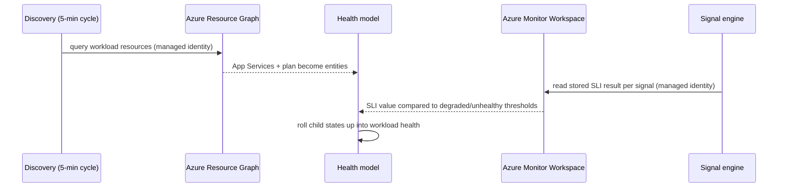
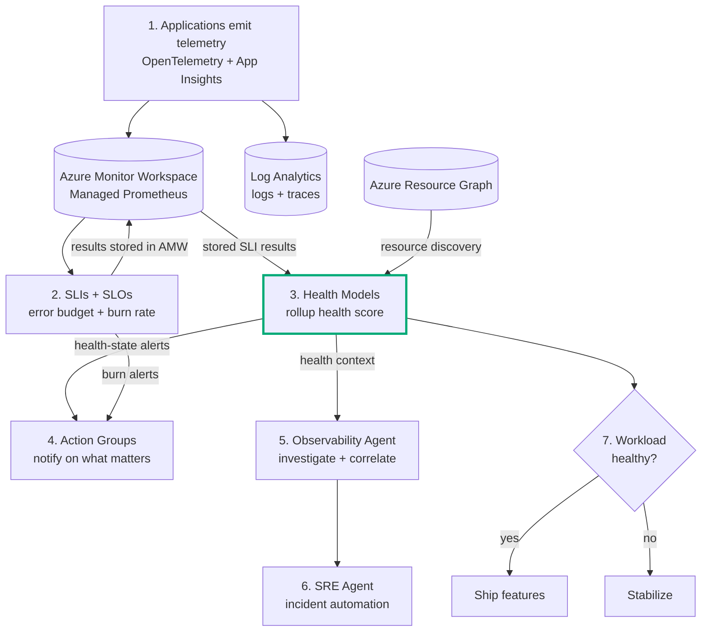

# Resiliency Starter Kit: Roll Up Reliability with Azure Monitor Health Models

A hands-on follow-on to the [SLI/SLO starter kit](https://github.com/jvargh/azure-reliability-starter-kit/blob/main/blog/resiliency-starter-kit-sli-slo-on-azure-monitor.md). That kit gave you customer-experience reliability as numbers: SLIs on a Service Group, error budgets, and burn-rate alerts. This kit answers the next question a team asks once it has many good signals: **"so is the workload healthy right now, as one state, and what is dragging it down?"**

It moves from a real operational pain point, through a health-model architecture, into standing up the model, deciding what to represent, discovering the app, tapping the SLI metrics as signals, alerting on health state, and validating it end to end. Everything is grounded in the same runnable e-commerce demo and two companion documents in this repo: the [Health Model Design Guide](https://github.com/jvargh/azure-reliability-starter-kit/blob/main/healthmodel-demo/Health-Model-Design-Guide.md) (theory and process) and the [Health Model Lab](https://github.com/jvargh/azure-reliability-starter-kit/blob/main/healthmodel-demo/Health-Model-Lab.md) (the executable, command-by-command version).

The through-line: an app already emits telemetry and SLIs, discovery turns that app into **entities**, **signals** score each entity, health **rolls up** across dependencies into one state, and **state-change alerts** replace per-metric noise.

This blog is the high-level pass; the [Health Model Lab](https://github.com/jvargh/azure-reliability-starter-kit/blob/main/healthmodel-demo/Health-Model-Lab.md) is the command-by-command version. Every Lab part maps to a section here, so you can drop into the Lab for exact commands at any point:

| Lab part | Covered in this blog |
| --- | --- |
| Part 0 - environment setup + prerequisites | 4. Stand up the platform |
| Part 1 - create the health model + identity | 6.1 Create the model |
| Part 2 - discover the app as entities | 6.2 Discover the app |
| Part 3 - tap the stored SLI results as signals | 7. Configure signals |
| Part 4 - configure health-state alerts | 8. Configure alerts |
| Part 5 - view and validate | 9. Validate end-to-end |
| Part 6 - teardown | 11. Repository layout (cleanup) |

> **Prerequisite:** this kit builds on the deployed SLI demo. If you have not run it yet, start with the [SLI/SLO starter kit](https://github.com/jvargh/azure-reliability-starter-kit/blob/main/blog/resiliency-starter-kit-sli-slo-on-azure-monitor.md), then come back: the health model discovers that app's **Azure resources** and taps its **Azure Monitor Workspace**, where the evaluated SLI results are stored.

---

## 1. The problem: many signals, no single health state

The SLI kit gave you good numbers. But a mature workload has *many* good numbers: an availability SLI, a latency SLI, a dependency SLI, plus resource metrics, plus log queries. When something breaks, they all move at once and each fires its own alert. The on-call engineer gets ten notifications for one incident and still cannot answer the only question that matters at 2 a.m.: **is the checkout workload healthy, and if not, what is the root component?**

Alert-based monitoring is noisy (one incident, many alerts), local (each alert knows nothing about the others), and stateless (nothing says "the workload is unhealthy right now"). You are left correlating by hand under pressure.

A **health model** closes that gap. It assigns a **health state** to each component (entity), combines an entity's own signals with the health of the things it depends on, and rolls the result up into one score for the workload. The ten alerts become one state change on one entity, with the dependency graph showing the blast radius.

| Symptom | What you get without a health model | What a health model gives you |
| --- | --- | --- |
| Checkout degrades | Availability alert + 5xx alert + dependency alert, all separate | Checkout entity goes **Degraded**, one alert, upstream entities show the ripple |
| Is the workload OK? | Scan many dashboards and alerts | One rolled-up state on the workload root |
| Where is the root cause? | Manual correlation | The graph highlights the unhealthy child |

**What success looks like**

*   You can see one health state for the whole workload, not a wall of alerts.
*   Each entity's state is explainable by its signals and its dependencies.
*   You alert on state changes, not on every metric that twitches.

---

## 2. What the app does

The demo is the same mission-critical online store from the SLI kit, deliberately small so the reliability mechanics are the star. Nothing new to deploy for the app itself.

| Journey | User goal | Path | Dependency |
| --- | --- | --- | --- |
| Checkout | Complete a purchase | `/checkout` via `/api/checkout` | Payment provider |
| Login | Sign in to the store | `/login` via `/api/login` | none |
| Payment | Charge the customer | called inside checkout | simulated provider |

Two Node.js services (a **frontend** and a **backend**, both App Service Linux) are deployed as Azure resources and emit Prometheus metrics that the SLI engine evaluates into an **Azure Monitor Workspace** (where the SLI results are stored). That is exactly what the health model consumes: it discovers the App Service **resources** as entities, and reads the **stored SLI results** in the workspace as signals.

---

## 3. The architecture

### 3.1 Component layout

The health model lives in its **own resource group** and references the SLI app across resource groups. It is served by the `Microsoft.CloudHealth` provider (preview).

| Resource | Purpose |
| --- | --- |
| Health model (`Microsoft.CloudHealth/healthmodels`) | The model: entities, signals, relationships, alerts |
| System-assigned managed identity | Runs discovery and queries data sources |
| Authentication setting (`system-assigned`) | Binds the identity to discovery and signal queries |
| Resource Graph discovery | Imports the workload's App Services (frontend, backend, collector, proxy) and plan as entities; excludes alert rules and smart detectors |
| Azure Monitor Workspace (from the SLI kit) | Stores the evaluated SLI results (`ns::.../m::<sli>:value`) that the signals read |
| Action Group (optional) | Notification target for health-state alerts |

> **Screenshot placeholder:** the health model **Graph view** with the `hm-checkout-demo` root, the discovery container, and the discovered `slidemo-be` / `slidemo-fe` App Service entities (Checkout and Login).
>
> ``

### 3.2 How the model taps the SLI foundation

The health model does not collect new telemetry. It reads what the SLI kit already produces: entities come from an **Azure Resource Graph** query (the workload's Azure resources), and signals read the **stored SLI results** in the same Azure Monitor Workspace, so the model and the SLIs report the same numbers.



### 3.3 End-to-end reliability workflow

Health models are step 3 of the broader operating model. Because everything hangs off the same Service Group and Azure Monitor Workspace, the model layers on top of the SLI foundation without rework, and the AI agents layer on top of it later.



1.  **Telemetry in.** Apps emit OpenTelemetry (metrics) and App Insights (traces + topology).
2.  **Score it.** SLIs turn telemetry into customer-experience reliability with error budgets.
3.  **Roll it up (this kit).** Health models discover the workload's Azure resources as entities and read the stored SLI results as signals, then combine them into one health state.
4.  **Alert on what matters.** Health-state alerts fire through shared Action Groups, not raw metric noise.
5.  **Understand fast.** (Later) The Observability Agent uses the health context to correlate and investigate.
6.  **Act.** (Later) The SRE Agent takes approved remediation on incidents.
7.  **Decide.** Rolled-up health gates the ship-or-stabilize call.

**Scope of this blog:** step 3 (health models), plus the state-based alerting in step 4. Steps 1 and 2 come from the SLI kit; steps 5 and 6 are the roadmap in section 12.

**What success looks like**

*   You can trace the path from an Azure resource to an entity, and from a stored SLI result to a signal.
*   The model reuses the SLI workspace, so its numbers match your SLIs.

---

## 4. Stand up the platform

Everything after this queries a live model, so make sure the SLI demo is deployed and has traffic, then create the health model.

**Prerequisites (from the SLI kit):**

```powershell
# Confirm the workload resources + SLI workspace exist in the SLI resource group
az resource list -g rg-sli-demo --resource-type 'Microsoft.Web/sites'        --query "[].name" -o tsv   # App Services (the app)
az resource list -g rg-sli-demo --resource-type 'Microsoft.Monitor/accounts' --query "[].name" -o tsv   # Azure Monitor Workspace (SLI results)
```

Keep the SLI traffic generator running so signals report values instead of `Unknown`:

```powershell
pwsh -File ../sli-demo/load/generate-traffic-all.ps1 -Rps 30
```

Then create the health model, its identity, and read access to the app in one script:

```powershell
cd healthmodel-demo
./deploy.ps1        # -ResourceGroup rg-healthmodel-demo -Location centralus -SliResourceGroup rg-sli-demo
```

`deploy.ps1` creates the resource group, registers `Microsoft.CloudHealth`, creates the model with a system-assigned identity, grants it **Monitoring Reader** on the SLI resource group, and sets up a **Resource Graph discovery** scoped to the workload's App Services and plan. It prints the model's portal URL.

> Health models are region-limited (uksouth, canadacentral, centralus, swedencentral, southeastasia, switzerlandnorth, italynorth, northeurope, germanywestcentral, australiaeast). The monitored app can live anywhere; the SLI demo uses `eastus2`.

**What success looks like**

*   `deploy.ps1` reports the model provisioned and prints its portal link.
*   `az monitor health-models show` returns `provisioningState: Succeeded`.

---

## 5. Decide what to model

You cannot build a useful health model by dumping every resource into it. Decide, in order, what entities matter, what signals prove each is healthy, how their states combine, and which state changes deserve an alert. The [Design Guide](https://github.com/jvargh/azure-reliability-starter-kit/blob/main/healthmodel-demo/Health-Model-Design-Guide.md) explains the reasoning; the [Lab](https://github.com/jvargh/azure-reliability-starter-kit/blob/main/healthmodel-demo/Health-Model-Lab.md) turns it into commands. The chain, where each link is forced by the one before it:

```
Entity -> Signal -> Health state -> Relationship -> Rollup -> Alert
```

### 5.1 Entities: what do you care about the health of?

An entity is a node: an Azure resource (an App Service) or a logical component (a user flow). You rarely hand-author them. A **discovery rule** populates the model and keeps it current on a fixed 5-minute cycle. Three kinds:

| Discovery kind | Imports | Best for |
| --- | --- | --- |
| Application Insights topology | Components + dependencies from an App Insights resource | Application-centric workloads (this demo) |
| Resource graph query | Azure resources matching a KQL query | Scope by type / RG / subscription / tag |
| Service group | Members of a service group | Service-group-organized workloads (for example the SLI `CheckoutSG`) |

The demo uses a **Resource Graph query** scoped to the workload's Azure resources: the App Services (frontend, backend, OTel collector, remote-write proxy) and their App Service plan. That keeps the model **resource-only**: alerting artifacts (alert rules, smart detectors) and App Insights cloud-role duplicates are never modeled, because they have no runtime health that reflects the workload.

### 5.2 Signals: prove each entity is healthy

A signal samples data and compares it to a **degraded** and an **unhealthy** threshold. Three types, one data source per type per entity:

| Signal type | Data source | Use it for |
| --- | --- | --- |
| Azure resource | A platform metric (CPU, Http5xx) | Infra health, no query to write |
| Log Analytics workspace | A KQL query returning one number | Log-derived health (error counts) |
| Azure Monitor workspace | A **PromQL** query returning one number | Prometheus / SLI-style metrics |

The kit uses the **Azure Monitor workspace** type to tap the SLI metrics directly, so the health signal and the SLI are the same measurement.

### 5.3 Thresholds and rollup

Thresholds are integers, so this kit expresses every SLI signal as a **compliance percentage** where higher is better and uses `LessThan`: **degraded < 99**, **unhealthy < 95**. A ~99.9% SLI reads Healthy, a dip below 99% is Degraded, below 95% is Unhealthy.

*   **Request-based SLIs** (Checkout availability, Payment dependency) publish `:value` already as a percentage, so the signal reads it directly.
*   **Window-based SLIs** (Login latency) publish `:value` as the raw measurement (seconds) plus `:uptime`/`:downtime` window counts, so the signal computes the compliance percentage `100 * uptime / (uptime + downtime)`.

**Rollup** combines a parent's own signals with its children's health (worst-of, minimum-healthy, or maximum-not-healthy), so one failing dependency degrades the workload.

### 5.4 Alert strategy

Alert on **state change**, not per metric. Enable Degraded, Unhealthy, or both, per entity, with a severity and optional action groups. One state change replaces the pile of per-metric alerts.

**What success looks like**

*   A short list of entities that matter, populated by discovery, not by hand.
*   One or two signals per entity that map to real customer pain.
*   Thresholds whose direction and integer scaling are deliberate.

---

## 6. Build the model

### 6.1 Create the model and identity

`deploy.ps1` already did this in section 4: a health model with a system-assigned identity and Monitoring Reader on the SLI resource group. Under the hood it is the first-class CLI plus one role assignment:

```powershell
$hm = az monitor health-models create -g rg-healthmodel-demo -n hm-checkout-demo -l centralus --system-assigned -o json | ConvertFrom-Json
az role assignment create --assignee-object-id $hm.identity.principalId --assignee-principal-type ServicePrincipal `
  --role 'Monitoring Reader' --scope (az group show -n rg-sli-demo --query id -o tsv)
```

### 6.2 Discover the app as entities

`deploy.ps1` creates an **authentication setting** bound to the identity and a **Resource Graph discovery rule** scoped to the workload's Azure resources:

```kql
resources
| where resourceGroup =~ 'rg-sli-demo'
| where type in~ ('microsoft.web/sites','microsoft.web/serverfarms')
```

Recommended and Resource Health signals are disabled on the rule, so discovery adds only the entities (health comes from the signals in section 7). After ~5 minutes the entities appear:

```powershell
az monitor health-models entity list -g rg-healthmodel-demo --health-model-name hm-checkout-demo `
  --query "[].properties.displayName" -o tsv
```

Expected: the frontend/backend App Services (`slidemo-fe-...` Login, `slidemo-be-...` Checkout), the OTel collector and remote-write proxy App Services, and the App Service `plan`. No alert rules, smart detectors, or App Insights cloud-role duplicates.

> **Screenshot placeholder:** the **Discovery** blade showing the Resource Graph rule as `Succeeded`, and the entity list populated with the workload's App Services and plan.
>
> ``

**What success looks like**

*   The discovery rule provisions `Succeeded`.
*   The workload's App Services and plan are listed as entities; no alert rules or smart detectors.

---

## 7. Configure signals: tap the stored SLI results

This is the heart of the kit: attach **Azure Monitor workspace signals** to the App Service entities that read the **evaluated SLI results the SLI engine stored** in the workspace (`ns::<servicegroup>/m::<sli>:value`), so the health model and the SLIs report the exact same number. One script does it:

```powershell
./configure-signals-alerts.ps1
```

It grants the identity **Monitoring Reader** on the Azure Monitor Workspace, discovers the three published SLI series, and maps all three SLIs onto the two app entities (Checkout depends on Payment, so both live on the backend):

| Entity | SLI signal | Reads | Degraded | Unhealthy |
| --- | --- | --- | --- | --- |
| `slidemo-be-...` (Checkout) | Checkout availability SLI | `...m::checkoutavailabilitysli:value` | `< 99` | `< 95` |
| `slidemo-be-...` (Checkout) | Payment dependency SLI | `...m::paymentdependencysli:value` | `< 99` | `< 95` |
| `slidemo-fe-...` (Login) | Login latency SLI | `100 * uptime / (uptime + downtime)` from `...m::loginlatencysli:*` | `< 99` | `< 95` |

Each query wraps the series in `last_over_time({__name__="..."}[1h])` so a brief idle gap between traffic and the next SLI evaluation does not error the signal. Because the series names contain `/` and `::`, they are queried with the `{__name__="..."}` form.

Attaching a signal to a discovered entity is a preserve-and-PUT: the script keeps the entity's exact `azureResourceId` (a full replace that changes it is rejected for dynamic entities), disables the entity's unsupported Resource Health signal, drops the recommended resource metric, and PUTs the `azureMonitorWorkspace` signals plus alerts. See the [Lab, Part 3](https://github.com/jvargh/azure-reliability-starter-kit/blob/main/healthmodel-demo/Health-Model-Lab.md) for the detail.

> **Screenshot placeholder:** the Checkout entity's **Signals** tab showing the Checkout availability SLI and Payment dependency SLI (Azure Monitor workspace signals), both Healthy at ~99.9%.
>
> ``

### 7.1 Keep the model clean and green

`configure-signals-alerts.ps1` also does three things so the workload rolls up to one honest green state:

*   **Disables** the discovery rule's recommended and Resource Health signals, so noisy auto-signals (a "failed requests" log query that trips at >0, or Resource Health that reads Unknown on non-Premium App Service plans) are never added.
*   **Adds an uptime signal** to the supporting resources (OTel collector, remote-write proxy, App Service plan). It **detects the App Service plan tier**: on **Basic or higher** it prefers the built-in **Azure Resource Health** availability signal; on **Free/Shared** (where Resource Health is unsupported) it falls back to a platform-metric signal — **HTTP 2xx** for the App Services (serving 2xx = up) and **CPU %** for the plan. They stay `impact = Standard`, so a genuinely down pipeline resource shows up in the rollup.
*   **Links the model root** to the discovery container entity, so the app entities' health rolls up into `hm-checkout-demo` (otherwise the root reads Unknown).

**What success looks like**

*   The backend entity carries the Checkout availability + Payment dependency SLI signals; the frontend carries the Login latency SLI.
*   With traffic flowing, all three read a value (not `Unknown`) that matches the SLI numbers, and the root is green.

---

## 8. Configure alerts

Health model alerts fire when an **entity changes state**, not per raw metric. `configure-signals-alerts.ps1` sets an `alerts` block on each app entity on the same PUT:

| State | Severity | Fires when |
| --- | --- | --- |
| Degraded | `Sev2` | the entity enters Degraded |
| Unhealthy | `Sev1` | the entity enters Unhealthy |

Attach an action group (optional, up to five) to notify:

```powershell
./configure-signals-alerts.ps1 -ActionGroupId "/subscriptions/<sub>/resourceGroups/<rg>/providers/Microsoft.Insights/actionGroups/<ag>"
```

Because the entity state already correlates its signals and children, one health-state alert replaces the pile of per-metric alerts from section 1.

> **Screenshot placeholder:** the entity's **Alerts** tab with Degraded (Sev2) and Unhealthy (Sev1) enabled.
>
> ``

**What success looks like**

*   Both app entities have Degraded and Unhealthy alerts enabled.
*   A single state change produces one alert, not ten.

---

## 9. Validate end-to-end

A configured model is not a working model. Prove the pieces are in place and evaluating.

```powershell
# Model state
az monitor health-models show -g rg-healthmodel-demo -n hm-checkout-demo `
  --query "{name:name,location:location,state:properties.provisioningState,identity:identity.type}" -o jsonc

# The Checkout (backend App Service) entity: SLI signals + alerts
$name = (az monitor health-models entity list -g rg-healthmodel-demo --health-model-name hm-checkout-demo -o json | ConvertFrom-Json |
  Where-Object { $_.properties.displayName -like '*-be-*' -and $_.properties.displayName -notlike '*-plan' }).name
$e = az monitor health-models entity show -g rg-healthmodel-demo --health-model-name hm-checkout-demo --entity-name $name -o json | ConvertFrom-Json
$e.properties.signalGroups.azureMonitorWorkspace.signals     # Checkout availability + Payment dependency SLI signals
$e.properties.alerts                                         # Degraded/Unhealthy
```

In the portal, open the health model > **Graph view** to see the App Services with their current state, then drill into an entity for its **Signals** and **Alerts** tabs and the **Timeline** view of state over time.

> **Screenshot placeholder:** the **Timeline view** of an entity's health state over the last few hours, showing a Healthy-to-Degraded transition when a service is degraded.
>
> ``

**What success looks like**

*   The model is `Succeeded` and entities show a live state (not `Unknown`) under traffic.
*   The backend App Service entity carries the Checkout availability + Payment dependency SLI signals and both alerts, and the root is green.

---

## 10. Operate: one state, faster triage

This is where the model earns its keep.

**Light up the UI first.** With no traffic the SLI signals read `Unknown`. Start the SLI traffic generator so the SLI engine keeps publishing and the health model turns green:

```powershell
pwsh -File ../sli-demo/load/generate-traffic-all.ps1 -Rps 30
```

Within a minute the **Graph view** shows the app App Services and the workload root green, and each entity's **Timeline** fills with a healthy band. Now reuse the SLI kit's degradation knob (the backend chaos endpoint, see [load/inject-degradation.md](https://github.com/jvargh/azure-reliability-starter-kit/blob/main/sli-demo/load/inject-degradation.md)) while traffic runs, and watch the model react:

| Degrade | Signal that moves | Entity state | Alert |
| --- | --- | --- | --- |
| `checkout` errorRate `0.08` | Checkout availability SLI drops below 95% | Checkout -> **Unhealthy** | Unhealthy (Sev1) |
| `login` extraLatencyMs `600` | Login latency SLI compliance drops | Login -> **Unhealthy** | Unhealthy (Sev1) |
| set rates back to `0` | signals recover | entities -> **Healthy** | alert resolves |

The payoff: instead of three separate metric alerts, you see one entity turn red on the graph, the workload root reflect it via rollup, and one state-change alert fire, then resolve on recovery. Triage starts from "which entity is red and what does it depend on?" rather than from a pile of correlated-by-hand notifications.

**What success looks like**

*   Degrading one service turns exactly one entity Unhealthy and rolls up to the workload.
*   One state-change alert fires and then resolves, instead of a burst of metric alerts.

---

## 11. Repository layout

Everything for this kit is under `healthmodel-demo/`, next to the SLI demo it builds on:

```
healthmodel-demo/
  README.md                     overview + quick start
  Health-Model-Design-Guide.md  theory: entities, signals, rollup, discoveries, alerts
  Health-Model-Lab.md           executable, command-by-command lab
  deploy.ps1                    create model + identity + role + Resource Graph discovery
  configure-signals-alerts.ps1  AMW Monitoring Reader + SLI-result signals + alerts + suppress infra + root link
  teardown.ps1                  delete model + remove role assignments
sli-demo/                       the SLI kit this builds on (app, infra, AMW, SLIs)
```

Cleanup when you are done (the SLI demo is never touched):

```powershell
cd healthmodel-demo
./teardown.ps1 -DeleteResourceGroup
```

Start with the Design Guide to build intuition, then run the Lab against your deployed SLI app.

---

## 12. Next steps: from health model to reliability operating model

The health model turns many signals into one honest state. Because it hangs off the same Service Group and Azure Monitor Workspace as the SLIs, the next moves layer on without rework:

| Phase | Move | Outcome |
| --- | --- | --- |
| Done | **SLIs + error budgets** (the SLI kit) | Customer-experience reliability as numbers |
| This kit | **Health Models** over your SLIs and resources | One rolled-up health score, faster triage |
| Next | **Observability Agent + SRE Agent** | Lower MTTR, protected error budget |
| Then | **Operating model** | Health and budgets gate releases as a managed practice |

The Observability Agent uses the health context to correlate alerts and run deep investigations; the SRE Agent takes action on incidents and applies approved fixes. The [repo README](https://github.com/jvargh/azure-reliability-starter-kit/blob/main/README.md) has the full phased roadmap.

### Call to action

1.  Read the [Health Model Design Guide](https://github.com/jvargh/azure-reliability-starter-kit/blob/main/healthmodel-demo/Health-Model-Design-Guide.md) to internalize the chain from entity to alert.
2.  Make sure the [SLI demo](https://github.com/jvargh/azure-reliability-starter-kit/blob/main/blog/resiliency-starter-kit-sli-slo-on-azure-monitor.md) is deployed with traffic flowing.
3.  Run `healthmodel-demo/deploy.ps1` to create the model and discover the app's Azure resources, then `configure-signals-alerts.ps1` to tap the stored SLI results and turn on health-state alerts.
4.  Degrade one service, watch a single entity turn Unhealthy and roll up to the workload, and let one state change (not ten metric alerts) tell you what to fix.

Model the entities that matter, let signals score them, and let one health state drive triage. Reliability stops being a wall of alerts and becomes a single, explainable score.
