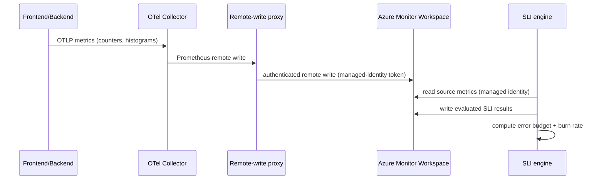
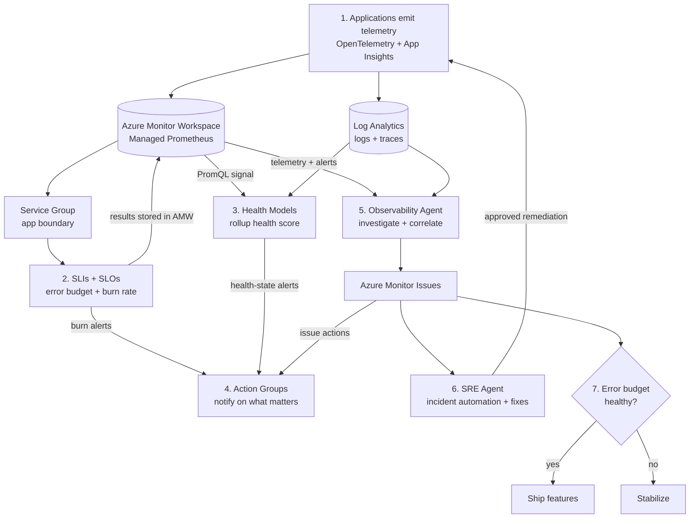

# Resiliency Starter Kit: Design and Ship SLIs and SLOs on Azure Monitor

A hands-on starter kit for teams that want to stop guessing whether a service is healthy and start measuring reliability the way customers actually feel it. It moves from a real operational pain point, through a working architecture, into standing up the platform, deciding what to measure, authoring the measurements, validating them, and operating on them day to day. Everything is grounded in a runnable e-commerce demo and two companion documents in this repo: the [SLO/SLI Design Guide](https://github.com/jvargh/azure-reliability-starter-kit/blob/main/sli-demo/SLO-SLI-Design-Guide.md) (theory and process) and the [SLO/SLI Design Lab](https://github.com/jvargh/azure-reliability-starter-kit/blob/main/sli-demo/SLO-SLI-Design-Lab.md) (the executable, command-by-command version).

The through-line is simple: an app emits metrics, those metrics become SLIs on a Service Group, SLIs produce error budgets, and burn-rate alerts on those budgets tell you when to ship and when to stabilize.

This blog is the high-level pass; the [Design Lab](https://github.com/jvargh/azure-reliability-starter-kit/blob/main/sli-demo/SLO-SLI-Design-Lab.md) is the command-by-command version. Every Lab step maps to a section here, so you can drop into the Lab for the exact queries at any point:

| Lab part / step | Covered in this blog |
| --- | --- |
| Part 0 - environment setup + query access | 4\. Stand up the platform and start metrics flowing |
| Part 1.1 - build journey inventory from telemetry | 5.1 List every journey |
| Part 1.2 - enrich (user goal, dependency mapping) | 5.1 List every journey |
| Part 2.1 - score each journey | 5.2 Pick the critical journeys |
| Part 2.2 - criticality shortlist | 5.2 Pick the critical journeys |
| Part 2.3 - assign SLI category + shape | 5.2 Pick the critical journeys |
| Part 3.1 - confirm source metric + dimensions exist | 5.3 Collect the evidence per journey |
| Part 3.2 - measure current performance | 5.3 Collect the evidence per journey |
| Part 3.3 - confirm the signal is continuous | 5.3 Collect the evidence per journey |
| Part 3.4 - write the good / valid definition | 5.3 Collect the evidence per journey |
| Part 4 - consolidate into the design checklist | 5.4 Consolidate into a design checklist |
| Part 5 - author the SLIs in the portal | 6\. Author the SLIs |
| Part 6 - validate end to end | 7\. Validate end-to-end |

---

## 1\. The problem: infrastructure health is not customer health

Most teams monitor infrastructure. Dashboards track CPU, memory, host up or down, and average latency, and alerts fire when a machine misbehaves. That answers "what are the servers doing?" but not "what did the customer experience?"

The gap shows up the moment something degrades. Checkout starts failing for one request in fifty, but CPU is fine, the hosts are up, and average latency barely moves, so the dashboards stay green. The on-call engineer has no objective way to say whether checkout is actually healthy, leadership cannot tell whether it is safe to ship, and the team argues from opinion instead of evidence. The outcome is alert noise no one trusts and release decisions made on gut feel.

SLIs close the gap by measuring the thing that matters, the success of real customer requests, against an agreed target. "Healthy" becomes a number: the fraction of checkout requests that succeeded, or the fraction of logins served under 300 ms. Once that number and its target exist, the arguments turn into arithmetic.

| Symptom | What infrastructure monitoring shows | What the customer experienced |
| --- | --- | --- |
| Checkout intermittently failing | CPU 40%, memory fine, pods up | "My payment did not go through" |
| Login feels sluggish | Average latency looks acceptable | P95 users wait 800 ms and bounce |
| Payment provider flaky | Dependency host is reachable | 1 in 50 checkouts silently fails |

Averages hide pain, host health does not equal request success, and nobody can say how much failure is acceptable before it matters. This kit replaces those opinions with one agreed number and one agreed target per critical journey, then wires alerts to how fast you are spending the failure you allowed yourself.

**What success looks like**

*   You can name the 1 to 3 journeys that actually matter most to your users.
*   You can state, in a sentence, what "good" means for each one.
*   You accept that some failure is budgeted, not catastrophic.

---

## 2\. What the app does

The demo is a mission-critical online store, deliberately small so the reliability mechanics are the star, not the app.

| Journey | User goal | Path | Dependency |
| --- | --- | --- | --- |
| Checkout | Complete a purchase | `/checkout` via `/api/checkout` | Payment provider |
| Login | Sign in to the store | `/login` via `/api/login` | none |
| Payment | Charge the customer | called inside checkout | simulated provider |

Two Node.js services do the work:

*   **Frontend** (App Service Linux): the customer-facing site, proxies `/api/*` to the backend.
*   **Backend** (App Service Linux): serves `/login` and `/checkout`, calls a simulated payment dependency, and emits the custom metrics the SLIs read.

The backend is instrumented so you can drive its behavior at runtime, which is how you later watch an error budget deplete on demand. Every request records three metrics with the exact labels the SLIs filter on:

```
// backend emits the three SLI source signals
const requestsTotal   = meter.createCounter('http_server_requests_total');            // service, route, status_class
const requestDuration = meter.createHistogram('http_server_request_duration_seconds'); // service, route
const dependencyCalls = meter.createCounter('dependency_calls_total');                // dependency, status
```

Those three metrics are the raw material for every SLI in the kit.

---

## 3\. The architecture

### 3.1 Component layout

Everything runs on App Service, with an OpenTelemetry Collector as the metric bridge. No AKS or Container Apps required.

| Resource | Purpose |
| --- | --- |
| Frontend web app (App Service Linux) | Customer site, calls backend for login/checkout |
| Backend API (App Service Linux) | `/login`, `/checkout`, calls payment, tunable failure/latency |
| OpenTelemetry Collector (container web app) | Receives OTLP from the apps, remote-writes Prometheus metrics to the workspace |
| Azure Monitor Workspace (AMW) | SLI **source** metrics and SLI **destination** (evaluated results) |
| Application Insights + Log Analytics | Distributed traces and failures (the infrastructure-monitoring contrast) |
| User-assigned managed identity | Used by the SLI engine to read source metrics and publish results |
| Service Group `CheckoutSG` | The application boundary the SLIs are defined on |
| Action Group | Notification target for baseline and burn-rate alerts |

### 3.2 Metric flow

The apps speak OTLP. The Collector fans out: traces to Application Insights, metrics toward the Azure Monitor Workspace via Prometheus remote write. A managed-identity remote-write proxy sits in front of the workspace, attaching an Entra token so remote write works on App Service (which has no IMDS endpoint). The SLI engine reads those metrics back, computes the ratios, and publishes evaluated results into the same workspace.



### 3.3 End-to-end reliability workflow

This is the connective logic of the whole kit: telemetry flows in, SLIs score it, error budgets govern the release decision, and (as you mature) Health Models and AI agents layer on top without rework. The numbers in the diagram match the seven steps beneath it.



1.  **Telemetry in.** Apps emit OpenTelemetry into the Azure Monitor Workspace (metrics) and Log Analytics (traces).
2.  **Score it.** SLIs on a Service Group turn telemetry into customer-experience reliability, with error budgets and burn rate.
3.  **Roll it up.** (Later phase) Health Models read SLI results plus resource signals into one health score.
4.  **Alert on what matters.** Burn-rate and health-state alerts fire through shared Action Groups, not raw metric noise.
5.  **Understand fast.** (Later phase) The Observability Agent ingests telemetry directly, correlates alerts, and saves findings as Azure Monitor issues.
6.  **Act.** (Later phase) The SRE Agent picks up issues and incidents, correlates with code and deployments, and applies approved fixes. Issues also trigger Action Groups to notify the team.
7.  **Decide.** The error budget gates the call: ship when healthy, stabilize when burning.

**Scope of this blog:** the sections that follow cover only the SLI/SLO foundation, steps 1, 2, 4, and 7 (telemetry, SLIs and SLOs, burn-rate alerts, and the ship-or-stabilize decision). Health Models (step 3) and the Observability and SRE Agents (steps 5 and 6) are deliberately out of scope here; they are shown only to place the foundation in context, and they reuse the same Service Group and workspace when you are ready to add them. See section 10 and the [repo README](https://github.com/jvargh/azure-reliability-starter-kit/blob/main/README.md) for that roadmap.

**What success looks like**

*   You can trace the single path from a customer request to a reliability decision.
*   The component and metric-flow shapes match what you will deploy in the next section.

---

## 4\. Stand up the platform and start metrics flowing

Everything after this section queries live telemetry, so deploy the app and get metrics flowing first. One script provisions the infrastructure (frontend, backend, OpenTelemetry Collector, Azure Monitor Workspace, managed identity with the required Monitoring roles) and pushes the app code:

```
cd demo/infra
az login
az account set --subscription "<SUBSCRIPTION_ID>"

./deploy.ps1 -ResourceGroup rg-sli-demo -Location eastus2
```

Then start steady traffic so the SLI source metrics never go quiet:

```
cd ../../load
pwsh -File generate-traffic-all.ps1 -Rps 30
```

`generate-traffic-all.ps1` drives all three SLI paths at once: checkout, login, and the payment dependency (which is exercised automatically inside the checkout flow). This keeps every evaluation window full of samples, which is exactly what both the design queries in the next section and the SLI engine need. Leave it running through the rest of the kit.

**What success looks like**

*   `deploy.ps1` prints the app URLs and a suggested Service Group name.
*   `generate-traffic-all.ps1` shows a steady per-path counter.
*   A PromQL query for `http_server_requests_total` returns data in the Azure Monitor Workspace.

---

## 5\. Decide what to measure

You cannot author a useful SLI until you know which customer journey it protects and what "good" means for that journey. This is the step most implementations skip, and it is why their SLIs end up meaningless. With metrics now flowing, you can build the design from real data. The [Design Guide](https://github.com/jvargh/azure-reliability-starter-kit/blob/main/sli-demo/SLO-SLI-Design-Guide.md) explains the reasoning; the [Design Lab](https://github.com/jvargh/azure-reliability-starter-kit/blob/main/sli-demo/SLO-SLI-Design-Lab.md) turns it into commands. The idea is a simple chain, where each link is forced by the one before it:

```
User experience -> Event -> Good vs valid -> SLI -> SLO -> Error budget -> Burn rate -> Alerting
```

Work through the chain once and everything after it is decided for you, not invented.

### 5.1 List every journey (Lab Part 1)

Build a complete inventory from telemetry first, judgement second. One PromQL query over the request counter gives you routes, volume, and traffic share per service:

```
sum by (service, route) (increase(http_server_requests_total[7d]))
```

Expected shape:

```
Journey  Routes     Requests7d PctTraffic Instrumented
checkout /checkout      941231 65.7 %     Y
login    /login         490848 34.2 %     Y
Dependencies observed: payment
```

Telemetry gives you routes and volume. You add the one-line user goal and map each dependency to the journey that calls it by hand.

### 5.2 Pick the critical journeys (Lab Part 2)

Score each journey on four axes. Each axis runs from 1 (low) to 3 (high); add the four scores and keep the journeys totaling roughly 9+ of 12:

| Axis | Score 1 (low) | Score 3 (high) |
| --- | --- | --- |
| Business impact | internal only | direct revenue |
| Frequency | rare | constant |
| User visibility | background | foreground, blocking |
| Blast radius | isolated | many depend on it |

For the demo this yields exactly three candidates. For each survivor, assign the SLI category that best captures its pain, and the matching shape (Lab step 2.3):

*   **Availability** ("did it succeed?", the default) maps to a request-based SLI.
*   **Latency** ("was it fast enough?", where slowness is the failure) maps to a window-based SLI.
*   **Dependency availability** (a downstream call the journey cannot live without) maps to a request-based SLI.

| Critical journey | SLI category | Shape |
| --- | --- | --- |
| Checkout | Availability | Request-based |
| Login | Latency | Window-based |
| Payment | Dependency availability | Request-based |

Two shapes matter here. **Request-based** counts good events over valid events (availability). **Window-based** chops time into 5-minute slices and marks each good or bad (latency), because a percentile only exists across many requests, not one.

### 5.3 Collect the evidence per journey (Lab Part 3)

For each critical journey, confirm four things before touching the portal, one per Lab sub-step:

1.  **The dimensions exist (Lab 3.1).** An SLI can only filter on labels physically present on the metric, so confirm them before designing anything. If a label you need is missing, stop and fix instrumentation (or add a recording rule that emits it):
2.  **Current performance is measured (Lab 3.2).** Set the target from what the service does today, not from a default of five nines.
3.  **The signal is continuous (Lab 3.3).** An SLI over an empty window publishes nothing and reads "No data." Keep steady traffic so every evaluation window has samples.
4.  **Good and valid are written down (Lab 3.4).** In plain sentences, including edge cases (exclude `/healthz`, 3xx and 4xx are not good, and so on).

Measure current availability straight from the source metric (Lab 3.2):

```
sum(increase(http_server_requests_total{service="checkout",status_class="2xx"}[7d]))
/
sum(increase(http_server_requests_total{service="checkout"}[7d]))
```

### 5.4 Consolidate into a design checklist (Lab Part 4)

Collapse everything into one row per SLI. Each row becomes a direct script for the next section. Targets and budgets come straight from the measured numbers; nothing new is invented here.

| SLI name | Type | Shape | Target | Window | Budget | Fast burn | Slow burn |
| --- | --- | --- | --- | --- | --- | --- | --- |
| `CheckoutAvailabilitySLI` | Availability | Request | 99.9% | 7d | 0.1% | ~14x / 1h | ~3x / 6h |
| `LoginLatencySLI` | Latency | Window | 99% | 7d | 1% | ~14x / 1h | ~3x / 6h |
| `PaymentDependencySLI` | Availability | Request | 99.5% | 7d | 0.5% | ~14x / 1h | ~3x / 6h |

The error budget is simply `100% - target`. Burn-rate rules are a policy you decide once (fast burn pages, slow burn opens a ticket) and apply uniformly.

**What success looks like**

*   A completed design-checklist row for every SLI you will author.
*   Each target sits just below a measured number, so the SLO is achievable and meaningful.
*   Every filter label you plan to use is confirmed present on its metric.

---

## 6\. Author the SLIs

With the checklist in hand and metrics flowing, turn each row into a working SLI. Two pieces sit between your raw metrics and a computed SLI: the recording rules that make the labels usable, and the SLI definitions themselves. The demo automates both.

### 6.1 Why recording rules are required

This is the single most common failure mode, so it is worth calling out. SLIs read metrics through a metadata bridge that only exposes **dimensions** (the labels you filter and group by) for metrics produced by a recording rule. Raw remote-written series carry labels in PromQL but expose no dimensions to the SLI engine, so an SLI built directly on them fails validation with `Name 'service' does not exist in current context`.

The rules re-emit each metric with explicit `by (...)` grouping, registering the labels as dimensions:

| Recording-rule metric | Grouped by | Feeds |
| --- | --- | --- |
| `sli:http_requests:rate5m` | `service`, `status_class` | Checkout availability |
| `sli:dependency_calls:rate5m` | `dependency`, `status` | Payment dependency |
| `sli:http_request_latency_p95:5m` | `service` | Login latency |

### 6.2 Create the Service Group and the three SLIs

SLIs are authored on a **Service Group**, the logical boundary of the application. From `demo/infra/slo`, one idempotent script creates it and everything on it:

```
./deploy-slo.ps1
```

It reads the platform outputs, deploys the recording rules, creates the Service Group and adds `rg-sli-demo` as a member, waits for metric-dimension indexing, then creates the three SLIs and polls each until it provisions `Succeeded`.

Each SLI is just a good signal over a total signal (or, for latency, a per-window threshold):

| SLI | Good signal | Total / criterion | Target |
| --- | --- | --- | --- |
| `CheckoutAvailabilitySLI` | `sli:http_requests:rate5m{service=checkout,status_class=2xx}` | `sli:http_requests:rate5m{service=checkout}` | 99.9% |
| `LoginLatencySLI` | `sli:http_request_latency_p95:5m{service=login}` | window good if P95 `<= 0.3s` | 99% |
| `PaymentDependencySLI` | `sli:dependency_calls:rate5m{dependency=payment,status=ok}` | `sli:dependency_calls:rate5m{dependency=payment}` | 99.5% |

Prefer the portal? The Create SLI wizard has four tabs (Basics, SLI, Baseline + Alert, Review + create), and each column of your checklist lands in one field. For `CheckoutAvailabilitySLI`: type **Availability**, good signal `sli:http_requests:rate5m` filtered `service = checkout` and `status_class = 2xx`, total the same metric filtered `service = checkout`, baseline `99.9` over 7 rolling days. Click **Validate** and confirm the ratio sits near 1.0 under healthy traffic.

**What success looks like**

*   `deploy-slo.ps1` reports all three SLIs provisioned `Succeeded`.
*   Each SLI's good and total signals preview a ratio near 1.0 under healthy traffic.

---

## 7\. Validate end-to-end

A configured SLI is not a working SLI. Prove the engine is computing and publishing.

### 7.1 Provisioning and execution state

Service Group > **Monitoring** > **View all SLIs**. Each SLI should show evaluation method, type, baseline/window, status, and error budget remaining. Provisioning `Succeeded`, execution `Running`.

### 7.2 Confirm the engine publishes results

The engine writes results back as `ns::<servicegroup>/m::<sli>:value` (lowercased, namespace-prefixed). Query that series directly:

```
{__name__="ns::checkoutsg-<suffix>/m::checkoutavailabilitysli:value"}
```

If the series exists with a sane value, publishing works and the native panels will populate.

### 7.3 Cross-check the engine against your own math

Two independent checks confirm the number is trustworthy.

**Internal consistency:** `value` must equal `100 x good / total`:

```
engine value = 99.8369   100*good/total = 99.8369
```

**Independent recompute** from the source recording rule:

```
clamp_max(100 * sum(sli:http_requests:rate5m{service="checkout",status_class="2xx"})
              / sum(sli:http_requests:rate5m{service="checkout"}), 100)
```

A small gap here (a fraction of a percentage point, above or below) is normal timing noise: the engine and your recompute sample slightly offset 5-minute windows. Only a large, persistent divergence points to a real problem.

**What success looks like**

*   Each SLI provisions `Succeeded` and runs.
*   The `ns::.../m::...:value` series exists.
*   `value` equals `100 x good / total` to full precision and lands within a fraction of a point of the independent recompute.

---

## 8\. Operate: error budgets and burn-rate alerts

This is where measurement becomes a decision tool.

### 8.1 The alert strategy

Alert on how fast you are spending the budget, not on the raw number. A dip to 99.8% for one minute may be well within budget; a sustained spike drains it fast. Three alert types share one action group:

| Alert | When it fires | Lookback | Use |
| --- | --- | --- | --- |
| Baseline | SLI below the baseline over the period | 7d | Compliance miss |
| Fast burn | Budget consumed rapidly (~14x) | 1h | Page: sudden regression or bad deploy |
| Slow burn | Budget consumed steadily (~3x) | 6h | Ticket: sustained degradation |

Create the action group once:

```
az monitor action-group create `
  -g rg-sli-demo -n ag-sli-demo --short-name sliDemo `
  --action email oncall <oncall-email>
```

### 8.2 See the SLIs move in real time

With `generate-traffic-all.ps1` running, the SLIs compute continuously and you can watch the error budget hold steady under healthy traffic. To see a budget actually burn and an alert fire, degrade one service while the load keeps running. The backend exposes a control endpoint for exactly this; the commands are in [load/inject-degradation.md](https://github.com/jvargh/azure-reliability-starter-kit/blob/main/sli-demo/load/inject-degradation.md).

| To see | Degrade | Expected result |
| --- | --- | --- |
| Fast burn | `checkout` errorRate `0.08` | Fast-burn alert fires within the short lookback |
| Slow burn | `checkout` errorRate `0.015` sustained | Slow-burn alert fires after steady consumption |
| Latency burn | `login` extraLatencyMs `600` | Latency SLI budget burns, P95 > 300 ms |
| Recovery | set rates back to `0` | Burn rate returns below 1, alert resolves |

Watch the error budget remaining deplete in the SLI view, the burn-rate chart spike above 1x, and the alert move to fired, then back to resolved on recovery. That full loop, driven by steady load plus a single degraded knob, is the payoff of the whole kit.

### 8.3 The operating model

The capstone is a simple rule the whole team can follow:

*   **Budget healthy** -> ship features.
*   **Budget burning** -> stabilize.

Burn-rate and baseline alerts supply the evidence; the error budget makes the call objective instead of political.

**What success looks like**

*   Degrading a service fires the expected alert within its lookback.
*   Error budget remaining visibly depletes, then recovers.
*   Release decisions start citing the budget instead of gut feel.

---

## 9\. Repository layout

Everything you need is in this repo, organized by concern:

```
design/
  SLO-SLI-Design-Guide.md   theory and the 9-step process
  SLO-SLI-Design-Lab.md     executable, command-by-command version
demo/
  architecture.md           diagrams and signal design detail
  README.md                 plan + step-by-step runbook
  infra/
    deploy.ps1              platform: app + telemetry + workspace
    main.bicep, modules/    Bicep for all resources
    slo/
      deploy-slo.ps1        Service Group + recording rules + SLIs
      recording-rules.bicep dimension-exposing Prometheus rules
      servicegroup-sli.bicep declarative Service Group + 3 SLIs
  src/
    backend/                Node API with tunable failure/latency + OTel metrics
    frontend/               Node web app
  load/
    generate-traffic-all.ps1  steady load across all three SLI paths
    inject-degradation.md     commands to degrade a service on demand
  sli/
    01-sli-authoring-runbook.md  portal steps for the 3 SLIs
    02-burn-rate-alerts.md       baseline + fast/slow burn config
```

Start with the Design Guide to build intuition, run the Design Lab to collect evidence against your own app, then use `demo/infra` to stand up the reference implementation.

---

## 10\. Next steps: from starter kit to reliability operating model

The starter kit stops at solid SLIs, error budgets, and burn-rate alerts. Because it all hangs off a Service Group and an Azure Monitor Workspace, three moves layer on without rework:

| Phase | Move | Outcome |
| --- | --- | --- |
| 1 | **Health Models** over your SLIs | One honest health score, faster triage |
| 2 | **Observability Agent + SRE Agent** | Lower MTTR, protected error budget |
| 3 | **Operating model** | Budgets gate releases as a managed practice |

Health Models point a PromQL signal at the stored SLI result (`ns::<sg>/m::<sli>:value`) and roll it into a top-down score. The Observability Agent chats with your data and runs deep investigations; the SRE Agent takes action on incidents and applies approved fixes. The [repo README](https://github.com/jvargh/azure-reliability-starter-kit/blob/main/README.md) has the full phased roadmap.

### Call to action

1.  Read the [SLO/SLI Design Guide](https://github.com/jvargh/azure-reliability-starter-kit/blob/main/sli-demo/SLO-SLI-Design-Guide.md) to internalize the chain from user experience to alerting.
2.  Stand up the demo with `demo/infra/deploy.ps1` and start `generate-traffic-all.ps1` so metrics flow.
3.  Run the [SLO/SLI Design Lab](https://github.com/jvargh/azure-reliability-starter-kit/blob/main/sli-demo/SLO-SLI-Design-Lab.md) against the running app to list journeys and measure current performance.
4.  Author the three SLIs with `deploy-slo.ps1`, then degrade one service, watch a budget burn, and make your next release decision with a number instead of a hunch.

Pick your top three journeys, name an owner for each, and let the error budget decide. Reliability stops being an argument and becomes arithmetic.

```
count by (service, status_class) (http_server_requests_total{service="checkout"})
```