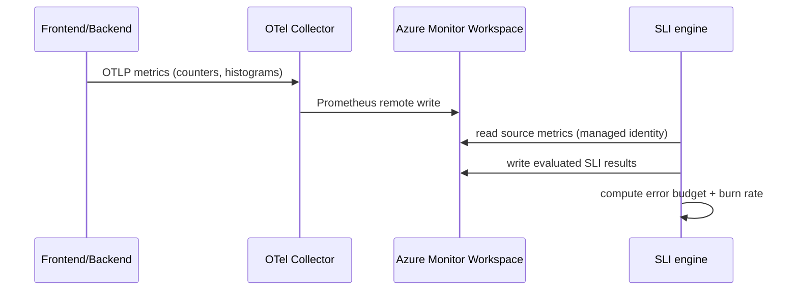

# Architecture and signal design

## Components

| Resource | Purpose |
| --- | --- |
| Frontend web app (App Service Linux) | Customer-facing site, calls backend for login/checkout |
| Backend API (App Service Linux) | `/login`, `/checkout`, calls the payment dependency; tunable failure/latency for the demo |
| Application Insights | Distributed tracing, failures, live metrics (the "traditional monitoring" contrast) |
| Log Analytics workspace | App Insights backing store, KQL |
| Azure Monitor Workspace | SLI **source** metrics and SLI **destination** (evaluated results) |
| OpenTelemetry Collector (Container App) | Receives OTLP from the apps, remote-writes Prometheus metrics to the Azure Monitor Workspace |
| User-assigned managed identity | Used by the SLI engine to read source metrics and publish evaluated results |
| Service Group `CheckoutSG` | Application boundary the SLIs are defined on |
| Action Group | Notification target for baseline and burn-rate alerts |

## Metric flow

## Signal design

### Availability SLI (request-based, portal label "Request Count Based") — Checkout

*   **Good signal** (numerator): `http_server_requests_total` filtered to `service="checkout"` and `status_class="2xx"`, temporal aggregation = rate/sum over time.
*   **Total signal** (denominator): `http_server_requests_total` filtered to `service="checkout"`, all status classes.
*   **Baseline (SLO):** 99.9% over rolling 7 days (and a 30-day compliance view).

### Latency SLI — Login

*   **Type:** Latency.
*   **Signal:** `http_server_request_duration_seconds` for `service="login"`, P95 temporal aggregation.
*   **Baseline:** 95% of requests under 300 ms.

### Dependency availability SLI — Payment (formula)

*   **Good signal:** `dependency_calls_total{dependency="payment",status="ok"}`.
*   **Total signal:** `dependency_calls_total{dependency="payment"}` (ok + error), or a formula `ok / (ok + error)`.
*   **Baseline:** 99.9%.

## Error budget and burn rate

*   `Error budget = 100% - baseline target`. At 99.9% the budget is 0.1%.
*   **Burn rate** is how fast that budget is consumed relative to the compliance period. A burn rate of 1 exactly exhausts the budget at the end of the window; a burn rate of 14.4 over 1 hour consumes ~2% of a 30-day budget.
*   **Fast-burn alert:** short lookback (for example 1h) with a high burn-rate multiple to catch sudden regressions.
*   **Slow-burn alert:** long lookback (for example 6h) with a lower multiple to catch sustained degradation.

## Fallback ingestion option (alternative stack)

If you prefer the most common SLI metric path, containerize the apps and run them on **AKS with Managed Prometheus**. The apps expose `/metrics`, Managed Prometheus scrapes them into the Azure Monitor Workspace, and SLI authoring is identical. The App Service + OTel Collector path in this demo matches the chosen App Service + Application Insights + OpenTelemetry stack.