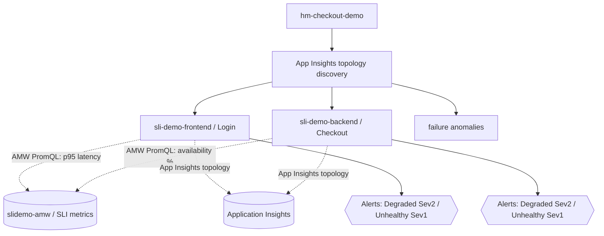

# Health Model Design: Foundations and Process

A single, ground-up guide to designing an **Azure Monitor health model** for a workload. It starts at
zero, builds each idea on the one before it, then turns the theory into a repeatable process with the
concrete Azure implementation (`Microsoft.CloudHealth` health models, discoveries, signals sourced
from Application Insights / Log Analytics / an Azure Monitor Workspace, and health-state alerts). The
worked example throughout is the **Checkout / Login** application already deployed by the SLI demo
(`../sli-demo`), represented in the health model `hm-checkout-demo`.

Read order matters: think **entity-first** (what do I care about the health of?), then decide the
**signals** that prove whether each entity is healthy, then how health **rolls up** across
relationships, and finally which state changes are worth an **alert**.

For the executable, command-by-command version of this process, see
[Health-Model-Lab.md](Health-Model-Lab.md).

> How this relates to SLIs: a health model does not replace SLIs, it *consumes* them. The SLI demo
> produces reliability metrics in an Azure Monitor Workspace (AMW). This health model taps into that
> same AMW so the customer-facing reliability of Checkout and Login becomes one node in a broader
> state-based view. See [SLO-SLI-Design-Guide.md](../sli-demo/SLO-SLI-Design-Guide.md) for the SLI
> theory.

---

## 1. Why health models exist

Alert-based monitoring answers "did a specific metric cross a line?" It is noisy (one incident fires
ten alerts), local (each alert knows nothing about the others), and stateless (there is no single
place that says "the checkout workload is unhealthy right now").

A health model adds **business context** to the raw signals you already collect. It answers three
questions that alert rules alone cannot:

- What is the health of the whole workload right now, as one state?
- Which component is causing it, and what does that component depend on?
- If this component degrades, what else is affected?

It does this by assigning a **health state** to each component and **rolling those states up** along
dependency relationships, so a single graph tells you both the symptom and the blast radius.

---

## 2. The layered mental model

Each layer depends on the one before it. Do not skip ahead.

```
Layer 1  Entity              A thing whose health you care about (a resource or a logical component)
Layer 2  Signal              One measurement on an entity, compared to thresholds
Layer 3  Health state        Healthy / Degraded / Unhealthy / Unknown, derived from the signals
Layer 4  Relationship        "A depends on B" edges between entities
Layer 5  Rollup              A parent's state is derived from its own signals plus its children
Layer 6  Alert               Fire when an entity changes state (not when a single metric moves)
```

### Layer 1: Entity

An entity is a node in the model. It can represent an **Azure resource** (an App Service, an AMW, a
database) or a **logical component** (a user flow, a team, an aggregate). Entities are added
**manually** or, more usefully, by **discovery** (section 5). In the demo, the frontend (Login) and
backend (Checkout) App Services are discovered as entities.

### Layer 2: Signal

A signal samples data and compares it to a **degraded** and an **unhealthy** threshold. Each signal
resolves to a state. A signal has a data source, a query or metric, a refresh interval, and its two
thresholds. Section 4 covers the three signal types.

### Layer 3: Health state

Each entity has one of four states: **Healthy**, **Degraded**, **Unhealthy**, or **Unknown**
(no data). The entity's state is the worst of its own signals, combined with the state rolled up from
its children.

### Layer 4: Relationship

Relationships are directed edges ("A depends on B"). Discovery can create them automatically (for
App Insights topology, the dependency edges become relationships). They are what turn a list of
resources into a workload graph.

### Layer 5: Rollup

A parent entity's health is a function of its own signals and its children's health, using an
aggregation policy (worst-of, minimum-healthy count, or maximum-not-healthy count, optionally with a
degraded and an unhealthy threshold). This is how "one failing dependency" becomes "the workload is
degraded."

### Layer 6: Alert

Unlike a resource alert rule that fires on a single metric, a **health model alert** fires when an
**entity changes state**. You enable it per entity for **Degraded**, **Unhealthy**, or both, set a
**severity** (Sev0 to Sev4), and attach up to five **action groups**. Because the entity state
already correlates many signals and children, one alert replaces many noisy ones.

---

## 3. Worked example: the Checkout / Login model

The SLI demo runs an online store with a **frontend (Login)** and a **backend (Checkout)** App
Service, both reporting to Application Insights and emitting Prometheus metrics to an Azure Monitor
Workspace. The health model built in the lab represents it like this:



- **Entities** come from an **Application Insights topology discovery** pointed at the SLI demo's
  Application Insights. Discovery imports the Login and Checkout components and adds recommended
  signals (a Log Analytics "failed requests" signal) automatically.
- **Signals that tap into the AMW**: a PromQL availability signal on Checkout and a PromQL p95 latency
  signal on Login, both querying the SLI Azure Monitor Workspace. This is the same workspace the SLIs
  are built on, so the health model and the SLIs agree on the numbers.
- **Alerts** are enabled on both entities for Degraded (Sev2) and Unhealthy (Sev1).

---

## 4. Signal types (and when to use each)

A health model supports three signal types. Each entity can have one data source per type, and
multiple signals per data source.

| Signal type | Data source | Use it for | In the demo |
| --- | --- | --- | --- |
| **Azure resource** | A platform metric on the resource, compared to a threshold | Infra health (CPU, HTTP 5xx count, response time) with no query to write | Optional: App Service `Http5xx` |
| **Log Analytics workspace** | A KQL query returning one numeric value | Log-derived health (error counts, custom calculations) | Recommended signal added by discovery: `AppRequests | where Success == false | summarize count()` |
| **Azure Monitor workspace** | A **PromQL** query returning one numeric value | Prometheus / SLI-style metrics scraped or remote-written to an AMW | **The AMW tap**: Checkout availability %, Login p95 latency |

**Thresholds.** Each signal has an optional **degraded** and a required **unhealthy** rule. Each rule
has an operator (`GreaterThan`, `LessThan`, ...) and a numeric threshold. Choose the operator to match
the metric's direction:

- Metric where **higher is worse** (error count, latency): `GreaterThan`, and set degraded **below**
  unhealthy (for example degraded > 200 ms, unhealthy > 300 ms).
- Metric where **lower is worse** (availability %): `LessThan`, and set degraded **above** unhealthy
  (for example degraded < 100, unhealthy < 99).

> Thresholds are integers. For ratio metrics (0..1), scale in the query (for example
> `100 * <ratio>`) so an integer threshold is meaningful.

**Signal definitions** let you define a signal once and reuse it across entities (optionally with
per-entity thresholds). Useful when many entities share the same metric.

---

## 5. Discoveries (how entities get into the model)

Rather than add every resource by hand, a **discovery rule** populates the model and keeps it current.
Discoveries run on a fixed **5-minute** cycle. Three kinds:

| Discovery kind | What it imports | Best for |
| --- | --- | --- |
| **Application Insights topology** | The components and dependencies tracked in an App Insights resource | Application-centric workloads (this demo) |
| **Resource graph query** | Azure resources matching an Azure Resource Graph (KQL) query | Scope by type / RG / subscription / tag |
| **Service group** | Members of a service group | Service-group-organized workloads (for example the SLI `CheckoutSG`) |

Discovery options worth setting:

- **Discover relationships**: draw dependency edges between discovered entities.
- **Add recommended signals**: attach a starter signal set per resource type so entities are monitored
  immediately.

Discovery is authenticated by an **authentication setting** on the model (section 6). Manually added
signals (like the AMW taps in this demo) **persist** across discovery cycles; discovery only manages
the entities and recommended signals it owns.

---

## 6. Identity and permissions

A health model uses one or more **managed identities** to run discoveries and query data sources. This
demo uses a **system-assigned** identity, referenced by an **authentication setting** named
`system-assigned`.

The identity needs, at minimum, **Monitoring Reader** on:

- the Azure resources represented by entities (granted at the SLI resource-group scope), and
- the **Log Analytics workspace** and **Azure Monitor Workspace** behind any log or PromQL signals.

Without these grants, discovery returns nothing and signals read **Unknown**.

---

## 7. Design decisions for this demo

| Decision | Choice | Why |
| --- | --- | --- |
| Model location | A **new** resource group, region `centralus` | Health models (`Microsoft.CloudHealth`) are region-limited; the monitored app can live anywhere (SLI is in `eastus2`) |
| How entities enter | App Insights topology discovery | The app already reports full topology to App Insights; no manual entity authoring |
| Identity | System-assigned + `system-assigned` auth setting | Simplest least-privilege path; no user identity lifecycle to manage |
| AMW tap | PromQL signals on Checkout (availability) and Login (latency) | Reuse the exact SLI metrics so health and SLIs agree |
| Alerts | Per-entity Degraded (Sev2) / Unhealthy (Sev1), action groups optional | State-based alerting replaces per-metric noise |

---

## 8. Gotchas

- **Provider name.** The live provider is `Microsoft.CloudHealth`, not `Microsoft.Monitor`. Register
  `Microsoft.CloudHealth` and use API `2026-05-01-preview`.
- **Region.** Only a subset of regions is supported (uksouth, canadacentral, centralus, swedencentral,
  southeastasia, switzerlandnorth, italynorth, northeurope, germanywestcentral, australiaeast).
- **Discovery latency.** Entities and recommended signals appear within ~5 to 10 minutes, not
  instantly.
- **Unknown signals.** A correctly wired PromQL/log signal reads **Unknown** until the underlying data
  exists. If the SLI app has no recent traffic, generate some so the metrics report values.
- **Integer thresholds.** Scale ratios in the query.
- **Editing discovered entities.** Add signals by GET-merge-PUT (preserve existing signal groups and
  drop runtime fields like `status`, `healthState`, `provisioningState`); discovery re-stamps the
  entity on its next cycle without removing your manual signals.

---

## 9. Reference

| Fact | Value |
| --- | --- |
| Resource provider | `Microsoft.CloudHealth` |
| API version | `2026-05-01-preview` |
| Health model type | `Microsoft.CloudHealth/healthmodels` |
| Child types | `.../authenticationsettings`, `.../discoveryrules`, `.../entities`, `.../signaldefinitions`, `.../relationships` |
| CLI | `az monitor health-models ...` (extension `health-models`, preview) |
| Discovery cadence | 5 minutes (fixed) |
| Signal states | Healthy, Degraded, Unhealthy, Unknown |
| Alert severities | Sev0 to Sev4 |

Docs: [Create](https://learn.microsoft.com/azure/azure-monitor/health-models/create) ·
[Discoveries](https://learn.microsoft.com/azure/azure-monitor/health-models/discoveries?tabs=app-insights) ·
[Signals](https://learn.microsoft.com/azure/azure-monitor/health-models/signals?tabs=azuremonitorworkspace) ·
[Alerts](https://learn.microsoft.com/azure/azure-monitor/health-models/alerts)
