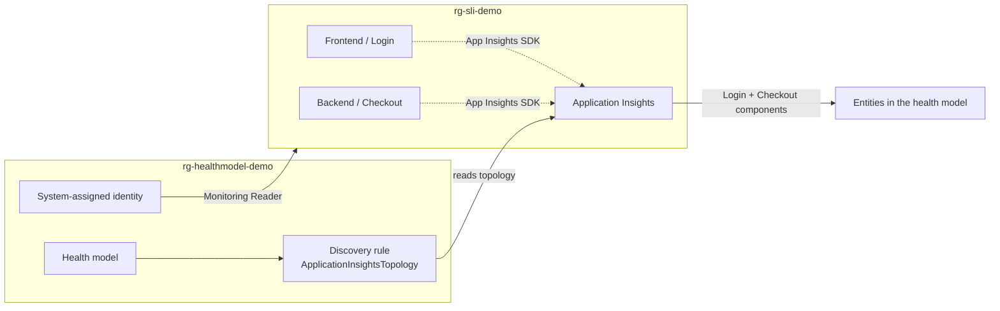

# Azure Monitor Health Model Demo: Checkout/Login application

A PowerShell-runnable deployment that creates an **Azure Monitor Health Model (preview)** in a
**new resource group** and populates it by **discovering the Checkout/Login application** that the
SLI demo (`../sli-demo`) already emits to Application Insights.

It automates the two Microsoft Learn how-tos end to end:

1. [Create a health model](https://learn.microsoft.com/azure/azure-monitor/health-models/create) (Basics + Identity)
2. [Discover entities with an Application Insights topology discovery](https://learn.microsoft.com/azure/azure-monitor/health-models/discoveries?tabs=app-insights)

**End result:** the frontend (Login) and backend (Checkout) components tracked in Application
Insights show up as **entities** in the health model, with recommended signals attached and
relationships drawn between them. A follow-up script also taps the health model into the SLI
**Azure Monitor Workspace** (PromQL signals) and configures **health-state alerts**.

> Full walkthroughs live alongside this README:
> [Health-Model-Lab.md](Health-Model-Lab.md) (replicate every step) and
> [Health-Model-Design-Guide.md](Health-Model-Design-Guide.md) (concepts you need to know).
> These mirror the SLI demo's `sli-demo/` guide pair.

---

## What gets deployed

| Resource | Purpose |
| --- | --- |
| Health model (`Microsoft.CloudHealth/healthmodels`) | The model container, in a new RG (`rg-healthmodel-demo`) |
| System-assigned managed identity | Identity used for discovery and reading telemetry (the create flow's "Identity" tab) |
| Monitoring Reader role assignment | Granted to the identity on the SLI resource group so discovery can read App Insights + resource telemetry |
| Authentication setting (`.../authenticationsettings`) | Binds the discovery rule to the system-assigned identity |
| Discovery rule (`.../discoveryrules`, kind `ApplicationInsightsTopology`) | Points at the SLI demo's Application Insights and imports its components |
| Azure Monitor workspace signals (`.../entities` PromQL) | Taps the SLI AMW: Checkout availability % and Login p95 latency |
| Entity alerts (`.../entities` alerts) | Degraded (Sev2) / Unhealthy (Sev1) health-state alerts on the app entities |

The health model lives in its **own resource group** and references the SLI app across resource
groups (Azure Monitor allows the monitored resources to be elsewhere).

> Health models are served by the `Microsoft.CloudHealth` provider and are only available in a
> subset of regions: **uksouth, canadacentral, centralus, swedencentral, southeastasia,
> switzerlandnorth, italynorth, northeurope, germanywestcentral, australiaeast**. The default is
> `centralus`. The monitored SLI app can live in any region (the SLI demo uses `eastus2`).



---

## Prerequisites

- **Azure CLI** logged in (`az login`) with **Contributor** on the subscription (or on both resource groups) so it can create the model and assign the Monitoring Reader role.
- **The SLI demo is deployed** (`../sli-demo/infra/deploy.ps1`) so its Application Insights resource exists.
- **Some traffic has flowed** through the app (run `../sli-demo/load/generate-traffic.js`) so the Application Insights topology actually contains the Login/Checkout components and their dependencies. Discovery can only import what App Insights has already observed.

The `health-models` Azure CLI extension is a preview extension; `deploy.ps1` installs it for you.

---

## Run it

```powershell
cd healthmodel-demo
./deploy.ps1                     # 1. create model + identity + role + App Insights discovery
./configure-signals-alerts.ps1  # 2. tap the SLI AMW (PromQL signals) + configure health-state alerts
```

> Run `configure-signals-alerts.ps1` after `deploy.ps1`. It enriches the discovered app entities, so
> the entities must exist first (allow ~5 minutes after `deploy.ps1` for discovery to run).

Common overrides:

```powershell
# Different names / region, or point at a different SLI resource group
./deploy.ps1 -ResourceGroup rg-healthmodel-demo -Location centralus -SliResourceGroup rg-sli-demo

# Point directly at a specific Application Insights resource
./deploy.ps1 -AppInsightsResourceId "/subscriptions/<sub>/resourceGroups/rg-sli-demo/providers/Microsoft.Insights/components/slidemo-ai-xxxxx"
```

| Parameter | Default | Description |
| --- | --- | --- |
| `-ResourceGroup` | `rg-healthmodel-demo` | New RG that will hold the health model |
| `-Location` | `centralus` | Region for the health model (must be a `Microsoft.CloudHealth`-supported region) |
| `-HealthModelName` | `hm-checkout-demo` | Name of the health model resource |
| `-SliResourceGroup` | `rg-sli-demo` | RG where the SLI app + App Insights live (Monitoring Reader scope) |
| `-AppInsightsResourceId` | (auto) | Explicit App Insights id; if omitted, the first component in `-SliResourceGroup` is used |

---

## View the result

Discovery runs on a fixed **5-minute** cadence. After 5 to 10 minutes:

1. Open the **Portal** link printed by `deploy.ps1` (or Azure portal > **Health models** > `hm-checkout-demo`).
2. Open the **Graph view**. You should see the Login (frontend) and Checkout (backend) components, plus discovered dependencies, as entities with health rollup.
3. Drill into an entity to see the recommended signals, the **Azure Monitor workspace** PromQL signal (availability / latency), and the **Alerts** tab (Degraded / Unhealthy).

> AMW PromQL signals read **Unknown** until the SLI metrics have data. Run the SLI traffic generator
> (`node ../sli-demo/load/generate-traffic.js --rps 15 --duration 900`) to make them report values.

---

## Teardown

```powershell
./teardown.ps1                      # delete the health model + remove the role assignment
./teardown.ps1 -DeleteResourceGroup # also delete rg-healthmodel-demo
```

The SLI demo (`rg-sli-demo`) is never touched.

---

## How this maps to the docs

| Doc step | Automated by |
| --- | --- |
| **Create > Basics** (subscription, resource group, region, name) | `az group create` + `az monitor health-models create -g -n -l` |
| **Create > Identity** (system-assigned managed identity) | `--system-assigned` on the create command |
| **Create > Permissions** (Monitoring Reader on monitored resources) | `az role assignment create --role "Monitoring Reader"` on the SLI RG |
| **Discoveries > authentication setting** | `az rest PUT .../authenticationsettings/system-assigned` (ManagedIdentity) |
| **Discoveries > Application Insights topology** | `az rest PUT .../discoveryrules/appinsights-topology` (specification kind `ApplicationInsightsTopology`) |

The health model and its child resources use the `Microsoft.CloudHealth` provider at API version
`2026-05-01-preview`. The child resources are created with `az rest` (explicit ARM bodies) so the
exact discovery configuration is deterministic and easy to read; the model itself uses the
first-class `az monitor health-models` commands.

---

## Portal fallback (if the preview CLI/API changes)

If a preview API change breaks `deploy.ps1`, you can reproduce the same result in the portal:

1. **Health models > Create.** Basics: pick your subscription, `rg-healthmodel-demo`, a supported region such as `centralus`, name `hm-checkout-demo`. Identity: enable **system-assigned**. Create.
2. Assign **Monitoring Reader** to the health model's system-assigned identity on `rg-sli-demo` (Access control (IAM) on the resource group).
3. Open the health model > **Discovery** > **Create** > **Application Insights topology**. Select the SLI demo's Application Insights, enable **Discover relationships** and **Add recommended signals**, and create.
4. Wait ~5 minutes and open the **Graph view**.

---

## Troubleshooting

- **"No Application Insights found in rg-sli-demo"** — deploy the SLI demo first, or pass `-AppInsightsResourceId` explicitly.
- **Empty graph after 10+ minutes** — the App Insights topology is empty. Generate traffic against the SLI app (`../sli-demo/load/generate-traffic.js`) so components and dependencies are recorded, then wait for the next 5-minute discovery cycle.
- **Role assignment fails** — you need permission to assign roles on `rg-sli-demo`. The script retries for identity replication; if it still fails, ask an owner to grant Monitoring Reader to the health model's identity.
- **Extension errors** — update the CLI (`az upgrade`) and re-run; the `health-models` extension requires a recent Azure CLI (2.75.0+).
