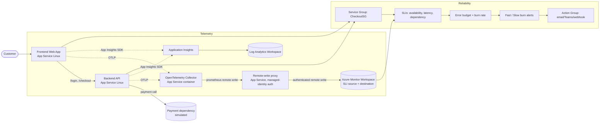
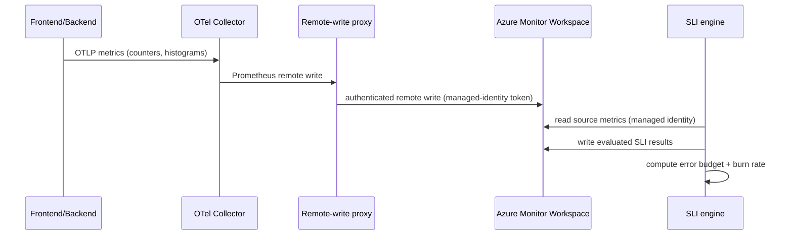

# Azure Monitor SLI/SLO Demo: Mission-Critical E-Commerce Reliability

A complete, runnable demo that shows how to **author SLIs**, **track an SLO (baseline)**, and **realize error budgets for burn-rate alerting** on Azure Monitor, applied to a mission-critical e-commerce application.

This plan follows the customer narrative from the deck: an online store with **Login** and **Checkout** services grouped into a **Service Group (`CheckoutSG`)**, measured by request-success availability and P95 latency, with error-budget-based fast/slow burn alerting.

> **Design guides in this folder:** the SLI/SLO theory and design process are in
> [SLO-SLI-Design-Guide.md](SLO-SLI-Design-Guide.md), and the executable, command-by-command
> walkthrough is in [SLO-SLI-Design-Lab.md](SLO-SLI-Design-Lab.md). Read the guide first if the
> vocabulary (SLI, SLO, error budget, burn rate) is new.

---

## 1. Demo objectives (what the audience will see)

| # | Outcome | SLI feature shown |
| --- | --- | --- |
| 1 | Reliability measured from the **customer's** point of view, not CPU/memory | Why application SLIs |
| 2 | Author an **availability SLI** (request success ratio) for Checkout | Request Count Based evaluation, good/total signals, filters |
| 3 | Author a **latency SLI** (P95 < 300 ms) for Login | Latency type, temporal/spatial aggregation |
| 4 | Author a **dependency availability SLI** (payment provider) | Multi-metric signal, formulas |
| 5 | Set an **SLO baseline** (99.9% over 7 / 30 rolling days) | Baseline (SLO), compliance period |
| 6 | Watch the **error budget** deplete as we inject failures | Error budget remaining |
| 7 | Trigger **fast-burn and slow-burn alerts** | Burn-rate alerting, action groups |
| 8 | Drill into trend, error budget, burn-rate charts | View and manage SLIs |

**Anchored targets**
- Availability SLO: **99.9%** of Checkout requests succeed (rolling 7 days, and a 30-day view).
- Latency SLO: **95% of Login requests complete in < 300 ms**.
- Dependency SLO: **99.9%** of payment-provider calls succeed.
- Alerting: **baseline alert** + **fast-burn** (rapid budget consumption) + **slow-burn** (sustained degradation).

---

## 2. Reference architecture



**Why this shape**
- **App Insights + Log Analytics** give the APM story (distributed traces, live metrics, failures) that teams use today, so you can contrast traditional monitoring with SLIs.
- Azure Monitor **SLIs read metrics from an Azure Monitor Workspace**. The apps emit OpenTelemetry metrics, and an **OpenTelemetry Collector** forwards them to the Azure Monitor Workspace using Prometheus remote write. The same workspace is the destination for evaluated SLI results.
- A **Service Group** is the logical application boundary that the SLIs are defined on (per product requirement: SLIs are authored at the service group level).

### Custom metrics the apps emit (the SLI source signals)

| Metric | Type | Key labels | Used by SLI |
| --- | --- | --- | --- |
| `http_server_requests_total` | counter | `service` (login/checkout), `route`, `status_class` (2xx/4xx/5xx) | Availability good/total |
| `http_server_request_duration_seconds` | histogram | `service`, `route` | Latency P95 |
| `dependency_calls_total` | counter | `dependency` (payment), `status` (ok/error) | Dependency availability |

These names and labels are what you select when authoring the SLI signals in the portal.

### Components

| Resource | Purpose |
| --- | --- |
| Frontend web app (App Service Linux) | Customer-facing site, calls backend for login/checkout |
| Backend API (App Service Linux) | `/login`, `/checkout`, calls the payment dependency; tunable failure/latency for the demo |
| Application Insights | Distributed tracing, failures, live metrics (the "traditional monitoring" contrast) |
| Log Analytics workspace | App Insights backing store, KQL |
| Azure Monitor Workspace | SLI **source** metrics and SLI **destination** (evaluated results) |
| OpenTelemetry Collector (Container App) | Receives OTLP from the apps, remote-writes Prometheus metrics to the Azure Monitor Workspace |
| User-assigned managed identity | Used by the SLI engine to read source metrics and publish evaluated results |
| Service Group `CheckoutSG` | Application boundary the SLIs are defined on |
| Action Group | Notification target for baseline and burn-rate alerts |

### Metric flow



### Signal design

#### Availability SLI (request-based, portal label "Request Count Based") — Checkout

*   **Good signal** (numerator): `http_server_requests_total` filtered to `service="checkout"` and `status_class="2xx"`, temporal aggregation = rate/sum over time.
*   **Total signal** (denominator): `http_server_requests_total` filtered to `service="checkout"`, all status classes.
*   **Baseline (SLO):** 99.9% over rolling 7 days (and a 30-day compliance view).

#### Latency SLI — Login

*   **Type:** Latency.
*   **Signal:** `http_server_request_duration_seconds` for `service="login"`, P95 temporal aggregation.
*   **Baseline:** 95% of requests under 300 ms.

#### Dependency availability SLI — Payment (formula)

*   **Good signal:** `dependency_calls_total{dependency="payment",status="ok"}`.
*   **Total signal:** `dependency_calls_total{dependency="payment"}` (ok + error), or a formula `ok / (ok + error)`.
*   **Baseline:** 99.9%.

### Error budget and burn rate

*   `Error budget = 100% - baseline target`. At 99.9% the budget is 0.1%.
*   **Burn rate** is how fast that budget is consumed relative to the compliance period. A burn rate of 1 exactly exhausts the budget at the end of the window; a burn rate of 14.4 over 1 hour consumes ~2% of a 30-day budget.
*   **Fast-burn alert:** short lookback (for example 1h) with a high burn-rate multiple to catch sudden regressions.
*   **Slow-burn alert:** long lookback (for example 6h) with a lower multiple to catch sustained degradation.

### Fallback ingestion option (alternative stack)

If you prefer the most common SLI metric path, containerize the apps and run them on **AKS with Managed Prometheus**. The apps expose `/metrics`, Managed Prometheus scrapes them into the Azure Monitor Workspace, and SLI authoring is identical. The App Service + OTel Collector path in this demo matches the chosen App Service + Application Insights + OpenTelemetry stack.

---

## 3. What gets built

```
sli-demo/
  README.md                 <- this plan + runbook (architecture + signal design)
  SLO-SLI-Design-Guide.md   <- SLI/SLO theory and design process
  SLO-SLI-Design-Lab.md     <- hands-on, command-by-command lab
  infra/
    main.bicep              <- subscription/RG resources
    modules/
      monitoring.bicep      <- Log Analytics, App Insights, Azure Monitor Workspace, DCE/DCR
      identity.bicep        <- user-assigned managed identity + role assignments
      appservice.bicep      <- plan + frontend + backend web apps
      collector.bicep       <- OpenTelemetry Collector as a Container App
    main.parameters.json
  src/
    backend/                <- Node.js API: /login, /checkout, tunable failure+latency
    frontend/               <- Node.js web app calling the backend
  load/
    generate-traffic.js     <- steady-state + spike traffic generator
    inject-degradation.md   <- how to trigger error-budget burn live
  sli/
    01-sli-authoring-runbook.md   <- portal steps to author the 3 SLIs
    02-burn-rate-alerts.md        <- baseline + fast/slow burn alert config
  demo-script.md            <- the live walk-through mapped to the slides
```

---

## 4. Prerequisites

- Azure subscription with **Contributor** + **User Access Administrator** (to assign roles to the managed identity), or the granular roles in the SLI doc.
- A region where Azure Monitor Workspace and Service Groups (preview) are available, for example **East US** or **West Europe**.
- Tooling: **Azure CLI**, **Bicep**, **Node.js 20+**.
- A **Service Group** (preview). Created in the portal after deployment, with a unique name (see runbook step 5.2).

> Minimum SLI role assignments (from product docs): **Monitoring Reader** on the source workspace; **Monitoring Reader** + **Monitoring Metrics Publisher** on the destination workspace; **Monitoring Reader** on the destination default data collection rule. The Bicep in `infra/` wires these to a user-assigned managed identity used by the SLI engine.

---

## 5. Step-by-step runbook

**Deployment order (do not skip ahead):**
1. One-stop deploy: resource group, all infrastructure, and app code (5.0)
2. Baseline traffic so metrics exist (5.1)
3. **Service Group** with a unique name, created last, then the resource group added to it (5.2)
4. SLIs, alerts, failure injection (5.3 onward)

The Service Group is created **after** the resource group and its resources, because it references the resource group as a member.

### 5.0 Deploy everything (one stop)

The entire platform is App Service only (frontend, backend, the OpenTelemetry Collector as a container web app, and the managed-identity remote-write proxy). One script provisions all infrastructure with Bicep and pushes the app code:

```powershell
cd sli-demo/infra
az login
az account set --subscription "<SUBSCRIPTION_ID>"

./deploy.ps1 -ResourceGroup rg-sli-demo -Location eastus2
# optional: -PlanSku B1   (lower cost)   -GenerateTraffic   (start load after deploy)
```

What it does:
1. Creates the resource group and registers providers.
2. Deploys `main.bicep`: Log Analytics, Application Insights, Azure Monitor Workspace, the user-assigned managed identity with the required Monitoring roles (on the AMW account **and** its managed data collection rule), the OpenTelemetry Collector container web app, the remote-write proxy, and the frontend/backend apps. The collector config is embedded from `collector/collector-config.yaml`, and the Prometheus remote-write URL is computed from the workspace's managed DCE/DCR.
3. Zip-deploys the Node code for the backend, frontend, and proxy (the collector runs a public image, no code push needed).

The script prints the app URLs, the managed identity client ID, the Azure Monitor Workspace name, and the **suggested Service Group name** (`CheckoutSG-<suffix>`) to use in step 5.2.

> Everything runs on App Service. There is no Azure Container Apps or AKS component. The remote-write proxy attaches a managed-identity Entra token (via the App Service identity endpoint) and forwards Prometheus remote-write to the workspace, which removes the IMDS dependency of the Azure Monitor sidecar.

### 5.1 Generate baseline traffic

```powershell
cd ../../load
$env:TARGET = "https://<frontend-app-name>.azurewebsites.net"
node generate-traffic.js --rps 20 --duration 1800
```

Let traffic run 15-30 minutes so the metrics build history in the Azure Monitor Workspace before you author SLIs. Confirm metrics are arriving (portal: Azure Monitor Workspace > Metrics, or run a PromQL query for `http_server_requests_total`).

### 5.2 Create the Service Group and add the resource group to it

> **Automated path (recommended).** Everything in 5.2 and 5.3 (recording rules, Service
> Group, membership, enabling monitoring, and the three SLIs) is automated by
> [infra/slo/deploy-slo.ps1](infra/slo/deploy-slo.ps1). From `sli-demo/infra/slo`, run:
>
> ```powershell
> ./deploy-slo.ps1
> ```
>
> It reads the main deployment outputs, so there is nothing to copy by hand. See
> [infra/slo/README.md](infra/slo/README.md) for details, including the recording rules
> that expose SLI-ready metric dimensions and the metric-dimension indexing wait. The
> portal walkthrough below is the manual alternative.

> **Sequencing matters.** Create the **resource group and all resources first** (steps 5.0 to 5.0c), and only then create the Service Group and add the resource group to it. The Service Group references the resource group as a member, so the resource group must already exist with its resources deployed. Do not create the Service Group before the resource group.

SLIs are authored on a **Service Group**, the logical boundary of the application. The cleanest way to scope the whole demo is to **add the resource group (`rg-sli-demo`) as a member**, so every resource it contains (frontend, backend, Azure Monitor Workspace, identity) is automatically in scope.

> **Service Group names must be unique in your tenant**, or creation fails. Use a randomized suffix. The simplest option is to reuse the `namingSuffix` output from step 5.0 so the name lines up with the deployed resources, for example `CheckoutSG-a1b2c3`. If you did not capture it, generate a fresh random suffix:
>
> ```powershell
> # Reuse the deployment suffix (preferred)
> $suffix = az deployment group show -g rg-sli-demo -n main --query "properties.outputs.namingSuffix.value" -o tsv
> # ...or generate a fresh random one
> if (-not $suffix) { $suffix = -join ((48..57) + (97..122) | Get-Random -Count 6 | ForEach-Object { [char]$_ }) }
> $sgName = "CheckoutSG-$suffix"
> Write-Host "Service Group name: $sgName"
> ```

1. **Create the Service Group** (after the resource group and resources exist)
   - Portal: **Service groups** > **Create**.
   - Name: **`$sgName`** from above (a unique name such as `CheckoutSG-a1b2c3`). Optionally set the friendly display name to `CheckoutSG`. Optionally nest it under an existing management/service group for org hierarchy.

2. **Add the resource group as a member**
   - Open the new Service Group > **Members** (or **Resources**) > **Add member**.
   - Member type: **Resource group**, then select **`rg-sli-demo`**.
   - Adding the resource group brings all contained resources into the service group, so you do not have to add each web app individually. (You can still add individual resources or a whole subscription as members if you prefer a narrower or broader boundary.)

3. **Verify membership**
   - On the Service Group > **Members**, confirm `rg-sli-demo` (and its resources) are listed before authoring SLIs.

4. **Enable monitoring and set Service Group defaults** (required before the SLI form works)
   - On the Service Group > **Monitoring**, the SLI card initially shows *"No SLIs"* and a note to enable monitoring. Select **Configure settings** and associate a **default Managed Identity** (`<prefix>-id-<suffix>` from the deployment) and a **default Azure Monitor Workspace** (`<prefix>-amw-<suffix>`).
   - Without these defaults the Create SLI form warns *"This service group (SG) doesn't have a default MI or AMW configured."* Setting them pre-populates the identity and data source/storage fields for every SLI.

> Service Groups are in preview and are managed primarily in the portal (resource provider `Microsoft.Management/serviceGroups`). Membership can take a few minutes to reflect. Wait until the apps and the Azure Monitor Workspace show under the service group before moving on.

### 5.3 Author the SLIs

Follow [sli/01-sli-authoring-runbook.md](sli/01-sli-authoring-runbook.md) to create:
1. **CheckoutAvailabilitySLI** (request-based, availability, good = 2xx, total = all, baseline 99.9%).
2. **LoginLatencySLI** (latency, P95 < 300 ms).
3. **PaymentDependencySLI** (dependency availability via formula).

### 5.4 Configure burn-rate alerts

Follow [sli/02-burn-rate-alerts.md](sli/02-burn-rate-alerts.md) to enable the baseline alert plus fast-burn and slow-burn alerts and bind them to an action group.

### 5.5 Run the failure injection and watch the budget burn

```powershell
# Drive Checkout 5xx errors to ~8% to trigger fast burn
Invoke-RestMethod -Method Post "https://<backend-app-name>.azurewebsites.net/admin/chaos" `
  -Body (@{ service = "checkout"; errorRate = 0.08; extraLatencyMs = 0 } | ConvertTo-Json) `
  -ContentType "application/json"
```

Watch **Error budget remaining** fall and the **fast-burn alert** fire. Reset with `errorRate = 0` to show recovery. For latency, set `extraLatencyMs = 600` on `login` to breach the P95 < 300 ms SLI and trigger the latency budget burn.

---

## 6. Mapping demo to SLI product features

| Slide / concept | Demo action | Azure Monitor feature |
| --- | --- | --- |
| What is SLI/SLO | Show CheckoutSG with availability + latency SLIs | SLI types, baseline = SLO |
| Traditional vs SLI monitoring | Compare App Insights CPU/500 charts with SLI error budget | User-centric measurement |
| Pre-req: Service Group | Create `CheckoutSG` | Service group boundary |
| Common scenarios (login/checkout) | Author availability for checkout, latency for login | Request-based, latency evaluation |
| Error budget burns too fast | Inject 8% errors | Fast-burn alert |
| Sustained degradation | Inject +600 ms latency | Slow-burn alert |
| Manage SLIs view | Show list with status + error budget remaining | View and manage SLIs |

---

## 7. Reliability talking points for the customer

- **Error budget = `100% - SLO`.** At 99.9% the budget is 0.1%. For ~25.9M checkout requests/30 days, that is roughly **25,920 failed requests** before the SLO is missed. This reframes "is it down?" into "how much failure can we still absorb?".
- **Fast burn** catches sudden regressions (a bad deploy) early enough to roll back before the monthly budget is gone. **Slow burn** catches death-by-a-thousand-cuts degradation that single-threshold alerts miss.
- SLIs are a **standard, cross-service signal**, so reliability conversations and release/incident decisions use one consistent language across the whole application.

---

## 8. Cleanup

```powershell
az group delete -n rg-sli-demo --yes --no-wait
```

Delete the Service Group and SLIs from the portal if they were created outside the resource group.
